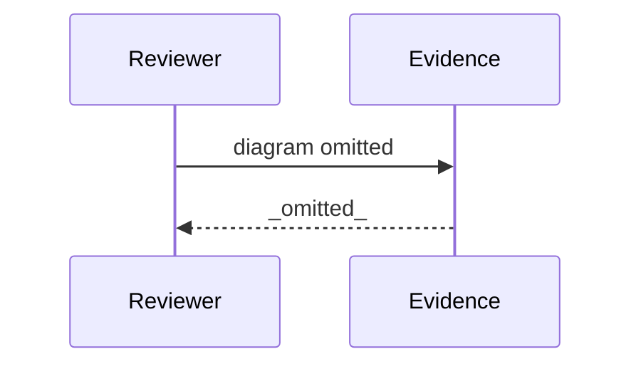

# Review Diagrams: Iteration 001 — engine, channels, dispatcher, breaker, Claude binding

**Schema**: v1
**Diagram Format**: mermaid

> **Review Evidence Warning disposition** _(reviewed, explained)_: the 12-tasks-vs-63-files scaffold flag decomposes as ~30 lifecycle/spec/workshop artifacts + ~33 implementation files, every one committed and traceable to a T0NN boundary commit (full decomposition in coverage-evidence.md).

---

## Structure Diagram

## Flow Diagram

## Omissions

- Structure diagram omitted: inter-module edges (0) below threshold (2).
- Flow diagram omitted: entrypoints changed (0) below threshold (1).

## Local View Hints

- specs\171-specrew-refocus\iterations\001\review-diagrams.md
