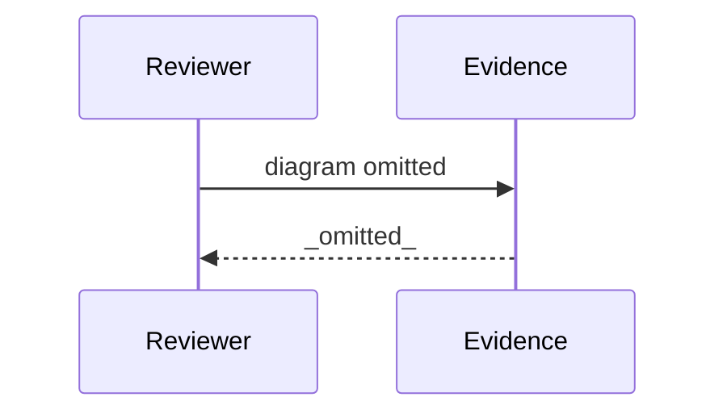

# Review Diagrams: Iteration 002 — research-gated host bindings, carries, docs, beta evidence

**Schema**: v1
**Diagram Format**: mermaid

> **Review Evidence Warning disposition** _(reviewed, explained)_: the 5-tasks-vs-39-files scaffold flag decomposes into 19 implementation files (3 scripts x3 trees, catalog+digests x2 trees, init/update wiring, 4 manifests), 2 test suites, 3 docs, 9 spec/lifecycle artifacts, 6 state-trail files - all committed and task-traceable; full decomposition in coverage-evidence.md.

---

## Structure Diagram

## Flow Diagram

## Omissions

- Structure diagram omitted: inter-module edges (0) below threshold (2).
- Flow diagram omitted: entrypoints changed (0) below threshold (1).

## Local View Hints

- specs\171-specrew-refocus\iterations\002\review-diagrams.md
