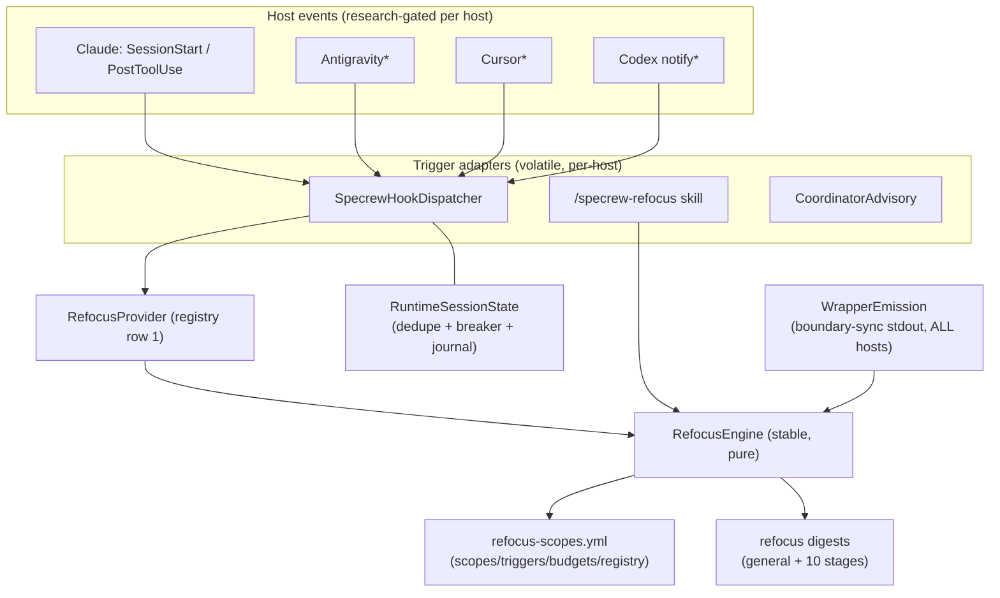
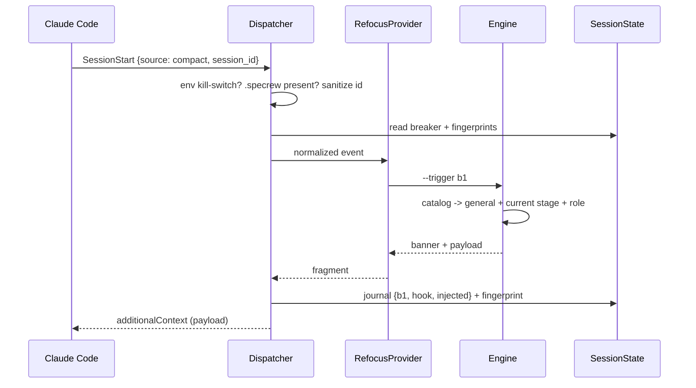
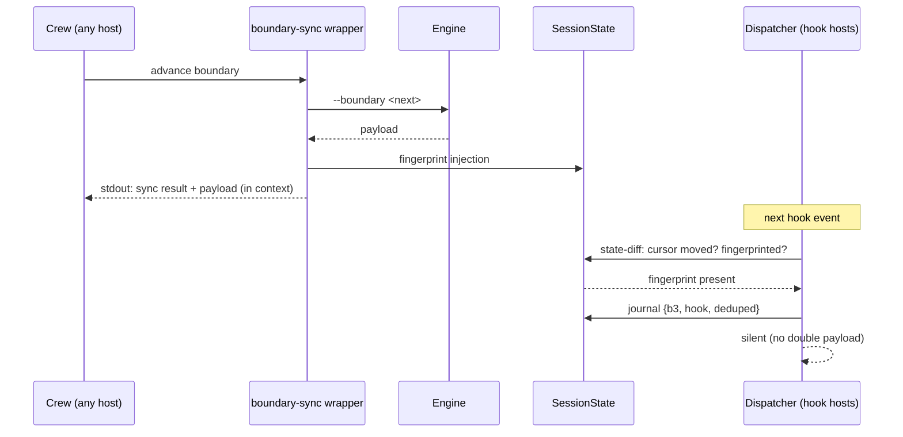
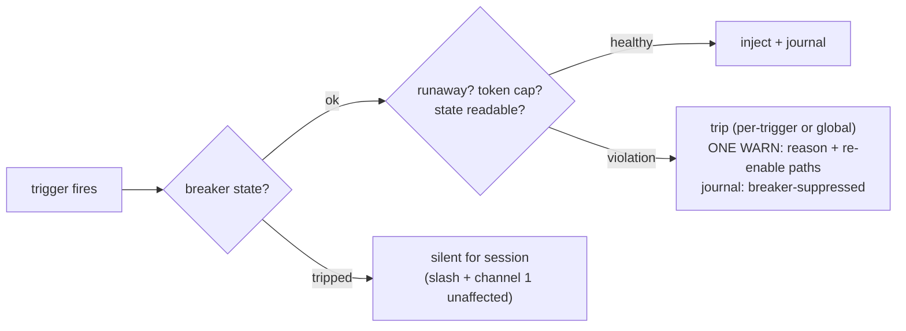

# Review Diagrams: Specrew Refocus

**Feature**: 171-specrew-refocus
**Phase**: pre-implementation (planning artifact for reviewer)

## Component diagram

## Sequence: B1 post-compaction (Claude)

## Sequence: B3 dedupe across channels

## Failure mode: breaker trip

