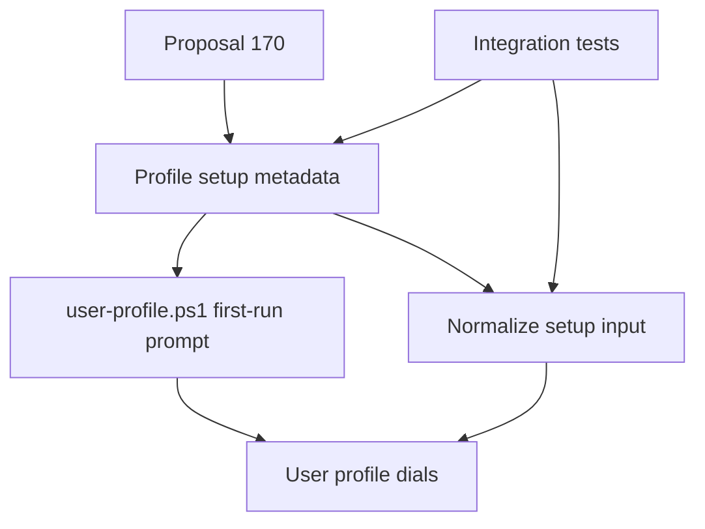
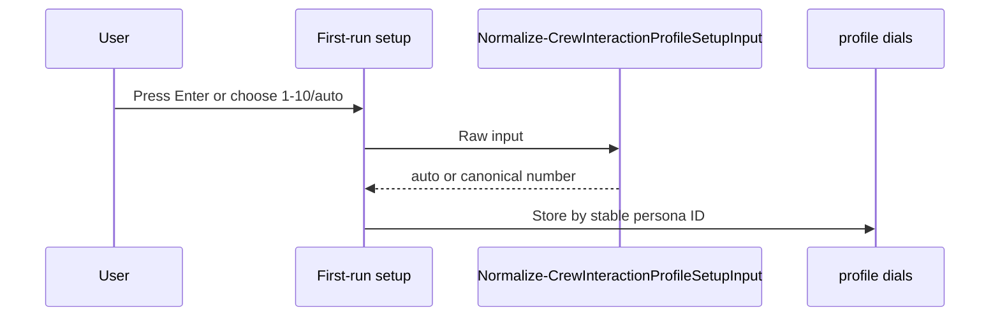

# Review Diagrams: Iteration 001

**Schema**: v1
**Diagram Format**: mermaid

## Structure Diagram

## Flow Diagram

## Omissions

- Deployment diagram omitted: no deployment, host binding, or package surface
  changed.
- Data migration diagram omitted: persisted profile schema was preserved.
