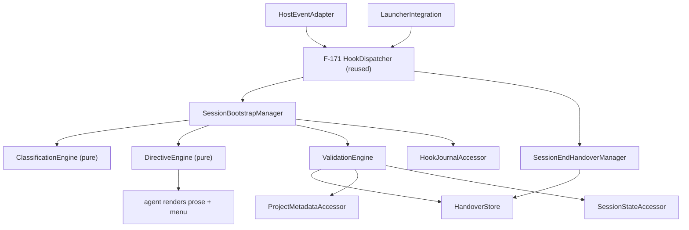

# Review Diagrams: Hook-Driven Session Bootstrap

**Feature**: 174-hook-driven-session-bootstrap
**Phase**: pre-implementation (planning artifact for reviewer)

## Component diagram



## Sequence: full bootstrap that clears a stale anchor

```mermaid
sequenceDiagram
  participant User
  participant Dispatcher as F-171 Dispatcher (B2)
  participant Mgr as SessionBootstrapManager
  participant VE as ValidationEngine
  participant CE as ClassificationEngine
  participant DE as DirectiveEngine
  participant J as HookJournalAccessor
  participant Agent
  User->>Dispatcher: direct host launch
  Dispatcher->>Mgr: SessionStart B2 event
  Mgr->>VE: validate handover + anchor vs project
  VE-->>Mgr: handover invalid; anchor merged/absolute -> cleared
  Mgr->>CE: classify(no valid resume)
  CE-->>Mgr: mode = full (reason: cleared stale anchor)
  Mgr->>DE: build directive(full, findings)
  DE-->>Mgr: directive{render_first, findings}
  Mgr->>J: record{mode:full, anchor_cleared:merged}
  Mgr-->>Agent: inject directive
  Agent-->>User: prose orientation + "Cleared a stale anchor" + Resume/New/Pick
```
