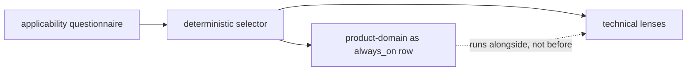
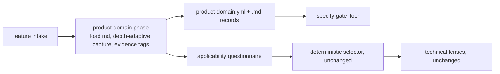
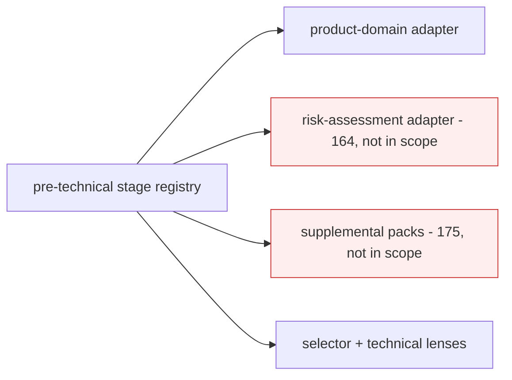
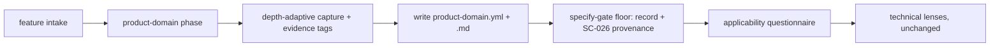

# Design Analysis — Feature 176 / Iteration 001

**Feature**: 176-product-domain-lens
**Iteration**: 001
**Date**: 2026-06-09
**Spec**: file:///C:/Dev/Specrew-product-domain-lens/specs/176-product-domain-lens/spec.md

## Problem Framing

The spec fixes the behavior: a required first lens `product-domain` runs before
technical-lens applicability selection, captures product/problem context at adaptive
depth, tags evidence, persists two records, and is enforced at the specify gate. The
intake workshop co-designed and human-confirmed the component map and the two forks
(extend the gate; conditional `research-needed` blocking). The open design questions for
this iteration: the **mechanical slot-in** of the lens into the existing catalog/selector,
the **structured-record schema**, the **quality-bar/stack** (a before-plan mis-inference),
and the **run cadence** (a maintainer rule recorded at this verdict). Binding constraints:
reuse the existing catalog + skill + gate machinery (no parallel subsystem); keep the
deterministic selector pure (Feature 141 decoupling); ~6-10 SP, single iteration; Proposals
156/162 unshipped so their integrations are forward-compatible shape only.

## Key Design Decision Points

1. **Slot-in** — where `product-domain` lives relative to the existing yes/no
   applicability questionnaire (an `always_on` row, a new first-stage phase ahead of the
   selector, or a generalized pre-technical lens framework). This is the primary decision
   compared in Alternatives below.
2. **Structured-record schema** — the `product-domain.yml` shape: depth, per-area answers,
   evidence-tagged statements, skipped areas, follow-up research, confirmation provenance,
   plus the forward-compat `product_id` / `product_context_ref` and `context_scope` hooks.
3. **Quality-bar / stack** — the before-plan resolver mis-inferred a react-spa browser
   stack; the real stack is PowerShell governance tooling (drift D-003), needing sign-off.
4. **Run cadence** — the lens runs before every feature at adaptive depth (not once);
   feature-standalone in V1, delta mode once Proposal 162 ships (maintainer rule, captured
   in the dedicated section below and FR-002/FR-014).

## Alternatives

### Option A: Simplest — add `product-domain` to the `always_on` lens list

**Approach**: Register `product-domain` as another `always_on` entry in
`applicability-map.json` so the existing selector returns it alongside the foundational
lenses. No new phase concept; the lens md is loaded like any other lens.
**Architectural pattern**: Register-in-place on the existing deterministic selector.
**Quality features considered**: *(architecture-core)* smallest change; *(requirements-nfr)*
fails FR-001 — `always_on` lenses are selected by, and run alongside, the questionnaire, not
before it; *(component-design)* the depth model, evidence tags, and run-first ordering have
no home in the yes/no gated machinery.
**Effort estimate**: Small (~40% of B).
**Reversibility cost**: Medium — once the lens is wired through the selector, moving it to a
first-stage phase later reworks the selector contract and tests.
**Trade-offs**:

- (+) Cheapest registration; reuses the selector verbatim.
- (−) Semantically wrong: violates FR-001 "run before applicability selection"; the selector
  returns nothing until the questionnaire is answered, so "first" cannot hold.
- (−) Forces the depth model + evidence tags through a mechanism built for yes/no gating.

**Design principle / why this matters**: cohesion — a mechanism (the deterministic yes/no
selector) should not be overloaded with a concept it was not designed for (a pre-technical,
depth-adaptive, evidence-tagged phase). Cheaper now, but couples two unlike responsibilities.

**Recommended for**: a lens that genuinely is a peer of the technical lenses — which
`product-domain` is not.

**Diagram**:

### Option B: Reasonable — a new first-stage workshop phase ahead of the selector (recommended)

**Approach**: Introduce a "product-domain phase" the workshop runs first — load
`product-domain.md`, facilitate the depth-adaptive capture, write the two records, enforce
at the specify gate — and only then run the existing applicability questionnaire + technical
lenses, untouched. `product-domain` is registered in `index.yml` as a first-stage lens (a
`default_phase` such as `intake-product-domain`) but is NOT a row in `applicability-map.json`,
so the deterministic selector stays pure.
**Architectural pattern**: A new pre-selector workshop phase + a thin first-stage runner; the
existing selector is unchanged; the gate floor extends the existing specify gate.
**Quality features considered**: *(architecture-core)* honors FR-001 and keeps the
LLM/network-free selector pure; *(requirements-nfr)* the depth model (FR-002), evidence tags
(FR-004), dual records (FR-005), and the run-first ordering (FR-001) all have a natural home;
*(component-design)* the lens md / first-stage runner / record writer / gate floor are
separate units; *(devops-operations)* the conduct change deploys to the host-managed skill
surfaces.
**Effort estimate**: Medium (baseline) — ~6-10 SP, single iteration.
**Reversibility cost**: Low — the phase is additive; the selector and technical lenses are
untouched, so generalizing later (Option C) is incremental.
**Trade-offs**:

- (+) Faithful to FR-001; keeps the deterministic selector pure (Feature 141 intent).
- (+) Natural home for depth + evidence tags + artifacts; reuses the gate + skill machinery.
- (−) Introduces one new "first-stage" concept and touches the workshop skill + a runner.
- (−) The first-stage phase is bespoke to one lens (until a second pre-technical lens lands).

**Design principle / why this matters**: separation of concerns + reversibility — the
pre-technical product grounding is its own phase with its own contract, isolated from the
technical selector; the smallest change that honors the requirement and stays cheap to
generalize when a second pre-technical lens (164/175) actually arrives.

**Recommended for**: exactly this feature — one pre-technical lens that must run first with
its own depth/evidence machinery, without over-building a framework for hypothetical peers.

**Diagram**:

### Option C: By-the-book — a generalized pre-technical lens-stage framework

**Approach**: Build a first-class "pre-technical stage" registry that can host
`product-domain` today and future pre-technical lenses (Proposal 164 risk-assessment,
Proposal 175 supplemental packs) as data rows, with stage ordering and a stage contract.
**Architectural pattern**: A new pre-technical stage framework + registry + per-lens stage
adapters, layered ahead of the existing selector.
**Quality features considered**: *(architecture-core)* most future-proof, but premature
generalization from a single example; *(requirements-nfr)* no current FR needs the framework
— 164/175 are not in scope; *(component-design)* more surface, more tests, more deploy risk
for one lens.
**Effort estimate**: Large (~2× B) — likely exceeds the single-iteration cap.
**Reversibility cost**: High — a registry + stage contract are entrenched surfaces that later
lenses would depend on, hard to reshape once 164/175 bind to them.
**Trade-offs**:

- (+) Most future-proof; one home for all pre-technical lenses.
- (−) Premature: the abstraction is guessed from one example; 164/175 are not approved scope.
- (−) Breaks the iteration cap and the "no parallel subsystem" constraint.

**Design principle / why this matters**: YAGNI / right-sizing — a framework justified by one
concrete case is speculation; the Option B phase generalizes to a framework later at lower
total cost than guessing the contract now. (Specrew fights under-engineering, but right-sizing
is exactly the design-analysis call.)

**Recommended for**: a future iteration once a second pre-technical lens (164/175) is approved
and the shared contract can be designed from two real examples.

**Diagram**:

## Applicable Lenses

Selected by the applicability questionnaire (recorded in `lens-applicability.json`):
always-on foundational lenses plus `devops-operations` (the conduct deploys to the host skill
surfaces). Each `Addressed:` entry points into the option comparison above; delete them and
the option Trade-offs still engage the lens — the discriminator. This iteration is FR-026-era
(not grandfathered).

- **architecture-core** - `extensions/specrew-speckit/knowledge/design-lenses/architecture-core.md`
  - Decision points: major building blocks + responsibilities; volatile areas isolated behind
    interfaces; binding constraints vs. preferences; out of scope; which option balances
    simplicity/reversibility/future cost.
  - Addressed: the building blocks are the product-domain phase / first-stage runner / record
    writer / gate floor (Option B Approach); the volatile pre-technical grounding is isolated
    as its own phase, keeping the deterministic selector pure; the binding constraints
    (FR-001 run-first, selector purity, no parallel subsystem, the cap) rule out Option A
    (partial) and Option C (over-built); the balance is Option B — see Crew Recommendation.
- **component-design** - `extensions/specrew-speckit/knowledge/design-lenses/component-design.md`
  - Decision points: responsibilities together vs. separate; dependency direction; right
    abstraction; where schemas decouple; extension mechanism.
  - Addressed: Option B keeps the lens md / first-stage runner / record writer / gate floor /
    tests as separate units (the intake-confirmed map); the workshop conduct depends inward on
    the lens md; the `product-domain.yml` schema is the decoupling seam (forward-compatible
    with 156); extension stays data-file-driven — see Option B Architectural pattern.
  - Addressed: see the Co-Design Record below for the full component-to-responsibility map.
- **requirements-nfr** - `extensions/specrew-speckit/knowledge/design-lenses/requirements-nfr.md`
  - Decision points: which NFRs drive design; mandatory vs. preference; measurable thresholds;
    what needs clarification; acceptance criteria beyond the happy path.
  - Addressed: the design-driver NFRs are enforced-not-prose grounding (FR-010/SC-005),
    evidence honesty (FR-004/SC-003), conditional research-needed blocking (FR-011/SC-006),
    and multi-host parity (FR-013/SC-007); each is the measurable threshold the iteration must
    prove — see Option B Quality features. Option C is rejected NFR-wise (no SC needs the
    framework).
- **devops-operations** - `extensions/specrew-speckit/knowledge/design-lenses/devops-operations.md`
  - Decision points: what ships where; deploy/release path; how multi-surface artifacts stay
    in sync; what CI can prove vs. runtime validation.
  - Addressed: the lens md is one shared catalog file; the conduct change propagates to the
    host-managed skill surfaces of all five supported hosts via the managed-skill deploy path
    (Option B devops note); a host-parity test guards the surfaces against drift (SC-007); the
    exact host→surface mapping is a plan-time detail.

*Not selected: ui-ux (ui=no; agent-facing, no GUI), security-compliance (security=no; no
auth/secrets/PII), data-storage (data=no; design-time artifact schema owned under
component-design), integration-api (integration=no; internal catalog/skill wiring),
observability-resilience (perf=no; no runtime telemetry).*

## Crew Recommendation

**Recommended: Option B.**

Option B is the smallest change that honors FR-001's "run before applicability selection"
while keeping the deterministic, LLM/network-free selector pure (the Feature 141 decoupling
intent). It gives the lens's distinct machinery — the Light/Standard/Deep depth model, the
evidence-tag vocabulary, and the dual artifacts — a natural home as a first-stage phase, and
it reuses the existing catalog, workshop skill, and specify-gate machinery rather than adding
a parallel subsystem. Option A is cheaper but semantically wrong: an `always_on` lens is
selected by, and runs alongside, the questionnaire, so "first" cannot hold and FR-001 is
violated. Option C is the most future-proof but premature — a pre-technical framework guessed
from one example, breaking the iteration cap and the no-parallel-subsystem constraint; the
Option B phase generalizes to that framework later, at lower cost, once a second pre-technical
lens (Proposal 164/175) is approved. On the supporting decisions: the schema (DP2) is as in
the Co-Design Record, including the optional `product_id` / `product_context_ref` and
`context_scope` forward-compat hooks; and the quality bar (DP3) is corrected from the
mis-inferred react-spa profile to the PowerShell profile (drift D-003), pending the
maintainer's sign-off.

## Human Decision

- **Decision verdict**: approved for plan with Option B
- **Chosen option**: Option B
- **Reason**: the maintainer selected "approve with instructions" (verdict 2) without
  overriding the recommended slot-in default, so Option B (the new first-stage phase ahead of
  the selector) stands — it faithfully honors FR-001 and keeps the selector pure, where Option
  A is semantically wrong and Option C over-builds for one lens.
- **Modifications**: carry the **product-domain run cadence rule** (see the dedicated section
  below): the lens runs before every feature at adaptive depth, `feature_standalone` in V1 and
  `feature_delta` once Proposal 162 ships; add the `context_scope`
  (`feature_standalone | product_baseline | feature_delta`) field; keep the `product_id` /
  `product_context_ref` inheritance hooks (shape only). **Stack correction approved (DP3)**:
  the quality bar is the PowerShell profile (Pester + PSScriptAnalyzer + Specrew
  mechanical-checks/validator), concurrency-correctness not-applicable; the react-spa
  auto-inference (drift D-003) is overridden.
- **Design-analysis draft commit**: `985c8374`
- **Decision recorded in commit**: `df08fa9f` (the commit that records this populated
  decision; differs from the draft `985c8374`)

## Product-domain run cadence (maintainer rule, carried to plan)

The product-domain lens is **NOT run only once** — it runs **before every feature, at
adaptive depth**. Recorded at the design-analysis verdict and carried into the lens md,
FR-002/FR-014, and `plan.md`:

- **V1 (Proposal 176, Proposal 162 not shipped)**: every feature gets a feature-level
  product-domain pass (`context_scope: feature_standalone`). Depth is Light / Standard / Deep
  by **risk and novelty**.
- **Future (Proposal 162 shipped)**: the lens still runs per feature but in **delta mode**
  (`context_scope: feature_delta`) — inherit the product-level baseline
  (`context_scope: product_baseline`) and ask only what is new, changed, contradictory, or
  feature-specific. Proposal 162 owns the persistent baseline + inheritance behavior; 176
  builds the feature-level pass and the forward-compatible hooks.
- **Depth-selection rules** (encoded in the lens conduct):
  - first feature / new product / unclear product context → Standard or Deep;
  - later feature in a known product → Light or Delta;
  - tiny bug fix / narrow internal utility → Light;
  - major pivot, new user segment, new workflow, migration/replacement, regulated/high-risk
    area → Standard or Deep;
  - do NOT re-run full competitive/business discovery for every feature unless the feature
    changes the product context;
  - do NOT treat inherited product context as silently valid if the feature contradicts it —
    record the divergence and the reason (the divergence-recording principle is honored in V1
    in the record shape; 162 wires the inheritance compare).

## Co-Design Record

**Decomposition method (agreed at intake)**: governance/methodology decomposition by build
area (catalog knowledge → workshop conduct → per-feature artifacts → enforcement → tests), per
the human-confirmed component map.

**Component-to-responsibility map** (human-confirmed at intake; carried here unchanged):

- `product-domain.md` (catalog lens file) — responsibility: the decision areas, depth model,
  evidence vocabulary, and no-batch-confirmation conduct.
- Catalog registration (`index.yml` first-stage entry + `diagram-vocabulary.json`) —
  responsibility: makes the lens discoverable as the first-stage lens (Option B).
- `specrew-design-workshop` skill — responsibility: runs the product-domain phase first;
  deployed to the host-managed skill surfaces of all five supported hosts.
- Record writer/validator (PowerShell) — responsibility: scaffolds `product-domain.{yml,md}`,
  validates fields, evidence tags, and provenance.
- Specify-gate floor — responsibility: requires the record + SC-026 provenance; rejects batch
  approval (FR-009).
- Tests — responsibility: depth selection, dual-artifact, evidence-tags, FR-009
  non-equivalence, gate floor, host-parity, and SC-008 schema conformance.

**Agreed key flow** (the slot-in under Option B):

- **Human-agreed**: yes — the maintainer approved this design at the design-analysis verdict
  (2026-06-09, "approve with instructions": Option B + stack correction, plus the run-cadence
  rule above).
