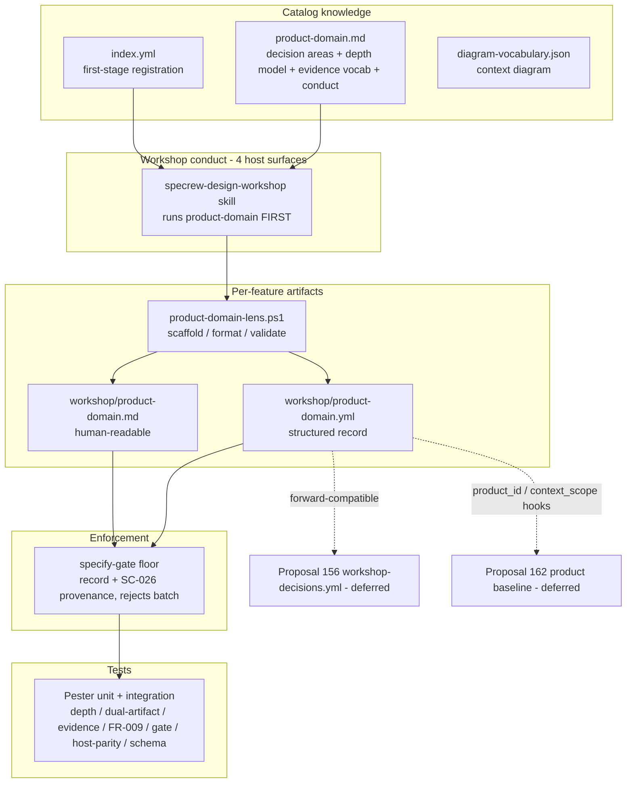
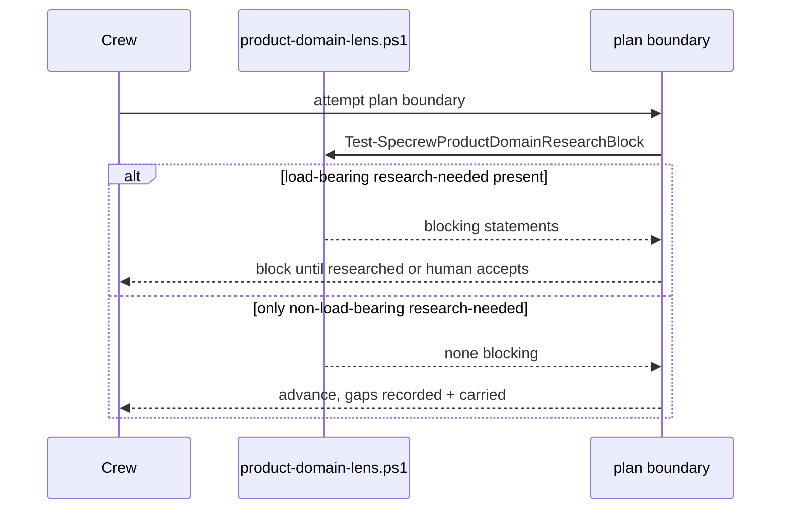

# Review Diagrams: Product & Problem Domain Lens

**Feature**: 176-product-domain-lens
**Phase**: pre-implementation (planning artifact for the reviewer)

## Component diagram



## Sequence: product-domain phase at feature intake

```mermaid
sequenceDiagram
  participant Human
  participant Crew as Crew (workshop)
  participant Lens as product-domain.md
  participant Writer as product-domain-lens.ps1
  participant Gate as specify-gate floor

  Crew->>Lens: load first-stage lens (before applicability questionnaire)
  Crew->>Crew: select depth by risk + novelty (FR-002)
  Crew->>Human: reframe solution-first request into the problem; ask product/problem questions
  Human-->>Crew: answers (or explicit delegate/skip)
  Crew->>Crew: tag each material statement (known/assumed/unknown/research-needed)
  Crew->>Writer: write product-domain.yml + .md (context_scope=feature_standalone)
  Crew->>Gate: sync specify boundary
  Gate->>Writer: validate record (schema + non-batch confirmation provenance)
  alt valid + genuine confirmation
    Gate-->>Crew: pass -> proceed to applicability questionnaire + technical lenses
  else missing / batch-approved / malformed
    Gate-->>Crew: fail-closed with reason (FR-009/FR-010)
  end
```

## Sequence: conditional research-needed plan-block (FR-011)


