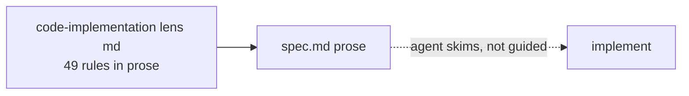
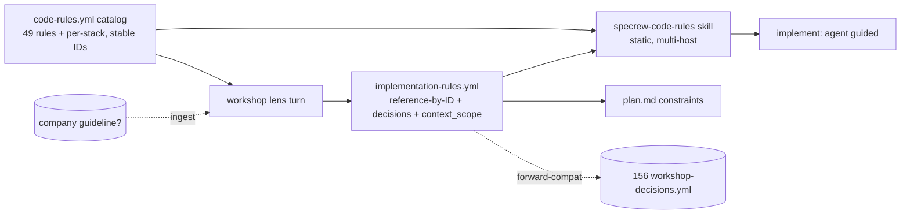
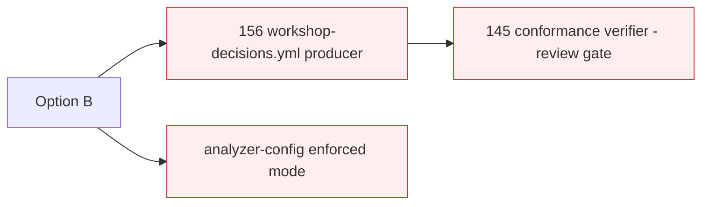
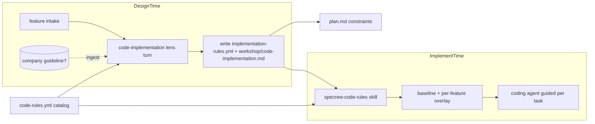

# Design Analysis — Feature 177 / Iteration 001

**Feature**: 177-software-development-rules-lens
**Iteration**: 001
**Date**: 2026-06-10
**Spec**: file:///C:/Dev/Specrew-software-development-rules-lens/specs/177-software-development-rules-lens/spec.md

## Problem Framing

The spec adds a `code-implementation` design lens that captures implementation-craft rules **with the
human at design time** and **actively guides the coding agent at implement time** — the part of the
design space ("how the code is written") that the existing lenses never cover. The intake workshop
co-designed and human-confirmed the architecture and every fork. The design-analysis question is which
**overall delivery shape** to bind before plan, given three binding maintainer rulings: (1) the **full**
feature, not record-only V1; (2) **no Proposal-145** review-time conformance gate / no parallel
code-quality engine; (3) a **guidance skill** is the load-bearing deliverable. Further binding
constraints: self-contained (Proposals 156/162/145 are unshipped on disk → forward-compatible shape
only); reuse the existing design-lens + deploy machinery (no parallel subsystem); multi-host parity;
product-level cadence (decide once, inherit per feature, re-open on new tech/language).

## Key Design Decision Points

1. **Rule home** — the 49 rules + per-stack defaults as a data-driven `code-rules.yml` catalog vs
   prose-only in the lens md. *(Primary fork; compared in Alternatives.)*
2. **Guidance delivery** — one static multi-host guidance skill reading the per-feature manifest
   (baseline + overlay) vs multiple skills vs rules baked into the agent system prompt.
3. **Enforcement posture** — guidance-only (no gate) vs review-time mechanical conformance (145) vs
   analyzer-config enforced mode.
4. **Manifest shape** — reference-by-ID vs embed-text; forward-compat `context_scope` (162) + stable
   rule IDs as the future-156 join key.
5. **Custom rules / company guideline** — guideline-first source-of-truth question, assisted ingestion, and a project overlay (`code-rules.local.yml`).
6. **Deployment** — reuse the existing data-driven deploy engine vs build new fan-out; the
   `Deploy-SpecrewSkill` extraction.
7. **Cadence** — product-baseline once + feature-delta on new tech/language (forward-compat 162).
8. **Tooling / dependency selection research** (added 2026-06-10, maintainer-directed pre-plan) — when implementation may add or choose a library, framework, SDK, CLI, test tool, build tool, or runtime package, the lens presents "use existing project tools / no new dependency" first plus relevant options, captures the structured selection fields (version, license, source org, canonical URL, maintenance signal, security/advisory status, compatibility, cost/quota if relevant, coupling weight, replaceability, test implications), and persists the selected policy into the manifest + skill context. Full coupling-catalog + dependency-report automation stay OUT of scope (compose Proposals 097/122 and a planned 178 later).

## Alternatives

### Option A: Simplest — prose-only, record-only lens

**Approach**: Add the lens md with the 49 rules in prose; the workshop captures chosen rules into
`spec.md` prose; no catalog, no manifest, no guidance skill. (This is essentially Proposal 163's
record-only V1.)
**Architectural pattern**: Prose-in-md, like the other nine lenses.
**Quality features considered**: *(architecture-core)* smallest change; *(requirements-nfr)* fails the
load-bearing outcome — the agent is never *actively guided* at implement time (SC-004); *(ui-ux)* 49
rules in prose is the wall; *(component-design)* no stable rule IDs → drift, no per-feature manifest.
**Effort estimate**: Small (~40% of B).
**Reversibility cost**: Medium — moving prose rules to a data catalog + manifest later reworks the lens
contract and any consumer.
**Trade-offs**:

- (+) Cheapest; pure content.
- (−) Violates the maintainer's full-feature + guidance-skill rulings (no skill, no active guidance).
- (−) No guideline ingestion, no set/unset state, no stable IDs for future 156/145.

**Design principle / why this matters**: under-engineering — Specrew exists to fight vibe-coding; a
prose-only lens that the agent skims reproduces the exact ad-hoc-at-implement problem this feature
removes. Rejected by the full-feature ruling.

**Recommended for**: a throwaway spike, not this feature.

### Option B: Reasonable — data-driven catalog + manifest + one guidance skill (recommended)

**Approach**: A data-driven `code-rules.yml` catalog (49 rules + per-stack, stable IDs, grouped +
scope-tagged) → the workshop writes a per-feature reference-by-ID `implementation-rules.yml` manifest →
one static, multi-host `specrew-code-rules` guidance skill reads the manifest and composes a baseline +
per-feature overlay to guide the agent; guideline-first ingestion + grouped set/unset checklist + custom
rules + project overlay; reuse the existing deploy engine; forward-compat `context_scope` hooks; **no
145 gate**.
**Architectural pattern**: producer (workshop) → artifact (catalog + manifest) → consumer (guidance
skill + plan/implement); content in data, selection per feature, delivery in one skill, only a pointer
in the system prompt.
**Quality features considered**: *(architecture-core)* honors all three rulings + isolates volatile
rules/versions as data (lens rule 7); *(component-design)* catalog / manifest / skill / wiring / tests
are separate units; *(requirements-nfr)* FR-001..FR-012 all have a home; usability(rule-volume) is the
top driver, met by grouping + pre-checked checklist; *(ui-ux)* guideline-first + grouped checklist
solves the wall on both surfaces; *(integration-api)* stable IDs are the future-156 join key, fail-open
everywhere; *(devops-operations)* reuses the deploy engine + the F-176 release checklist.
**Effort estimate**: Medium (baseline) — ~2 iterations.
**Reversibility cost**: Low — additive; forward-compatible with 156/162/145, so Option C is incremental
later.
**Trade-offs**:

- (+) Faithful to the full-feature + no-145 + guidance-skill rulings; self-contained.
- (+) Active implement-time guidance; one source of truth; guideline ingestion; no wall.
- (−) More surface than A (catalog + manifest + skill + ingestion + overlay + wiring + tests).
- (−) Assisted guideline ingestion is agent-reasoning, not a deterministic parser (accepted).

**Design principle / why this matters**: separation of concerns + reversibility + right-sizing — the
exact scope the maintainer ruled, built self-contained and forward-compatible rather than coupling to
unshipped proposals.

**Recommended for**: exactly this feature.

### Option C: By-the-book — full enforcement spine (156 producer + 145 verifier + analyzer mode)

**Approach**: Option B PLUS build the generic Proposal-156 `workshop-decisions.yml` producer + the
Proposal-145 `workshop-decision-conformance.yml` review-time verifier + an analyzer-config enforced mode
that configures and requires each stack's tooling as a gate.
**Architectural pattern**: Option B + a generic decision-conformance spine + a mechanical review gate.
**Quality features considered**: *(architecture-core)* most future-proof; *(requirements-nfr)* no
current SC needs the mechanical gate; *(component-design)* far more surface, pulls in two unshipped
proposals; *(devops-operations)* much larger release + CI risk.
**Effort estimate**: Large (~2-3× B) — far exceeds 2 iterations.
**Reversibility cost**: High — a conformance spine + mechanical gate are entrenched surfaces later work
binds to.
**Trade-offs**:

- (+) Strongest enforcement; the eventual end-state.
- (−) Directly violates the no-145 / no-parallel-engine ruling.
- (−) Pulls in unshipped 156 + 145; speculative; breaks the cap.

**Design principle / why this matters**: YAGNI / right-sizing — enforcement-by-gate is explicitly out
of scope; Option B's stable IDs + forward-compat hooks let C be built later from real dogfood data, at
lower total cost than guessing the conformance contract now.

## Applicable Lenses

Selected at intake (recorded in `lens-applicability.json`): the six workshop lenses. Each `Addressed:`
points into the option comparison above — the discriminator.

- **architecture-core** - `extensions/specrew-speckit/knowledge/design-lenses/architecture-core.md`
  - Decision points: building blocks + responsibilities; volatile areas isolated; binding constraints;
    out of scope; which option balances simplicity/reversibility/future cost.
  - Addressed: building blocks = catalog / manifest / guidance skill / wiring (Option B); volatile
    rules/versions/per-stack isolated as data (lens rule 7); the three rulings + self-containment rule
    out Option A (under-built) and Option C (over-built) — see Crew Recommendation.
- **component-design** - `extensions/specrew-speckit/knowledge/design-lenses/component-design.md`
  - Decision points: responsibilities together vs separate; dependency direction; right abstraction;
    schema decoupling; extension mechanism.
  - Addressed: catalog / producer / per-feature artifacts / consumer skill / wiring / tests are separate
    units; the manifest schema is the decoupling seam; see the Co-Design Record below for the full map.
    The catalog gains a `dependency-selection` decision area and the manifest a `dependency_policy` block
    (FR-013) as additional, cohesive units — no new subsystem.
- **requirements-nfr** - `extensions/specrew-speckit/knowledge/design-lenses/requirements-nfr.md`
  - Decision points: design-driver NFRs; mandatory vs preference; measurable thresholds; acceptance
    beyond the happy path.
  - Addressed: usability(rule-volume) > maintainability/forward-compat > multi-host parity > testability
    (FR/SC mapping in spec); SC-004 + SC-007 are dogfood-validated, not file-presence. Option C rejected
    NFR-wise (no SC needs the mechanical gate). FR-013/SC-008 add the tooling/dependency-selection
    decision area (default-first "use existing / no new dependency" + structured capture).
- **ui-ux** - `extensions/specrew-speckit/knowledge/design-lenses/ui-ux.md`
  - Decision points: source of truth; primary flows; states; what belongs where.
  - Addressed: guideline-first source-of-truth (FR-010) + assisted ingestion (FR-011) + grouped
    pre-checked set/unset checklist (FR-003/FR-009) + custom rules (FR-012) solve the wall on the human
    surface; the agent surface = baseline + task-scoped + overlay.
- **integration-api** - `extensions/specrew-speckit/knowledge/design-lenses/integration-api.md`
  - Decision points: contract owner + versioning; sync/async; idempotency; compatibility.
  - Addressed: catalog + overlay + manifest contracts; stable rule IDs = future-156 join key;
    fail-open everywhere; always-applicable-for-code-features. The manifest gains a `dependency_policy`
    block (FR-013) — the captured dependency fields are part of the manifest contract; full
    coupling/dependency-report automation (097/122/178) is a separate future contract, out of scope.
- **devops-operations** - `extensions/specrew-speckit/knowledge/design-lenses/devops-operations.md`
  - Decision points: what ships where; deploy path; multi-surface sync; CI vs runtime validation.
  - Addressed: ships with the module (FileList + `.specify/` mirror) + deploys to host skill dirs via
    the engine (parity test); minor bump 0.34.0 → 0.35.0, beta-before-stable; real validation = dogfood.

*Not selected: data-storage (manifest is a contract under integration-api), security-compliance
(feature has no auth/secrets/PII surface; secure-coding rules are lens content), observability-resilience
(no runtime telemetry).*

## Crew Recommendation

**Recommended: Option B.**

Option B is the exact scope the maintainer ruled — the full feature (catalog + manifest + guidance
skill + guideline ingestion + overlay + wiring), built self-contained and forward-compatible, with **no
145 mechanical gate**. Option A (record-only prose) under-builds: it violates the full-feature and
guidance-skill rulings and reproduces the ad-hoc-at-implement problem this feature removes. Option C
(full enforcement spine) over-builds: it directly violates the no-145 / no-parallel-engine ruling, pulls
in unshipped Proposals 156 + 145, and breaks the iteration cap — and Option B's stable rule IDs +
`context_scope` hooks let C be added later from real dogfood data at lower total cost. The supporting
decisions (DP2 one static guidance skill; DP3 guidance-only posture; DP4 reference-by-ID +
forward-compat; DP5 guideline-first + ingestion + overlay; DP6 reuse the deploy engine + file the
`Deploy-SpecrewSkill` extraction as a sibling; DP7 product-baseline-then-feature-delta cadence) are all
human-confirmed in the intake workshop (`lens-applicability.json`). Option B also absorbs the
tooling/dependency-selection decision area (DP8/FR-013) — design-time human selection with structured
capture persisted to the manifest, default-first "use existing project tools / no new dependency" — while
the full coupling-catalog and dependency-report automation stay OUT of scope (Option C territory; compose
Proposals 097 + 122 + a planned 178 later). This keeps the feature self-contained and right-sized.

## Human Decision

- **Decision verdict**: approved for plan with Option B
- **Chosen option**: Option B (data-driven catalog + per-feature manifest + one static guidance skill;
  full feature, self-contained, no 145 gate)
- **Reason**: the maintainer selected verdict 1 ("approve for plan with Option B"). Option B is the exact
  ruled scope — the full feature with active implement-time guidance, built self-contained and
  forward-compatible. Option A under-builds (violates the full-feature + guidance-skill rulings); Option C
  over-builds (violates the no-145 / no-parallel-engine ruling and pulls in unshipped 156/145).
- **Modifications**: carry **FR-013** (Tooling / Dependency Selection Research, added pre-plan) with the
  capture-field set as listed, and the **~2-iteration split** into planning. i1 = catalog, manifest
  schema, lens md, registration, dependency-selection area; i2 = guidance skill, guideline ingestion,
  overlay, plan/implement wiring, tests.
- **Design-analysis draft commit**: `4b67fb88`
- **Decision recorded in commit**: the `boundary(design-analysis): record Human Decision Option B` commit
  that contains this populated decision (created at this verdict).

## Co-Design Record

**Decomposition method (agreed at intake)**: Specrew content-extension decomposition by build area
(catalog data/knowledge → workshop producer → per-feature artifacts → consumer guidance skill → plan/
implement wiring → tests), per the human-confirmed component map.

**Component-to-responsibility map** (human-confirmed at the intake component-design lens, 2026-06-10):

- `code-rules.yml` (catalog) — the 49 rules + per-stack defaults, each `id` / `group` / `scope` /
  applicability / default / enforcement-mode; single source of truth.
- `code-implementation.md` (lens md) — decision spine + per-stack dilemmas + run-cadence + conduct;
  references the catalog (not prose-duplicated).
- `implementation-rules.schema.json` — schema for the per-feature manifest.
- Registration (`index.yml` + `applicability-map.json` + design-workshop lens map + `$lensIds`) — makes
  the lens discoverable + selectable.
- `specrew-design-workshop` skill (updated) — runs the code lens turn (guideline-first, grouped
  checklist, capture); writes the manifest.
- `implementation-rules.yml` + `workshop/code-implementation.md` (per-feature artifacts) — the selected
  rules + decisions + custom rules + provenance + `context_scope`.
- `code-rules.local.yml` (project overlay) — the ingested company guideline + reusable custom rules
  (product-baseline tier).
- `specrew-code-rules` skill (NEW, static, multi-host) — resolves the active feature, reads the manifest
  at the known location, composes baseline + overlay to guide the agent.
- Wiring — `plan.md` converts selected rules to implement constraints; Implementer charter/coordinator
  carries a thin pointer to the skill.
- Dependency-selection (FR-013) — the catalog gains a `dependency-selection` decision area (trigger +
  default-first "use existing / no new dependency" + the capture-field set); the manifest gains a
  `dependency_policy` block; the guidance skill surfaces the policy so the agent honors it (no silent
  dependency adds). Full coupling-catalog + dependency-report automation are out of scope (097/122/178).
- Tests — registration, catalog integrity (unique/stable IDs, schema-valid), manifest schema,
  guidance-skill multi-host parity, workshop-writes-manifest, baseline+overlay composition, and the
  dependency-selection capture + persistence.

**Agreed key flows** (the design-time capture flow + the implement-time guidance flow):

- **Human-agreed**: yes — the component-to-responsibility map and both flows were co-designed and
  human-confirmed at the intake workshop (component-design + architecture-core lenses, 2026-06-10,
  `lens-applicability.json`); reaffirmed at the design-analysis verdict. The tooling/dependency-selection
  decision area (DP8/FR-013) was added at the maintainer's explicit pre-plan direction (2026-06-10) and
  is part of this co-design.

**Plan-stage additions (2026-06-10, human-directed, minor — no architecture change):** (1) the
source-of-truth (DP5/FR-010/FR-011) extends to **example projects** (GitHub/local/other), ingested by
example with provenance `from-example-project`; (2) three catalog rules added (FR-002): Strategy/State
over repeated conditionals, polymorphism-mechanism choice (functional vs inheritance/interfaces), and
SOLID as a baseline (composing with the existing OCP/DI rules). Catalog content + ingestion sources only;
Option B and the 2-iteration split stand.
