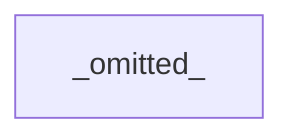
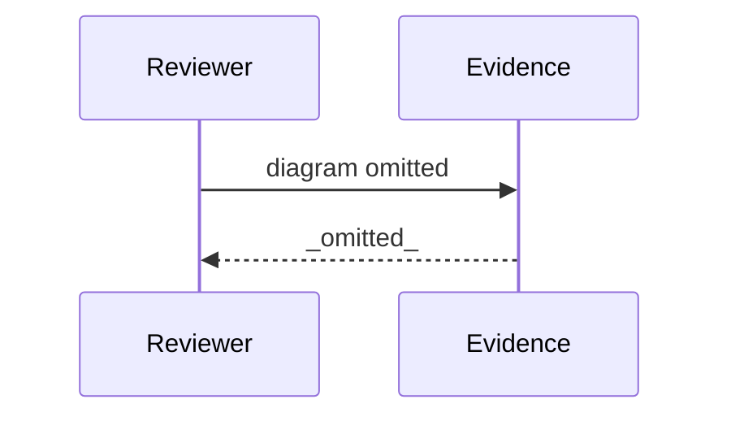

# Review Diagrams: Iteration 002

**Schema**: v1
**Diagram Format**: mermaid

> **⚠️ Review Evidence Warning** _(Form-vs-Meaning Gap Detected)_
>
> This iteration's task tracking declares **9 completed task(s)**, but the git diff against baseline `96ded099a4e29db56c8e26de441af9da13896db4` contains **26 file(s)**.
>
> **Severity**: WARNING  
> **Implication**: Review evidence may be incomplete or misleading.
>
> **Possible causes**:
>
> - Implementation work was not committed before scaffolding review artifacts
> - Task status markers in plan.md or review.md do not match actual progress
> - Baseline reference in state.md is stale or incorrect
>
> **Remediation**:
>
> 1. Verify implementation is committed: `git diff 96ded099a4e29db56c8e26de441af9da13896db4...HEAD --stat`
> 2. If uncommitted work exists: `git add . && git commit -m "Implementation complete"`
> 3. Re-run scaffolder with `-Force` flag to regenerate review artifacts after commit
> 4. Re-run `validate-governance.ps1` to clear pre-review commit gate error
>
> _See Proposal 073 (Review Evidence Integrity) for background on this validation._
>
> **Reviewed + JUSTIFIED as benign (see review.md Notes)**: all 26 files are committed (96ded099..da7a0129); one task legitimately touches many files (the conduct turn updates the template + 4 deployed host copies + 4 `.specify` mirrors; release-prep touches the FileList + version triple + CHANGELOG). No uncommitted or unexplained source change; do NOT re-run with `-Force` (known ShouldProcess defect).

---

## Structure Diagram

## Flow Diagram

## Omissions

- Structure diagram omitted: modules touched (1) below threshold (3).
- Flow diagram omitted: entrypoints changed (0) below threshold (1).

## Local View Hints

- specs\177-software-development-rules-lens\iterations\002\review-diagrams.md
