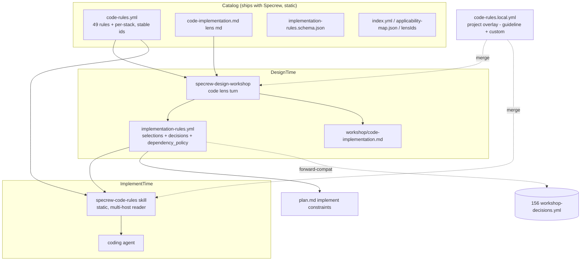
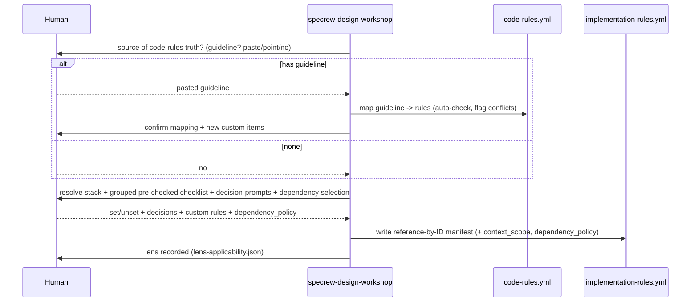
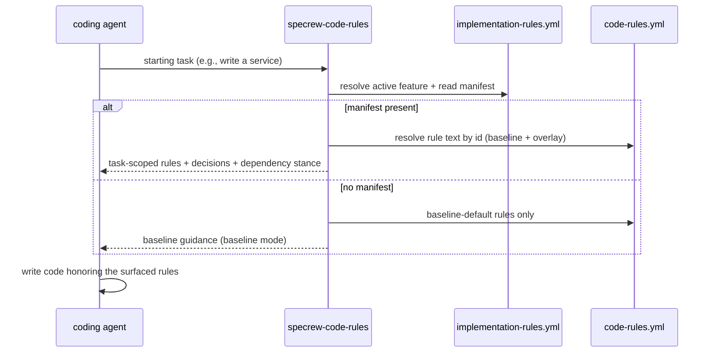

# Review Diagrams: Code & Implementation Lens

**Feature**: 177-software-development-rules-lens
**Phase**: pre-implementation (planning artifact for the reviewer)

## Component diagram

## Sequence: design-time capture (guideline-first)

## Sequence: implement-time guidance

