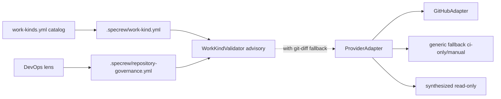
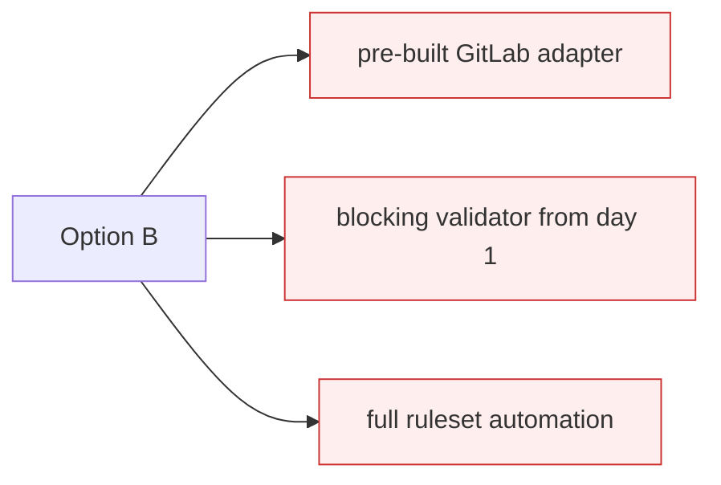
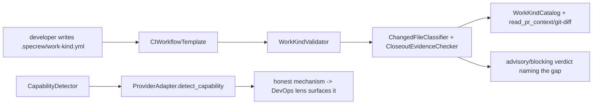

# Design Analysis — Feature 182 / Iteration 001

**Feature**: 182-work-kind-branch-governance
**Iteration**: 001
**Date**: 2026-06-11
**Spec**: file:///C:/tmp/Specrew-work-kind-branch-governance/specs/182-work-kind-branch-governance/spec.md

## Problem Framing

Specrew treats feature delivery, release validation, docs changes, and DevOps changes as one
lifecycle shape, so post-merge findings reopen merged features (unsafe on a protected release branch)
and trivial changes carry full-feature ceremony. The intake workshop (product-domain + 7 technical
lenses + code-implementation, recorded in `lens-applicability.json` + `workshop/`) co-designed and
human-confirmed the architecture and every fork — including three maintainer-directed expansions:
(1) a **provider-neutral core + pluggable `ProviderAdapter`** (no forge coupling for downstream
projects); (2) a user-configurable **`branch_model`** (branch names + branching method) and a
**`review_gate`**; and (3) **forge-neutralization** of all downstream-governing surfaces, without
changing Specrew's own GitHub usage. The design-analysis question is which **overall delivery shape**
to bind before plan, given those binding decisions: synthesize-don't-pre-build forge adapters,
advisory-default honest enforcement, project-level governance capture, brownfield adapt-or-change.

## Key Design Decision Points

1. **Decomposition** — data-driven catalog + thin validators + methodology surfaces (layered/modular)
   vs prose-only or a parallel subsystem. *(Primary fork; compared in Alternatives.)*
2. **Forge coupling** — provider-neutral core + pluggable `ProviderAdapter` (GitHub reference + generic
   fallback + on-the-fly read-only synthesis) vs GitHub-coupled vs pre-built multi-forge adapters.
3. **Lifecycle truth** — feature-closeout pre-merge + a separate release-validation-record + post-merge
   finding routes to a new work item (never reopen).
4. **Enforcement posture** — advisory by default, phased to blocking, with honest capability reporting,
   vs blocking-from-the-start vs documentation-only.
5. **Branch model / review gate** — user-configurable `branch_model` + `review_gate` (opt-in automated
   review) vs a fixed `main`-only single-branch assumption.
6. **Declaration mechanism** — `.specrew/work-kind.yml` authoritative + branch-prefix hint vs PR labels
   (rejected — forge-coupled).
7. **Brownfield + project-level capture** — detect existing CI/CD + protection, adapt-or-change, capture
   project-level `.specrew/repository-governance.yml` vs greenfield-only imposition.
8. **Forge-neutralization scope** — bounded migration of downstream-governing surfaces + an inventory vs
   chase-every-reference vs no decouple.

## Alternatives

### Option A: Simplest — methodology + adapter contract only

**Approach**: Ship the work-kind taxonomy + lifecycle surfaces + DevOps-lens governance + the
`ProviderAdapter` *contract* only, all advisory/documentation; defer the CI validator, capability
detection, synthesis, and the forge-neutralization migration to follow-up features.
**Architectural pattern**: methodology surfaces + a contract stub; no runtime.
**Quality features considered**: *(architecture-core)* smallest change; *(requirements-nfr)* the runtime
value US4/US5 slips entirely; *(devops-operations)* no enforcement layer; *(security-compliance)* no
apply_protection/audit surface yet.
**Effort estimate**: Small (~35% of B).
**Reversibility cost**: Medium — adding the runtime later reworks the validator/detector seams.
**Trade-offs**:

- (+) Fastest, lowest-risk, immediately usable; nothing to over-claim.
- (−) Does NOT deliver the full proposal the maintainer approved.
- (−) No automated enforcement, capability detection, synthesis, or decouple.

**Design principle / why this matters**: under-delivery — the proposal's load-bearing value is the
runtime layer + the forge-neutralization; a methodology-only slice reproduces the manual gap. Rejected
by the full-scope direction.

**Recommended for**: a methodology-first spike, not this feature.


### Option B: Reasonable — the co-designed 3-iteration plan (recommended)

**Approach**: Iter 1 methodology + adapter contract/fallback + audit/inventory + brownfield content;
Iter 2 runtime validator + capability detection + on-the-fly synthesis + dogfood; Iter 3
forge-neutralization decouple migration. Provider-neutral core; advisory default; honest capability;
synthesize-don't-pre-build; no change to Specrew's own GitHub usage.
**Architectural pattern**: data-driven catalog → declaration → enforcement spine, with the
`ProviderAdapter` as the only forge seam; defense-in-depth (methodology / CI semantic / branch
protection) delivered incrementally.
**Quality features considered**: *(architecture-core)* honors all confirmed decisions + isolates the
forge specifics behind the adapter (DP-A4); *(component-design)* catalog / surfaces / validators /
adapters / wiring are separate units; *(requirements-nfr)* FR-001..FR-021 all have a home, NFR #1
forge-neutrality is proven on a non-GitHub run; *(integration-api)* the declaration + adapter + catalog
contracts carry schema_version + stable IDs, fail-open; *(security-compliance)* apply_protection
human-gated, read-only synthesized adapters, no secrets, bypass audit; *(devops-operations)* the
F-176/177 release discipline + the project-level governance capture; *(ui-ux)* gap-naming validator
output + honest capability report.
**Effort estimate**: Medium (baseline) — ~16–24 SP across 3 iterations.
**Reversibility cost**: Low — additive; the declaration contract + catalog schema are isolated as
versioned data; Option C is incremental later.
**Trade-offs**:

- (+) Delivers exactly the approved scope; each iteration is independently valuable.
- (+) Forge-neutral by construction; honest phased enforcement; brownfield-safe.
- (−) The largest commitment; the Iter-3 migration carries the most uncertainty.
- (−) Bounded by making the coupling inventory an Iter-1 deliverable + a split-to-sibling escape hatch.

**Design principle / why this matters**: separation of concerns + reversibility + honesty — exactly the
scope the maintainer ruled, built provider-neutral and forward-compatible rather than coupling to a
single forge or over-claiming enforcement.

**Recommended for**: exactly this feature.



### Option C: By-the-book — maximal upfront enforcement

**Approach**: Option B PLUS a pre-built second forge adapter (e.g. GitLab) in v1, a blocking-from-the-
start validator on Specrew's own repo, and full ruleset-enforcement automation.
**Architectural pattern**: Option B + pre-built multi-forge adapters + a hard mechanical merge gate.
**Quality features considered**: *(architecture-core)* most enforcement; *(requirements-nfr)* no SC needs
blocking-now or a pre-built second adapter; *(security-compliance)* a freshly-built adapter applying
protection contradicts the read-only-by-default safety rule; *(devops-operations)* much larger
release/CI risk.
**Effort estimate**: Large (~2× B) — far exceeds the cap.
**Reversibility cost**: High — pre-built adapters + a blocking gate are entrenched surfaces later work
binds to.
**Trade-offs**:

- (+) Strongest enforcement; two proven adapters.
- (−) Directly contradicts confirmed maintainer decisions (synthesize-don't-pre-build, advisory-default,
  read-only synthesized adapters).
- (−) Over-built relative to the validated need; breaks the cap.

**Design principle / why this matters**: YAGNI / right-sizing — synthesis + advisory-default let C be
built later from real dogfood data at lower total cost than guessing now.



## Applicable Lenses

Selected at intake (recorded in `lens-applicability.json`): the seven workshop lenses. Each `Addressed:`
points into the option comparison above — the discriminator.

- **architecture-core** - `extensions/specrew-speckit/knowledge/design-lenses/architecture-core.md`
  - Decision points: decomposition style; building blocks + responsibilities; volatile areas isolated;
    binding constraints; out of scope; which option balances simplicity/reversibility/future cost.
  - Addressed: data-driven catalog + thin validators + methodology surfaces (Option B); forge specifics
    isolated behind the `ProviderAdapter` (DP-A4); the declaration contract + catalog schema are the
    hardest-to-reverse, isolated as versioned data (DP-A6); Option A under-builds the runtime, Option C
    over-builds — see Crew Recommendation.
- **devops-operations** - `extensions/specrew-speckit/knowledge/design-lenses/devops-operations.md`
  - Decision points: enforcement layering; the governance question set; branch model; capture location;
    single/multi-repo; CI lane; review gate; ship discipline.
  - Addressed: defense-in-depth (methodology / advisory CI / branch protection) in Option B; a
    user-configurable `branch_model` + `review_gate`; project-level `.specrew/repository-governance.yml`;
    advisory provider-neutral CI check; the F-176/177 release discipline. Option A drops the CI lane;
    Option C makes it blocking-from-day-1 (rejected).
- **integration-api** - `extensions/specrew-speckit/knowledge/design-lenses/integration-api.md`
  - Decision points: contract owner + versioning; declaration mechanism; sync/async; compatibility;
    fail-open.
  - Addressed: `.specrew/work-kind.yml` authoritative + branch-prefix hint (FR-009; PR labels rejected as
    forge-coupled); the `ProviderAdapter` contract + the catalog/governance schemas carry schema_version
    + stable IDs; fail-open + WARN everywhere; the validator runs with no adapter via git-diff. Option C's
    pre-built adapters add contract surface with no SC need.
- **component-design** - `extensions/specrew-speckit/knowledge/design-lenses/component-design.md`
  - Decision points: responsibilities together vs separate; dependency direction; the right abstraction;
    the two key flows; iteration assignment.
  - Addressed: the 17-component map (catalog / surfaces / validators / provider-seam / wiring) with
    dependency direction inward to the catalog; the declare→validate and detect→report flows; per-component
    iteration assignment (Option B's incremental split). See the Co-Design Record below for the full map.
- **security-compliance** - `extensions/specrew-speckit/knowledge/design-lenses/security-compliance.md`
  - Decision points: authorization model; privileged-action safety; synthesized-adapter trust; bypass
    audit; secrets/least-privilege; validator confinement.
  - Addressed: Specrew captures, the forge enforces (secure-by-default); `apply_protection` human-gated +
    never from an unverified synthesized adapter; read-only synthesized adapters; durable bypass audit
    (FR-011); least-privilege scopes + no Specrew-held secret; fail-open confined validator + denial-path
    tests. Option C's freshly-built adapter applying protection contradicts this — rejected.
- **requirements-nfr** - `extensions/specrew-speckit/knowledge/design-lenses/requirements-nfr.md`
  - Decision points: design-driver NFRs; mandatory vs preference; measurable thresholds; acceptance
    beyond the happy path; iteration split.
  - Addressed: NFR priority forge-neutrality > honesty > safety > maintainability > brownfield/fail-open >
    multi-host (performance a non-driver); SC-008/SC-010/SC-013/SC-014 are runtime/dogfood-validated, not
    file-presence; the FR/SC→iteration map matches Option B's 3-iteration split. Option A fails NFR #1's
    runtime proof; Option C adds no NFR-required capability.
- **ui-ux** - `extensions/specrew-speckit/knowledge/design-lenses/ui-ux.md`
  - Decision points: validator output UX; capability/brownfield report UX; declaration template shape.
  - Addressed: validator output names the exact gap + allowed scope + fix + advisory/blocking label
    (SC-005); honest capability report, describe-only by default; brownfield adapt-or-change prompt; a
    short commented `.specrew/work-kind.yml`. Delivered in Option B's runtime; absent in Option A.

*Not selected: data-storage (the capture schemas are contracts under integration-api/component-design),
observability-resilience (the bypass audit is under security-compliance; honest reporting under
requirements-nfr; no runtime telemetry surface).*

## Crew Recommendation

**Recommended: Option B.**

Option B is the exact scope the maintainer approved — the full proposal (work-kind taxonomy + lifecycle
surfaces + DevOps-lens governance with a configurable `branch_model` + `review_gate` + the
closeout-vs-release-validation invariant + a provider-neutral core + pluggable `ProviderAdapter` +
runtime validator + capability detection + on-the-fly read-only synthesis + brownfield adapt-or-change +
the forge-neutralization decouple) — built across three iterations, provider-neutral and forward-
compatible, honoring every workshop decision (synthesize-don't-pre-build, advisory-default honesty,
no change to Specrew's own GitHub usage). Option A under-builds: it ships only the methodology + a
contract stub and drops the load-bearing runtime + decouple value. Option C over-builds: it pre-builds a
second forge adapter, makes the validator blocking-from-day-1, and adds full ruleset automation — all of
which contradict confirmed decisions and break the cap; Option B's stable IDs + advisory-default let C be
added later from real dogfood data at lower total cost. The Iter-3 decouple risk is bounded by making the
precise coupling inventory an Iter-1 deliverable and keeping the split-to-sibling escape hatch.

## Human Decision

- **Decision verdict**: approved for plan with Option B
- **Chosen option**: Option B (the co-designed 3-iteration plan)
- **Reason**: the maintainer selected verdict 1 ("approved for plan with Option B"), no modifications.
  Option B delivers exactly the approved scope and honors every workshop decision; Option A under-builds
  (drops the runtime + decouple); Option C over-builds (pre-built adapters, blocking-from-day-1, full
  ruleset automation contradict confirmed decisions).
- **Modifications**: none. The 3-iteration split + the split-to-sibling escape hatch for Iter-3 carry
  into planning.
- **Authorizing human**: Alon Fliess
- **Date**: 2026-06-11
- **Design-analysis draft commit**: `5923c28b`
- **Decision recorded in commit**: `51edae93` (the `boundary(design-analysis): record Human Decision —
  approved for plan with Option B` commit that contains this populated decision).

## Co-Design Record

**Decomposition method (agreed at intake)**: data-driven catalog + thin validators + methodology
surfaces (layered/modular), per the human-confirmed component map.

**Component-to-responsibility map** (human-confirmed at the intake component-design lens, 2026-06-11):

```text
                    ┌─────────────────────────── WIRING ───────────────────────────┐
                    │ CIWorkflowTemplate (GH Actions v1)   ForgeNeutralizationMigration (Iter 3) │
                    └───────────────┬───────────────────────────────┬───────────────┘
             ┌──────────────────────▼──────────┐          ┌─────────▼────────────────────────┐
             │      VALIDATORS (forge-neutral)  │          │     METHODOLOGY SURFACES          │
             │ WorkKindValidator                │          │ DevOpsLensContent                 │
             │  + ChangedFileClassifier         │          │ DocsOnlyLifecycle                 │
             │  + CloseoutEvidenceChecker       │          │ DevOpsLifecycle                   │
             └───────┬──────────────┬───────────┘          │ CloseoutVsReleaseInvariant        │
                     │ reads        │ uses (with fallback) │ WorkKindTaxonomyDoc               │
                     │     ┌─────────▼───────────────┐      └────────┬──────────────────────────┘
                     │     │     PROVIDER SEAM        │◀─────────────┘ describe/synthesize
                     │     │ ProviderAdapterContract  │
                     │     │  + GitHubAdapter         │
                     │     │  + GenericFallbackAdapter │
                     │     │  + CapabilityDetector     │
                     │     │  + AdapterSynthesisConduct│
                     ▼     └───────────┬──────────────┘
             ┌───────────────────────────────────────────────────┐
             │            CATALOG & CONTRACTS (data)              │ ◀── everything depends inward
             │ WorkKindCatalog · CatalogSchema ·                  │
             │ WorkKindDeclaration · RepositoryGovernance         │
             └───────────────────────────────────────────────────┘
```

Components + responsibilities (one line each): **WorkKindCatalog** — 4 kinds × lifecycle weight +
required-evidence + allowed scope. **CatalogSchema** — validates catalog + declaration.
**WorkKindDeclaration** — declared kind + metadata. **RepositoryGovernance** — `branch_model` +
`review_gate` + `multi_repo`. **DevOpsLensContent** — governance questions + synthesis conduct.
**DocsOnlyLifecycle** / **DevOpsLifecycle** — lightweight lifecycle surfaces. **CloseoutVsReleaseInvariant**
— invariant doc + release-validation-record template. **WorkKindTaxonomyDoc** — catalog companion.
**WorkKindValidator** — PR checks → advisory/blocking verdict naming the gap. **ChangedFileClassifier** —
changed files → allowed scope (allow-list for global/generated). **CloseoutEvidenceChecker** — required
evidence / no open boundary. **ProviderAdapterContract** — the forge seam. **GitHubAdapter** — reference.
**GenericFallbackAdapter** — ci-only/manual + git-diff. **CapabilityDetector** — honest mechanism.
**AdapterSynthesisConduct** — on-the-fly, read-only by default. **CIWorkflowTemplate** — GH Actions
wrapper. **ForgeNeutralizationMigration** — Iter-3 decouple.

**Agreed key flows**:



**Agreed UI layout (human-approved at the ui-ux lens, 2026-06-11)** — the text/CLI surface: validator
output names the exact gap + allowed scope + fix + advisory/blocking label; the capability report is
honest + describe-only by default; the brownfield prompt offers adapt-or-change. Full layout in
file:///C:/tmp/Specrew-work-kind-branch-governance/specs/182-work-kind-branch-governance/workshop/ui-ux.md

```text
[work-kind] PR declares work_kind: docs-only
  x changed-file scope: <file> outside docs-only scope
     docs-only allows: **/*.md, docs/**, proposals/**, CHANGELOG.md
     -> reclassify to software-feature/devops, OR split the change
  verdict: ADVISORY-FAIL (1 issue) — not blocking (phased: advisory mode)
```

- **Human-agreed**: yes — the component-to-responsibility map, both flows, AND the UI layout above were
  co-designed and human-confirmed at the intake workshop (component-design "Approve the map" +
  architecture-core "Confirm all" + ui-ux "Confirm", 2026-06-11, `lens-applicability.json`); reaffirmed
  at the design-analysis verdict (`approved for plan with Option B`).
