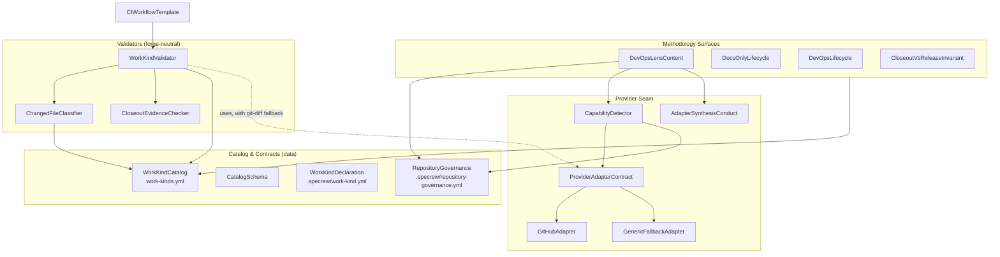
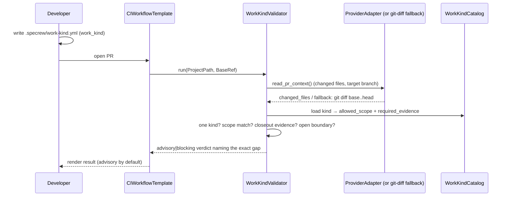

# Review Diagrams: Work Kind and Branch Governance Model

**Feature**: 182-work-kind-branch-governance
**Phase**: pre-implementation (planning artifact for reviewer)

## Component diagram



## Sequence: declare → validate (the canonical PR flow)



## Sequence: detect → report (honest capability)

```mermaid
sequenceDiagram
  participant Lens as DevOpsLensContent
  participant Cap as CapabilityDetector
  participant A as ProviderAdapter
  Lens->>Cap: detect(ProjectPath)
  Cap->>A: detect_capability(ctx)
  alt GitHub adapter present
    A-->>Cap: { mechanism: branch-protection|rulesets, constraints }
  else no/unknown adapter
    A-->>Cap: { mechanism: ci-only|manual }
  end
  Cap-->>Lens: honest mechanism + constraints (never over-promise)
  Lens->>Lens: describe-only by default; apply_protection needs human approval
```
