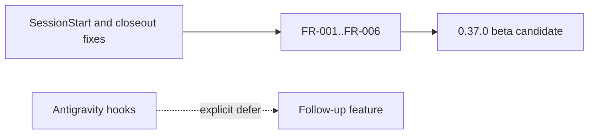
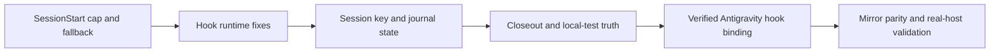
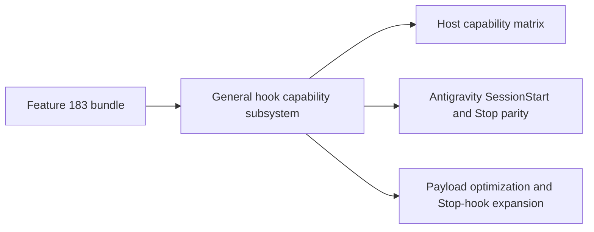
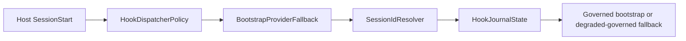

# Design Analysis: Stability and Quality Bundle (Iteration 001)

**Feature**: 183-stability-quality-bundle
**Date**: 2026-06-16
**Boundary**: design-analysis (pre-plan)
**Spec**: file:///C:/Dev/183-stability-quality-bundle/specs/183-stability-quality-bundle/spec.md
**Builds on**: the specify workshop records at file:///C:/Dev/183-stability-quality-bundle/specs/183-stability-quality-bundle/workshop/

## Problem Framing

Feature 183 is a focused stability and quality bundle for the post-F-174
hook-driven bootstrap path. The work must preserve SessionStart governance under
cap and provider-failure conditions, stop session state from collapsing under
global `unknown`, make closeout/test evidence trustworthy, add verified
Antigravity hook support after the Antigravity hook-surface amendment, and keep
source-to-deployed mirror parity. The design-analysis question is not whether to
solve the seven FRs; the clarify boundary already accepted them. The decision is
the delivery shape that fits the 20 SP cap without over-claiming Antigravity
parity or silently dropping scope.

## Key Design Decision Points

1. **Delivery shape**: one bounded stability iteration vs split core/Antigravity
   iterations vs a broader hook-platform refactor.
2. **Decomposition**: vertical bug-bash slices with shared helper seams vs a new
   generic hook abstraction.
3. **Antigravity support posture**: verified subset with fallback vs claiming
   full host parity up front.
4. **Capacity handling**: fit all seven FRs under 20 SP or force an explicit
   split/defer decision.
5. **Evidence bar**: deterministic Pester tests plus mirror parity and real-host
   validation, not file-presence-only proof.
6. **Release discipline**: dynamic `0.37.0-beta<N>` selection only after tag and
   published-state inspection.

## Alternatives

### Option A - Simplest: core stability only, defer Antigravity

**Approach**: Ship FR-001 through FR-006 now and explicitly defer FR-007
Antigravity hook support to a follow-up feature.

**Architectural pattern**: vertical bug-bash fixes on existing Specrew runtime
surfaces; no host registry/hook-capability expansion.

**Quality features considered**: strongest for SessionStart delivery, provider
fallback, session-key state, closeout truth, and local test hygiene; weakest for
host-support correctness because it preserves the known stale Antigravity
no-hooks assumption until later.

**Estimated effort**: 14-15 SP.

**Reversibility cost**: Medium. It is easy to add FR-007 later, but user-facing
docs and host-support messaging remain wrong in the interim.

**Trade-offs**:

- (+) Lowest implementation risk and leaves contingency under the 20 SP cap.
- (+) Keeps Antigravity research/real-host validation out of the critical path.
- (-) Contradicts the clarify amendment that added FR-007 after upstream hook
  evidence was found.
- (-) Requires explicit human-approved deferral before planning can proceed.

**Recommended for**: a schedule-driven beta where Antigravity cannot be verified
before release.

**Diagram**:



### Option B - Reasonable: one bounded seven-FR stability iteration

**Approach**: Deliver FR-001 through FR-007 in one iteration by keeping each FR
as a small vertical slice, adding Antigravity only through verified hook bindings
and project-scoped `.agents/hooks.json`, and preserving `specrew start --host
antigravity` as the fallback when event/output behavior is unverified.

**Architectural pattern**: modular vertical slices over existing Specrew
components. Shared seams are small and local: cap policy, fallback text,
session-key resolution, closeout classification, dashboard refresh, test
fixtures, mirror parity, and an Antigravity-specific hook config/event adapter.
No new runtime dependency or broad host-platform rewrite.

**Quality features considered**: satisfies all FRs and SCs; keeps untrusted host
payload validation and config-preservation controls explicit; makes partial
Antigravity support observable instead of binary; retains deterministic tests and
real-host validation as separate evidence classes.

**Estimated effort**: 20 SP exactly.

**Reversibility cost**: Low to medium. Each slice is isolated enough to tune or
back out, and Antigravity parity claims remain gated by verified behavior. The
risk is that Antigravity schema/output verification could expose more work than
the cap allows.

**Trade-offs**:

- (+) Delivers the approved seven-FR scope without a follow-up split.
- (+) Keeps the old Antigravity-no-hooks claim from surviving another beta.
- (+) Preserves the bug-bash conduct per item while still shipping one coherent
  software-feature release slice.
- (-) No slack remains under the 20 SP cap.
- (-) Requires a hard planning guard: if Antigravity verification expands beyond
  the adapter/config/doc slice, FR-007 must split rather than consuming hidden
  capacity.

**Recommended for**: this feature, with the split guard recorded in the plan.

**Diagram**:



### Option C - By the book: hook-platform hardening plus Antigravity parity

**Approach**: Treat FR-007 as the start of a general hook-platform refactor:
generalize provider/event schemas across all hosts, add a richer capability
matrix, normalize status and docs around host-specific hook semantics, and aim
for full Antigravity direct-launch and stop/handover parity in the same feature.

**Architectural pattern**: broader host-hook capability subsystem with more
contract surface than Feature 183 strictly needs.

**Quality features considered**: strongest long-term host model and parity
documentation, but it expands beyond the accepted stability bundle and risks
pulling in Proposal 191/168-style payload and Stop-hook work through the side
door.

**Estimated effort**: 28-35 SP across at least two iterations.

**Reversibility cost**: High. A generalized hook-platform contract becomes a
public design surface and is expensive to reshape after release.

**Trade-offs**:

- (+) Better long-term host capability architecture.
- (+) Fewer one-off Antigravity branches later.
- (-) Exceeds the 20 SP cap.
- (-) Expands beyond the governed Feature 183 scope.
- (-) Risks claiming parity before real-host behavior proves it.

**Recommended for**: a later host-hook platform feature, not this stability
bundle.

**Diagram**:



## Crew Recommendation

**Recommended: Option B.**

Option B is the only option that matches the clarified seven-FR scope, keeps the
20 SP cap honest, and avoids both under-delivery (Option A) and platform
overreach (Option C). The plan should carry an explicit capacity guard: if
official Antigravity schema/event/output verification exposes more than the
bounded adapter/config/docs/test work, pause for a human split/defer decision
rather than increasing capacity or silently weakening other FRs.

## Capacity Model

Inputs:

- Capacity: 20 story_points.
- Overcommit threshold: 1.0.
- Role owners: Spec Steward, Planner, Implementer, Reviewer.
- Requirement set: FR-001 through FR-007 plus TG/LIR/SC evidence obligations.

Plan-ready effort model for Option B:

| Slice | Requirements | Owner | Effort |
| --- | --- | --- | ---: |
| SessionStart cap policy and provider fallback | FR-001, FR-002, SC-001, SC-002 | Implementer | 4.0 |
| Delivery-cap hermetic fixture | FR-004, SC-004 | Implementer, Reviewer | 2.0 |
| Session ID resolver and journal state | FR-003, SC-003 | Implementer | 3.0 |
| Closeout classification, upstream wording, dashboard refresh | FR-005, SC-005 | Implementer | 4.0 |
| #1761 mechanical test hygiene | FR-006, SC-006 | Implementer, Reviewer | 2.0 |
| Antigravity hook binding, config merge, docs cleanup, verified-event tests | FR-007, SC-009, TG-004 | Implementer, Reviewer | 4.0 |
| Mirror/release readiness evidence and integration pass | SC-007, SC-008, TG-003, TG-005 | Reviewer, Spec Steward | 1.0 |
| **Total** |  |  | **20.0** |

Phase baseline:

| Phase | Effort |
| --- | ---: |
| Planning and artifact authoring | 2.0 |
| Discovery/spikes | 1.0 |
| Implementation | 13.0 |
| Review and deterministic validation | 3.0 |
| Expected rework | 1.0 |
| **Total** | **20.0** |

Capacity status: **warn, but within cap**. Option B consumes the full cap. The
only acceptable expansion path is a human-approved split/defer, with FR-007 as
the first explicit split candidate if Antigravity verification grows beyond the
bounded adapter work.

## Component Map

```text
--------------------------------------------------------------------------------+
| Feature 183: Stability and Quality Bundle                                      |
+--------------------------------------------------------------------------------+
        |
        +--> SessionStart Delivery
        |      HookDispatcherPolicy
        |      BootstrapProviderFallback
        |      DirectiveDeliveryCapFixture
        |
        +--> Session Identity and Journal State
        |      SessionIdResolver
        |      HookJournalState
        |      HookLauncherDeploymentCheck
        |
        +--> Closeout Sync and Classification
        |      CloseoutDirtyClassifier
        |      CloseoutRemoteMessage
        |      CloseoutDashboardRefresh
        |
        +--> Mechanical Test Hygiene
        |      CloseoutIdentityFixture
        |      LifecycleSyncCommandAssertion
        |
        +--> Antigravity Hook Support
        |      AntigravityHookManifest
        |      AntigravityHookConfigAdapter
        |      AntigravityEventAdapter
        |      AntigravityHookDocsCleanup
        |
        +--> Release and Mirror Discipline
               MirrorParityCheckpoint
               ReleaseValidationThread
```

Accepted component responsibilities:

- **HookDispatcherPolicy**: computes cap-aware fragment priority/drop behavior.
- **BootstrapProviderFallback**: emits the minimal fail-loud fallback directive
  on provider failure.
- **DirectiveDeliveryCapFixture**: builds synthetic SessionStart inputs for
  hermetic cap assertions.
- **SessionIdResolver**: extracts/sanitizes host session IDs and chooses a
  per-launch fallback token.
- **HookJournalState**: owns dedupe/breaker/journal key behavior tied to session
  identity.
- **HookLauncherDeploymentCheck**: flags when user-level hook launcher redeploy
  may be required.
- **CloseoutDirtyClassifier**: classifies `.specify` dirty surfaces coherently.
- **CloseoutRemoteMessage**: chooses commit-vs-push wording based on upstream
  existence.
- **CloseoutDashboardRefresh**: regenerates dashboard on auto-detect closeout
  paths.
- **CloseoutIdentityFixture**: isolates scratch git context from the real
  worktree.
- **LifecycleSyncCommandAssertion**: points ValidateSet checks at the
  module-internal sync copy.
- **AntigravityHookManifest**: adds verified hook capability metadata to the
  Antigravity host manifest.
- **AntigravityHookConfigAdapter**: deploys Specrew-owned entries into
  project-scoped `.agents/hooks.json` while preserving user entries.
- **AntigravityEventAdapter**: maps only verified Antigravity events to Specrew
  dispatcher/provider behavior.
- **AntigravityHookDocsCleanup**: removes stale Antigravity-no-hooks wording.
- **MirrorParityCheckpoint**: keeps source and deployed extension copies aligned.
- **ReleaseValidationThread**: records beta target selection, real-host
  validation, and stable-promotion gate.

## Key Flow

```text
Host SessionStart
  -> HookDispatcherPolicy computes cap priority
  -> BootstrapProviderFallback supplies governed fallback if provider fails
  -> SessionIdResolver returns host id or per-launch fallback token
  -> HookJournalState records state under that token
  -> host receives visible governed bootstrap or degraded-governed fallback
```

Antigravity-specific flow:

```text
specrew hooks install --host antigravity
  -> AntigravityHookManifest declares hook-capable binding only when verified
  -> AntigravityHookConfigAdapter merges Specrew entries into .agents/hooks.json
  -> AntigravityEventAdapter maps verified events to dispatcher/provider calls
  -> unverified event/output behavior remains documented as degraded/fallback
```

## Applicable Lenses

- **architecture-core**: one governed software-feature with bug-bash vertical
  slices unless capacity forces an explicit split.
  - Addressed: see Option B's bounded seven-FR iteration and Option C's rejected
    over-cap platform refactor.
- **component-design**: local helper seams keep cap policy, fallback text,
  session-key resolution, closeout classification, dashboard refresh, test
  fixtures, mirror parity, and Antigravity adapters separate.
  - Addressed: see Option B's modular vertical slices and component map.
- **data-storage**: runtime state remains local-file and best-effort; no
  migration for old `unknown` files; Antigravity config writes preserve user
  entries.
  - Addressed: see Option B's session-key state and Antigravity config adapter
    slices.
- **security-compliance**: host payloads and hook config are untrusted; parse and
  merge failures fail open without clobbering user config.
  - Addressed: see Option B's verified-subset Antigravity posture and fail-open
    hook config handling.
- **integration-api**: Antigravity uses project-scoped `.agents/hooks.json` and
  only verified events/output semantics are mapped.
  - Addressed: see Option B's Antigravity hook binding and Option C's rejected
    generalized hook-platform contract.
- **devops-operations**: dynamic beta target selection, mirror parity, real-host
  validation, and fallback guidance are release gates.
  - Addressed: see Option B's evidence slice and release/mirror discipline.
- **observability-resilience**: diagnostics distinguish cap handling, provider
  failure, session fallback, hook config failure, partial Antigravity support,
  and real-host validation failure.
  - Addressed: see Option B's deterministic tests plus real-host validation.
- **ui-ux**: fallback wording must say governance remains active and point to
  recovery commands.
  - Addressed: see Option B's fail-loud fallback and Antigravity fallback
    wording.
- **code-implementation**: use existing PowerShell/Pester patterns, no new
  dependency, and source-to-deployed mirror parity for touched files.
  - Addressed: see Option B's no-new-dependency adapter/config slices and Option
    C's rejected broad subsystem.

## Co-Design Record

**Human-agreed**: yes. The maintainer approved the design verdict
`approved for plan with Option B` on 2026-06-16.

The component map and per-lens decisions were human-confirmed during the specify
workshop. This design-analysis stop carries those decisions into three delivery
options and records the final Option B verdict before `plan.md` is authored.

Binding constraints already agreed:

- Decomposition remains modular vertical slices, not a new framework.
- Antigravity support is project-scoped via `.agents/hooks.json`.
- Antigravity parity claims require verified event and output/capture behavior.
- `specrew start --host antigravity` remains the fallback.
- Capacity cap remains 20 story_points; split/defer requires human approval.
- Release target remains dynamic until tag and published-state inspection.

Human decision required:

- Decision received: `approved for plan with Option B`.

Component-to-responsibility map:

| Component | Responsibility |
| --- | --- |
| HookDispatcherPolicy | Computes cap-aware fragment priority/drop behavior. |
| BootstrapProviderFallback | Emits the minimal fail-loud fallback directive on provider failure. |
| DirectiveDeliveryCapFixture | Builds synthetic SessionStart inputs for hermetic cap assertions. |
| SessionIdResolver | Extracts/sanitizes host session IDs and chooses a per-launch fallback token. |
| HookJournalState | Owns dedupe/breaker/journal key behavior tied to session identity. |
| HookLauncherDeploymentCheck | Flags when user-level hook launcher redeploy may be required. |
| CloseoutDirtyClassifier | Classifies `.specify` dirty surfaces coherently. |
| CloseoutRemoteMessage | Chooses commit-vs-push wording based on upstream existence. |
| CloseoutDashboardRefresh | Regenerates dashboard on auto-detect closeout paths. |
| CloseoutIdentityFixture | Isolates scratch git context from the real worktree. |
| LifecycleSyncCommandAssertion | Points ValidateSet checks at the module-internal sync copy. |
| AntigravityHookManifest | Adds verified hook capability metadata to the Antigravity host manifest. |
| AntigravityHookConfigAdapter | Deploys Specrew-owned entries into project-scoped `.agents/hooks.json` while preserving user entries. |
| AntigravityEventAdapter | Maps only verified Antigravity events to Specrew dispatcher/provider behavior. |
| AntigravityHookDocsCleanup | Removes stale Antigravity-no-hooks wording. |
| MirrorParityCheckpoint | Keeps source and deployed extension copies aligned. |
| ReleaseValidationThread | Records beta target selection, real-host validation, and stable-promotion gate. |

Agreed flow:



UI/screen-layout agreement:

```text
Fallback text surface
  Specrew hook bootstrap is degraded for <host>.
  Governance is still active.

  Try:
    1. specrew where
    2. /specrew-refocus
    3. specrew hooks status
    4. specrew start --host <host>
```

## Human Decision

- **Decision verdict**: approved for plan with Option B
- **Chosen Option**: Option B
- **Reason**: Proceed with all seven FRs in one bounded 20 SP iteration, while
  keeping a hard split guard if Antigravity verification grows beyond the
  adapter/config/docs/test slice.
- **Modifications**: None.
- **Design-analysis draft commit**: `2941b537`
- **Decision recorded in commit**: `c2fe1a32`
