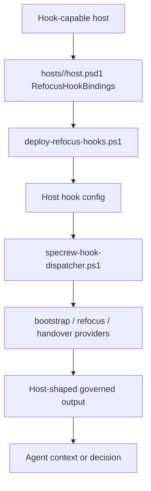
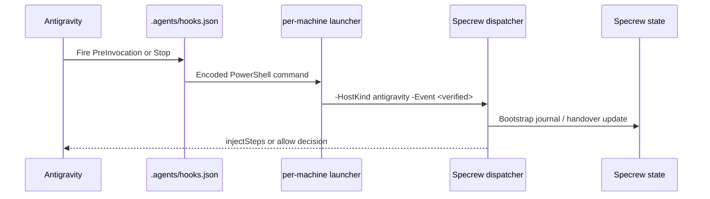
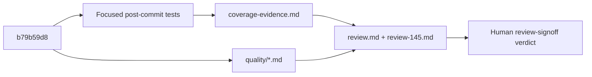

# Review Diagrams: Iteration 001

**Schema**: v1
**Diagram Format**: mermaid

## Hook Delivery Flow

## Antigravity Bounded Support

## Review Evidence Flow

## Omissions

- Security surface artifact omitted because no security-focused team role and no
  security-keyword task title required a separate security file; security-relevant
  hook input/config behavior is covered in review.md and coverage-evidence.md.
