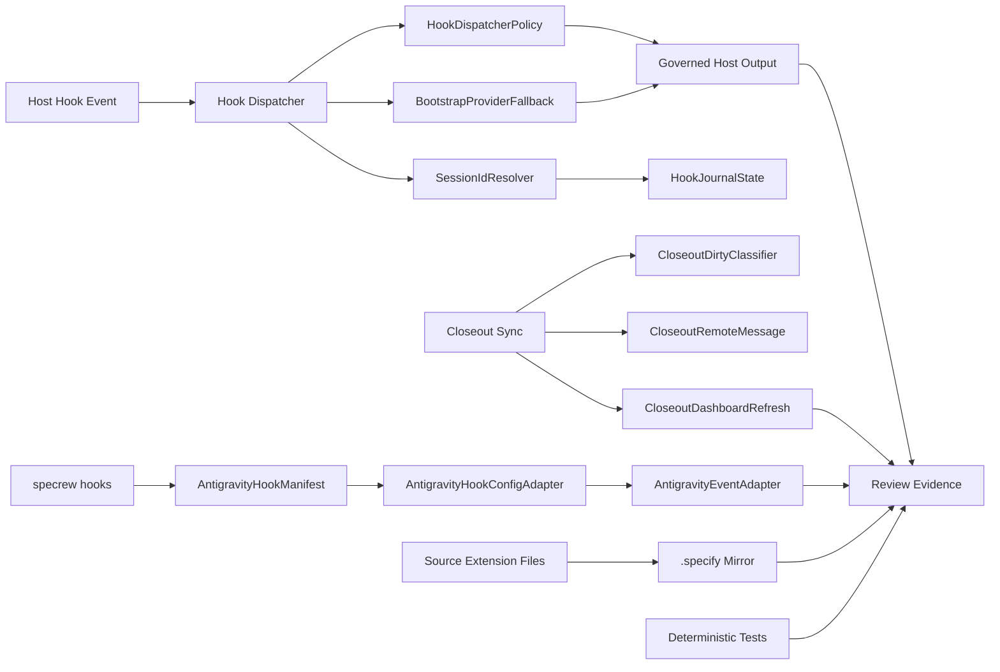
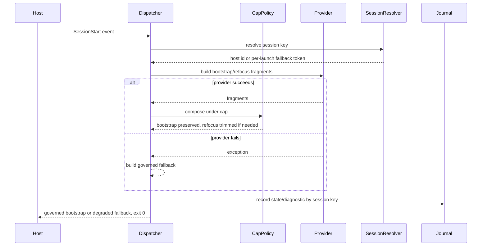
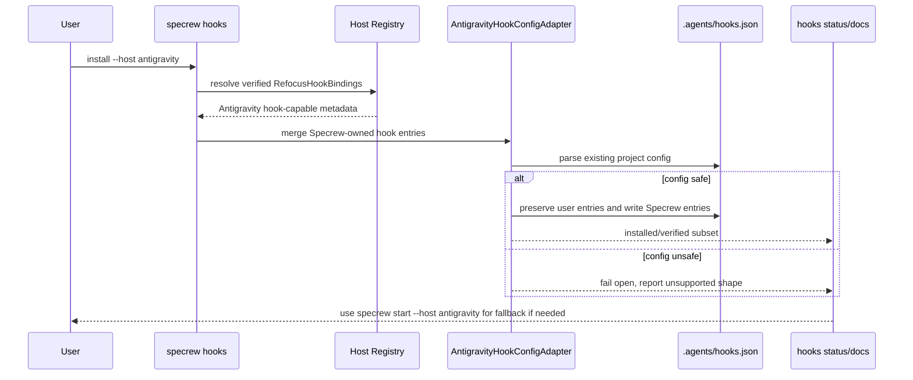

# Review Diagrams: Stability and Quality Bundle

**Feature**: 183-stability-quality-bundle
**Phase**: pre-implementation planning artifact for reviewer

## Component Diagram

## Sequence: SessionStart Degraded But Governed

## Sequence: Antigravity Hook Install

