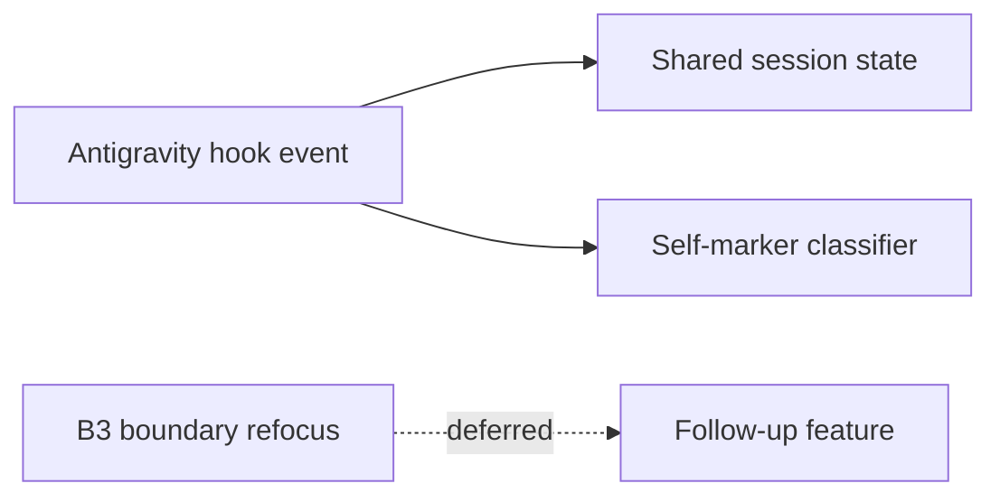
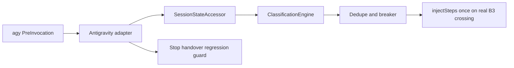
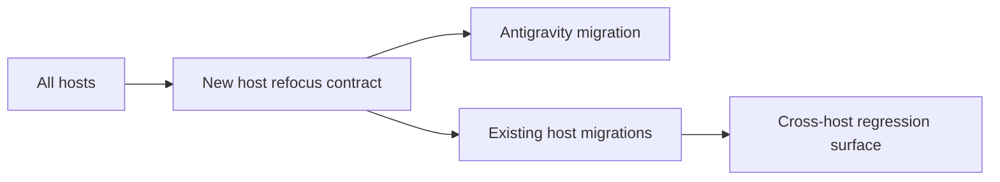

# Design Analysis: Full Antigravity Refocus (Iteration 001)

**Feature**: 184-full-antigravity-refocus
**Date**: 2026-06-17
**Boundary**: design-analysis (pre-plan)
**Spec**: file:///C:/Dev/183-stability-quality-bundle/specs/184-full-antigravity-refocus/spec.md
**Builds on**: file:///C:/Dev/183-stability-quality-bundle/specs/184-full-antigravity-refocus/workshop/

## Problem Framing

F-184 completes the Antigravity work intentionally left bounded in F-183. The
feature has three load-bearing implementation questions:

- Edge 1: Antigravity must not warn about its own same-worktree marker.
- Edge 2: Antigravity must use the same per-session refocus state/anchor model
  as other hosts, keyed by the real `conversationId`.
- B3: Antigravity must deliver boundary-cross refocus through `PreInvocation`
  `injectSteps`, exactly once, and only on real boundary crossings.

The design decision is how to finish those without turning F-184 into a broad
host-platform rewrite or claiming parity before real `agy` evidence exists.

## Key Design Decision Points

1. **Completion shape**: complete Edge 1, Edge 2, and B3 now vs split B3 again.
2. **Host model boundary**: Antigravity-specific adapter extension vs generic
   host-platform refactor.
3. **State ownership**: reuse `SessionStateAccessor` and existing refocus state
   files vs a private Antigravity state path.
4. **B3 carrier**: map boundary-cross refocus to `PreInvocation` `injectSteps`
   because Antigravity has no injection-safe `PostToolUse` path.
5. **Evidence gate**: keep docs deep, but do not mark Antigravity full/verified
   until real-host `agy` evidence proves it.
6. **Capacity handling**: use a temporary 26 SP capacity override for the known
   completion scope, then restore the baseline 20 SP cap at retro/closeout.

## Alternatives

### Option A - Simplest: Edge 1 and Edge 2 only, defer B3

**Approach**: Fix the self-marker concurrency advisory and wire Antigravity to
the shared per-session refocus state/anchor model, but leave B3-on-`PreInvocation`
as a later feature.

**Architectural pattern**: narrow Antigravity adapter/state repair over existing
runtime surfaces. No B3 classification or injection change in this iteration.

**Quality features considered**: strong for session identity, state ownership,
and self-marker correctness; weak for lifecycle refocus parity because boundary
crossings still cannot inject through Antigravity.

**Effort estimate**: 16 story_points.

**Reversibility cost**: Medium. The runtime changes are narrow, but another
follow-up feature would reopen a known missing requirement and repeat real-host
validation setup.

**Trade-offs**:

- (+) Fits the baseline 20 SP capacity.
- (+) Lowest uncertainty in automated tests.
- (-) Violates the maintainer's explicit completeness instruction.
- (-) Leaves Antigravity short of the same refocus behavior already expected
  from other hook-capable hosts.

**Recommended for**: a schedule-bound slice where the maintainer accepts another
partial Antigravity feature.

**Diagram**:



### Option B - Reasonable: complete bounded Antigravity refocus

**Approach**: Complete Edge 1, Edge 2, and B3 in one iteration by reusing the
existing refocus machinery (`SessionStateAccessor`, classification, dedupe,
breaker, and governed fallback), extending only the Antigravity manifest,
adapter, state-helper, deploy/config, docs, and tests needed for parity.

**Architectural pattern**: bounded host-adapter extension. Antigravity
normalizes host events and delegates to shared state/classification/refocus
code; non-Antigravity host contracts remain unchanged.

**Quality features considered**: satisfies the full F-184 scope, preserves F-183
bootstrap/Stop/handover behavior, keeps failures fail-open with bounded
diagnostics, protects user-owned `.agents/hooks.json`, and gates support labels
on real-host evidence.

**Effort estimate**: 26 story_points with a temporary F-184 capacity override
from the baseline 20 SP cap.

**Reversibility cost**: Low to medium. Most changes are isolated to Antigravity
binding/adapter code and shared helpers already designed for refocus behavior.
The risk is the B3-on-`PreInvocation` real-host path; T001 must prove the
split-guard triggers before runtime work proceeds.

**Trade-offs**:

- (+) Completes the known F-183 carry-forward scope now.
- (+) Avoids another partial Antigravity release.
- (+) Keeps the full parity claim evidence-gated instead of aspirational.
- (-) Requires a temporary capacity override and careful closeout restoration.
- (-) Depends on manual real-host `agy` validation for the final support claim.

**Recommended for**: this feature, because it matches the maintainer's
completion directive while preserving the split guard.

**Diagram**:



### Option C - By-the-book: general host-model refactor

**Approach**: Expand the host model so all providers express B2/B3, injection,
handover, state, marker, diagnostics, and capability status through a richer
shared contract, then move Antigravity onto that model.

**Architectural pattern**: broad host-platform refactor with new shared contract
surface and migration for existing hosts.

**Quality features considered**: strongest long-term abstraction if multiple
hosts need the same host-model expansion, but it expands beyond F-184's known
completion scope and risks changing shipped host behavior.

**Effort estimate**: 35+ story_points across multiple iterations.

**Reversibility cost**: High. A generalized host contract becomes a public
architecture surface and is expensive to reshape after release.

**Trade-offs**:

- (+) Cleaner long-term model if future hosts need richer hook contracts.
- (+) Reduces future one-off host conditionals.
- (-) Trips the F-184 split guard.
- (-) Repeats F-183's scope-expansion failure mode.
- (-) Risks regressions in Codex, Copilot, Claude, and Cursor.

**Recommended for**: a later host-platform feature, not this completion slice.

**Diagram**:



## Crew Recommendation

**Recommended: Option B.**

Option B is the only option that matches the user's completeness directive,
keeps F-184 scoped to the known Antigravity carry-forward work, and avoids
another evidence-light parity claim. The plan must sequence discovery first:
if T001 fails the fresh-boundary-cursor, exactly-once-B3, or bounded-host-model
trigger, implementation stops for a human split/defer decision despite the broad
implementation authorization.

## Capacity Model

Inputs:

- Baseline capacity: 20 story_points.
- Temporary F-184 capacity: 26 story_points.
- Overcommit threshold: 1.0.
- Role owners: Spec Steward, Planner, Implementer, Reviewer.
- Requirement set: FR-001 through FR-010 plus SC/TG evidence obligations.

Plan-ready effort model for Option B:

| Slice | Requirements | Owner | Effort |
| --- | --- | --- | ---: |
| Discovery spike and split-guard evidence | FR-003, FR-010, SC-009 | Planner, Reviewer | 3 |
| Per-session identity and state/anchor | FR-001, FR-002, FR-005, SC-001, SC-002 | Implementer | 4 |
| B3 on `PreInvocation` | FR-003, FR-006, FR-010, SC-003, SC-007, SC-009 | Implementer | 5 |
| Self-marker concurrency classifier | FR-004, SC-004 | Implementer | 3 |
| Hook config preservation and F-183 regression guards | FR-005, FR-007, SC-005, SC-006 | Implementer, Reviewer | 3 |
| Documentation and release-status wording | FR-008, FR-009, TG-006, SC-008, SC-010 | Spec Steward, Reviewer | 2 |
| Automated validation and mirror/FileList readiness | TG-001, TG-002, TG-003, SC-001..SC-010 | Reviewer | 3 |
| Real-host evidence and Proposal 145 review | TG-004, TG-005, SC-002, SC-003, SC-005, SC-009 | Reviewer | 3 |
| **Total** |  |  | **26** |

Capacity status: **26/26 story_points** under the temporary F-184 override from
the baseline 20 SP cap. The 6 SP expansion is explicitly accepted by the
maintainer's 2026-06-17 completeness instruction. No scope is deferred. The
discovery split guard remains binding, and retro/closeout must restore the
baseline cap.

## Component Map

```text
agy hook runtime
  |
  v
AntigravityEventAdapter
  - normalize conversationId, event, transcript path, workspace paths
  - shape PreInvocation and Stop output
  |
  v
SpecrewHookDispatcher
  |
  +--> SessionStateAccessor
  |      owns refocus-state-<session>.json, anchor, cursor, dedupe, breaker
  |
  +--> ClassificationEngine
  |      decides lifecycle boundary/refocus classification
  |
  +--> B3RefocusDecision
  |      uses existing Test-B3ShouldInject/dedupe/breaker behavior
  |
  +--> ConcurrencyMarkerClassifier
         small helper if needed: own marker vs competing marker

deploy-refocus-hooks.ps1
  |
  v
.agents/hooks.json
  - preserve user hooks
  - install/remove only Specrew-owned Antigravity hook definition
```

Accepted component responsibilities:

- **AntigravityEventAdapter**: normalizes event payloads and `conversationId`.
- **SessionStateAccessor**: remains sole owner of refocus state/anchor files.
- **ClassificationEngine**: detects lifecycle boundary transitions.
- **B3RefocusDecision**: reuses dedupe and breaker behavior for injection.
- **ConcurrencyMarkerClassifier**: distinguishes current session markers from
  real competing session markers.
- **deploy-refocus-hooks.ps1**: preserves user-owned `.agents/hooks.json`
  entries while installing/removing only Specrew-owned bindings.

## Key Flow

```text
agy PreInvocation
  -> AntigravityEventAdapter extracts conversationId
  -> SessionStateAccessor loads refocus-state-<session>.json
  -> ClassificationEngine compares boundary cursor
  -> B3RefocusDecision checks dedupe/breaker
  -> dispatcher emits Antigravity injectSteps exactly once
  -> SessionStateAccessor records decision/evidence
```

Stop handover regression flow:

```text
agy Stop
  -> dispatcher uses existing handover provider
  -> output remains Antigravity decision JSON
  -> rolling handover stays host-agnostic
```

## Applicable Lenses

- **architecture-core**: complete bounded Antigravity refocus via adapter
  extension, not a general host-platform rewrite.
  - Addressed: see Option B's bounded host-adapter extension and Option C's
    rejected host-model refactor.
- **component-design**: keep responsibilities split between adapter,
  `SessionStateAccessor`, `ClassificationEngine`, dedupe/breaker, marker
  classification, and deploy config.
  - Addressed: see Option B's architecture pattern and the component map.
- **data-storage**: per-session refocus state remains local file state owned by
  the existing accessor; no private Antigravity store is introduced.
  - Addressed: see Option B's state ownership and the capacity slice for
    per-session identity/state.
- **integration-api**: Antigravity uses `PreInvocation` for B2/B3 injection and
  `Stop` for handover; `PostToolUse` is not an injection carrier.
  - Addressed: see Option B's key flow and Option A's B3 deferral trade-off.
- **observability-resilience**: hook failures fail open with bounded diagnostics,
  dedupe/breaker behavior prevents repeat injection, and support claims require
  evidence.
  - Addressed: see Option B's quality features and real-host evidence slice.
- **devops-operations**: F-184 stacks on F-183, releases together, and restores
  the temporary capacity override after closeout.
  - Addressed: see Option B's capacity model and release/status evidence gates.
- **requirements-nfr**: success depends on state correctness, no false
  concurrency advisory, exactly-once B3, config preservation, and evidence-gated
  docs.
  - Addressed: see Option B's quality features and split-guard requirement.
- **ui-ux**: user-visible recovery remains direct and host-specific:
  `agy`, hook status/install/remove, `/permissions`, `enableTerminalSandbox`,
  and `specrew start --host antigravity`.
  - Addressed: see Option B's documentation slice and support-status wording.
- **code-implementation**: use existing PowerShell/JSON/YAML/Pester patterns,
  no new dependency, and mirror deployed extension copies for touched scripts.
  - Addressed: see Option B's bounded adapter/deploy/test slices and Option C's
    rejected new shared contract.

## Co-Design Record

**Human-agreed**: yes. The user approved the specify packet, asked for
completeness rather than returning to known partial features, accepted that this
mostly reuses the existing architecture/design with perhaps a small helper, and
then gave the 2026-06-17 instruction to implement all known F-184 scope before
the next human gate.

Binding constraints already agreed:

- F-184 completes F-183 Antigravity support and releases with it.
- Discovery must run first and define falsifiable split-guard triggers.
- Reuse existing refocus machinery; do not rebuild it.
- Docs can reach host-level depth, but full/verified/stable claims require
  real-host evidence.
- Validation includes manual real-host `agy` runs, exit/re-entry, B3 behavior,
  marker behavior, and handover.
- Stop at the next human gate only after complete implementation.

Human decision received:

- Decision received: `approved for plan with Option B` via the user's
  implementation-through-completion directive.

## Human Decision

- **Decision verdict**: approved for plan with Option B
- **Chosen Option**: Option B
- **Reason**: Complete all known F-184 Antigravity carry-forward scope now,
  avoiding another partial feature while keeping the split guard binding.
- **Modifications**: Temporary capacity override to 26 SP for this iteration;
  restore the baseline 20 SP cap at retro/closeout.
- **Design-analysis draft commit**: `de725ac4`
- **Decision recorded in commit**: `1b6e81e2`
