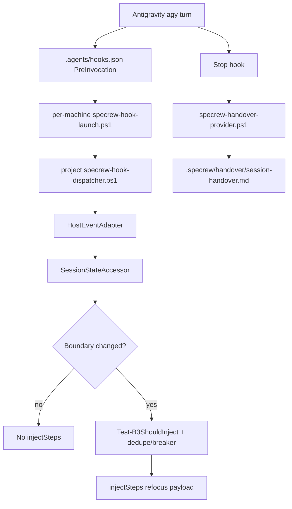
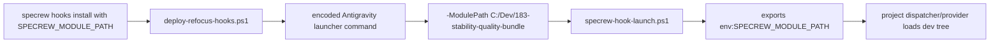
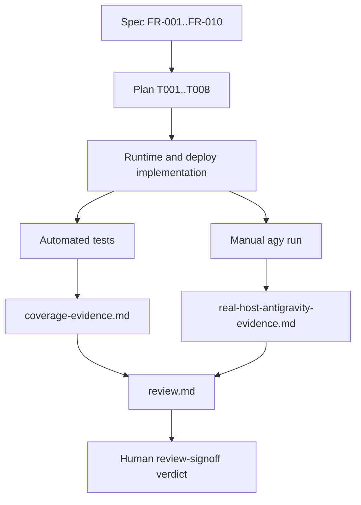

# Review Diagrams: F-184 Iteration 001

## Antigravity Refocus Flow

## T008 Module-Path Repair

## Evidence Chain

## Review Notes

- `PostToolUse` is intentionally not shown as a B3 injection carrier for
  Antigravity. F-184 maps B3 to `PreInvocation` only.
- Release validation is intentionally outside this diagram. The review accepts
  implementation completion, not stable release promotion.
