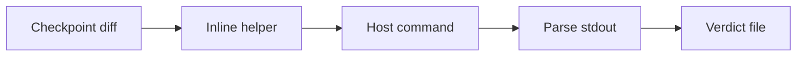
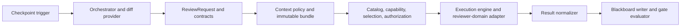
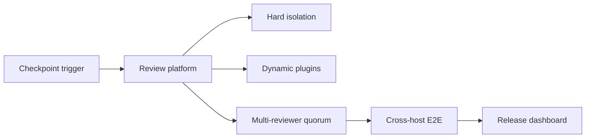

# Design Analysis - Feature 197-continuous-co-review / Iteration 001

**Feature**: 197-continuous-co-review
**Iteration**: 001
**Date**: 2026-06-17
**Spec**: file:///C:/Dev/197-continuous-co-review/specs/197-continuous-co-review/spec.md

## Problem Framing

Proposal 197 moves design-conformance review earlier in the lifecycle by adding a local, checkpoint-level
continuous co-review spine. Iteration 001 must be host-neutral, additive, and safe for the current Specrew
codebase: it creates review contracts, request packaging, fresh-context reviewer invocation, deterministic
failure normalization, durable blackboard evidence, and a gate verdict without modifying F-184 protected host
runtime, hook, provider, registry, refocus, shared-governance, or validator surfaces.

The governing constraints are PowerShell 7.x plus Markdown/YAML/JSON artifacts, no new dependencies, no named
CI/CD E2E companion, no proposal-governance edits on this branch, and explicit human authorization before any
non-default, paid, external, or newly added provider/model is invoked. The design must preserve future
multi-reviewer and live cross-host E2E composition hooks without absorbing those future features into this
iteration.

## Key Design Decision Points

1. How to introduce a checkpoint-level reviewer without coupling the orchestrator to volatile host/provider
   command details.
2. How to package review context so the reviewer has enough repository/design context while still excluding
   deliberate secret, ambient-state, and raw-transcript persistence.
3. How to represent provider/model choice, fallback, and cost authorization without silent downgrade.
4. How to persist durable review findings and gate verdicts independently from temporary request bundles.
5. How to make no-diff, provider-missing, timeout, invalid JSON, schema mismatch, and unsafe durable state
   deterministic outcomes rather than false passes.
6. How to keep the first slice parallel-safe and namespace-safe relative to Proposal 184 provider files.

## Alternatives

### Option A: Simplest - Inline reviewer helper

**Approach**: Add one direct PowerShell helper that computes the diff, builds a prompt, invokes one configured
headless host, parses stdout, and writes a small verdict artifact. The helper would keep most behavior in a
single module surface and use minimal contract separation.

**Architectural pattern**: Scripted transaction / procedural helper.

**Quality features considered**: Covers the happy path and a basic timeout/failure path, but only lightly
addresses component-design, integration-api, security-compliance, observability-resilience, and
code-implementation concerns. It does not provide enough explicit seam coverage for provider authorization,
contract fixtures, or F-184 namespace separation.

**Effort estimate**: 8 points.

**Reversibility cost**: Medium.

**Trade-offs**:

- (+) Fastest route to a visible reviewer run.
- (+) Low initial file count.
- (-) Couples diffing, context packaging, provider invocation, normalization, gate policy, and persistence.
- (-) Makes future multi-provider or stronger-reviewer work more likely to require disruptive refactoring.
- (-) Increases provider-file naming collision risk with Proposal 184 because adapter boundaries are vague.

**Design principle / why this matters**: The cheapest path is attractive for a first slice, but this feature is
itself about review trust. A coupled helper would make the safety and evidence contracts harder to inspect.

**Recommended for**: A throwaway spike or proof of CLI reachability, not the committed Iteration 001 design.

**Diagram**:



### Option B: Reasonable - Layered reviewer-domain spine with static adapter registry

**Approach**: Use the agreed layered/modular component design. The orchestrator owns the review-run lifecycle,
diff provider, and request builder. Stable schemas and provider/model configuration sit inward. Context
collection, visibility policy, and immutable bundle creation prepare the reviewer input. Execution uses a
reviewer-domain provider catalog, capability discovery, reviewer-selection policy, human authorization gate,
execution engine, static adapter registry, and provider-specific command adapters. Results are normalized into
durable review-thread and gate-verdict artifacts.

**Architectural pattern**: Layered modular architecture with explicit contract layer and provider adapter seam.

**Quality features considered**: Directly carries architecture-core, component-design, requirements-nfr,
data-storage, security-compliance, integration-api, devops-operations, observability-resilience, and
code-implementation lens decisions. It keeps runtime proof local and deterministic while preserving future
cross-host E2E hooks and multi-reviewer expansion seams.

**Effort estimate**: 18 points.

**Reversibility cost**: Low.

**Trade-offs**:

- (+) Keeps stable review contracts inward and volatile host commands outward.
- (+) Makes authorization, fallback, deterministic failures, blackboard evidence, and schema fixtures testable.
- (+) Preserves future fan-out/quorum/E2E composition without implementing it now.
- (+) Uses reviewer-domain names such as `reviewer-host-adapter-*`, avoiding Proposal 184 provider collisions.
- (-) More files and fixture surfaces than the inline helper.
- (-) Requires careful task slicing so contracts, adapters, and gate semantics stay aligned.

**Design principle / why this matters**: Dependency isolation and evidence durability matter more than raw
minimalism here. The feature is a governance/review spine, so the design should make the review contract, trust
boundary, and failure semantics independently inspectable.

**Recommended for**: Proposal 197 Iteration 001.

**Diagram**:



### Option C: By-the-book - Full review platform with hardened isolation and multi-reviewer quorum

**Approach**: Build a comprehensive review platform in the first slice: hard process containment, dynamic plugin
discovery, multi-reviewer fan-out, quorum policy, quota probing, live cross-host E2E automation, retro-informed
context, quality-drift comparison, and release-grade operational dashboards.

**Architectural pattern**: Pluggable review platform / orchestrated multi-provider workflow.

**Quality features considered**: Maximizes isolation, reviewer diversity, and operational ambition, but exceeds
the approved iteration scope. Dedicated hardening gates, known-traps workflows, strongest-class routing proof,
and live cross-host E2E belong to future approved slices or Proposal 181 plus Proposal 194 canary composition.

**Effort estimate**: 35+ points.

**Reversibility cost**: High.

**Trade-offs**:

- (+) Best long-term completeness if every future rung were already funded.
- (+) Could prove cross-host reviewer behavior earlier.
- (-) Violates the first-slice scope and capacity budget.
- (-) Risks touching protected/shared surfaces and creating provider-domain collisions.
- (-) Names and absorbs a CI/CD E2E companion before its exact contract surface is known.
- (-) Adds governance complexity before the host-neutral contract spine is proven.

**Design principle / why this matters**: By-the-book is meaningfully distinct, but premature. The right first
slice should leave clean seams for this shape rather than build it before the durable contract is stable.

**Recommended for**: Future authorized hardening and live-E2E slices, not Iteration 001.

**Diagram**:



## Applicable Lenses

- **architecture-core**
  - Addressed: Option B uses one fresh, bounded reviewer process per review run and keeps the durable blackboard
    as state; Option A is rejected for excessive coupling and Option C is deferred as over-scoped platform work.
- **component-design**
  - Addressed: Option B maps directly to the layered component map, contract layer, context packaging layer,
    execution layer, result/gate layer, and persistence layer recorded below.
- **requirements-nfr**
  - Addressed: Option B preserves deterministic failure semantics, auditability, bounded convergence, compatibility
    with Proposal 184 protected surfaces, cost control, and maintainable task seams.
- **data-storage**
  - Addressed: Option B separates immutable temporary request bundles from durable filesystem evidence under
    `.specrew/review/inline/<run-id>/...`; no database or queue is introduced.
- **security-compliance**
  - Addressed: Option B keeps reviewer visibility as explicit policy plus bundle construction, excludes deliberate
    secret/raw-transcript persistence, and blocks provider/model use without explicit authorization.
- **integration-api**
  - Addressed: Option B owns versioned local contracts for request, findings, thread, verdict, infrastructure
    failure, spawn invocation, run, and skipped-run artifacts.
- **devops-operations**
  - Addressed: Option B remains a local module/tooling spine with no server, daemon, new service identity, new CI
    workflow, branch-protection mutation, or release publishing.
- **observability-resilience**
  - Addressed: Option B carries run_id correlation, requested/actual host/model provenance, explicit skipped runs,
    deterministic infrastructure failures, cleanup evidence, and at most one authorized availability fallback.
- **code-implementation**
  - Addressed: Option B follows current Specrew PowerShell/Markdown/YAML/JSON methods, uses existing tooling only,
    avoids new dependencies, and requires reviewer-domain adapter names rather than generic provider filenames.

## Co-Design Record

**Decomposition vocabulary**: layered/modular with an adapter seam.

**Human-agreed**: yes - the component-design lens was surfaced and confirmed by the human, and the later plan
approval carried the same constraints plus hygiene instructions.

### Agreed component-to-responsibility map

```text
+--------------------------------------------------------------------------------+
| Orchestration Layer                                                            |
|  CheckpointReviewOrchestrator -> CheckpointDiffProvider -> ReviewRequestBuilder|
+------+-------------------------------------------------------------------------+
       |
       +------------------------------+------------------------------------------+
       |                              |
       v                              v
+----------------------------+   +-----------------------------------------------+
| Contract Layer             |   | Context Packaging Layer                        |
|  ReviewContractSchemas     |   |  DesignContextCollector                       |
|  ReviewerProviderConfig    |   |  ReviewVisibilityPolicyBuilder                |
|                            |   |  ReviewBundleBuilder                          |
+-------------+--------------+   +--------------------+--------------------------+
              |                                       |
              +-------------------+-------------------+
                                  |
                                  v
+--------------------------------------------------------------------------------+
| Execution Layer                                                               |
|  ReviewRunWorkspaceManager -> ReviewProviderCatalog -> ProviderCapability     |
|  Discovery -> ReviewerSelectionPolicy -> HumanAuthorizationGate ->            |
|  ReviewerExecutionEngine -> ProviderSpawnAdapterRegistry -> ProviderSpawn     |
|  Adapter -> ClaudePromptAdapter / CodexExecAdapter / CopilotPromptAdapter /   |
|  CursorAgentPromptAdapter / AntigravityPromptAdapter                          |
+------+-------------------------------------------------------------------------+
       |
       v
+--------------------------------------------------------------------------------+
| Result and Gate Layer                                                          |
|  ReviewResultNormalizer -> InlineReviewGateEvaluator                           |
+------+-------------------------------------------------------------------------+
       |
       v
+--------------------------------------------------------------------------------+
| Persistence Layer                                                              |
|  ReviewBlackboardWriter                                                        |
+--------------------------------------------------------------------------------+
```

#### Orchestration Layer

- `CheckpointReviewOrchestrator` - responsibility: owns checkpoint review-run lifecycle from start through
  packaging, execution, normalization, gate evaluation, persistence, and pass/block/failure return.
- `CheckpointDiffProvider` - responsibility: computes the bounded git diff/change-set from the checkpoint
  baseline without owning provider details or gate policy.
- `ReviewRequestBuilder` - responsibility: assembles the explicit reviewer request payload from diff, review
  kind, visibility policy, design context, and provider/model configuration.

#### Contract Layer

- `ReviewContractSchemas` - responsibility: owns stable external JSON schemas for request, result, finding,
  provenance, execution failure, and gate verdict.
- `ReviewerProviderConfig` - responsibility: owns explicit provider/model/cost authorization shape and validation
  before any paid or non-default reviewer process can spawn.

#### Context Packaging Layer

- `DesignContextCollector` - responsibility: gathers approved spec/workshop/rules excerpts into bounded reviewer
  context.
- `ReviewVisibilityPolicyBuilder` - responsibility: records allowed paths, forbidden paths, and review-scope
  policy as contract evidence without claiming hard filesystem isolation.
- `ReviewBundleBuilder` - responsibility: writes a per-run immutable request bundle for the fresh reviewer
  process; bundles are not reused across runs.

#### Execution Layer

- `ReviewRunWorkspaceManager` - responsibility: creates unique per-run temp workspaces, coordinates bundle
  placement, owns cleanup, preserves workspaces only under explicit debug mode, and prevents concurrent run
  collisions.
- `ReviewProviderCatalog` - responsibility: stores the static in-repo catalog of supported adapter types,
  allowed provider/model configuration, default/fallback policy, and cost/authorization metadata.
- `ProviderCapabilityDiscovery` - responsibility: checks installed headless hosts and discovers model IDs through
  explicit config, allowlists, official model-list commands where available, reliable CLI help/introspection, or
  human-entered model IDs.
- `ReviewerSelectionPolicy` - responsibility: recommends the strongest available review-class model and favors
  cross-host or cross-model independence when available and authorized.
- `HumanAuthorizationGate` - responsibility: obtains explicit user approval for non-default, paid, external, or
  newly added provider/model use and blocks rather than silently downgrading unavailable requested models.
- `ReviewerExecutionEngine` - responsibility: runs one fresh-context read-only-by-contract reviewer process,
  preferably from the review bundle directory, enforces timeout, and captures exit/stdout/stderr.
- `ProviderSpawnAdapterRegistry` - responsibility: statically selects exactly one configured provider adapter for
  Iteration 001 after capability discovery and authorization.
- `ProviderSpawnAdapter` - responsibility: defines the stable adapter interface that maps a review bundle and
  config to a provider command invocation.
- `ClaudePromptAdapter` - responsibility: command adapter for `claude -p`.
- `CodexExecAdapter` - responsibility: command adapter for `codex exec`.
- `CopilotPromptAdapter` - responsibility: command adapter for `copilot -p`.
- `CursorAgentPromptAdapter` - responsibility: command adapter for `cursor-agent -p`.
- `AntigravityPromptAdapter` - responsibility: command adapter for antigravity `-p`.

#### Result and Gate Layer

- `ReviewResultNormalizer` - responsibility: validates stdout JSON and maps timeout, nonzero exit, empty output,
  invalid JSON, malformed findings, or unknown blocking disposition into structured failures/findings.
- `InlineReviewGateEvaluator` - responsibility: applies deterministic blocking rules and decides whether the
  checkpoint can advance.

#### Persistence Layer

- `ReviewBlackboardWriter` - responsibility: writes durable review-thread/findings/verdict/provenance artifacts
  under `.specrew/review/inline/<run-id>/...`; it may store request summaries/hashes rather than the entire
  temporary bundle.

### Agreed flow

```text
checkpoint boundary
  -> CheckpointReviewOrchestrator
  -> CheckpointDiffProvider
  -> ReviewRequestBuilder
  -> ReviewContractSchemas + ReviewerProviderConfig
  -> DesignContextCollector + ReviewVisibilityPolicyBuilder + ReviewBundleBuilder
  -> ReviewRunWorkspaceManager
  -> ReviewProviderCatalog
  -> ProviderCapabilityDiscovery
  -> ReviewerSelectionPolicy
  -> HumanAuthorizationGate
  -> ReviewerExecutionEngine
  -> ProviderSpawnAdapterRegistry
  -> ProviderSpawnAdapter
  -> one provider-specific adapter
  -> ReviewResultNormalizer
  -> InlineReviewGateEvaluator
  -> ReviewBlackboardWriter
  -> pass/block/failure returned to checkpoint flow
```

## Crew Recommendation

**Recommended: Option B.**

Option B is the only alternative that fits the human-confirmed scope, quality profile, and branch-hygiene
constraints at the same time. It creates the durable review contract and evidence spine without overbuilding the
future review platform. It also keeps provider/runtime volatility behind reviewer-domain adapter seams so the
feature can avoid Proposal 184 protected surfaces and ambiguous provider filenames.

Option A is cheaper, but it would hide too much governance-critical behavior in a coupled helper. Option C is a
valid long-term direction, but it would prematurely absorb deferred hardening, multi-reviewer, and live E2E
work. The plan therefore realizes Option B as a contract-first, additive, local PowerShell implementation.

## Human Decision

- **Decision verdict**: approved for plan with Option B
- **Chosen option**: Option B
- **Reason**: The human approved planning with explicit confirmations that the no-new-dependency policy,
  current-Specrew implementation methods, unnamed CI/CD E2E hooks, Proposal 184 boundary guardrails, provider
  naming isolation, and no-silent-downgrade fallback semantics are correct for this first slice.
- **Modifications**: Keep `.squad/agents/spec-steward/history.md` runtime churn out of feature commits; keep
  proposal-governance edits out of this feature branch; keep the CI/CD E2E companion unnamed and composed later
  with Proposal 181 plus Proposal 194 canary; keep human-confirmed provenance audit as a non-blocking Proposal
  196 concern; use reviewer-domain provider names such as `reviewer-host-adapter-*`,
  `reviewer-model-capability`, and `reviewer-host-catalog`.
- **Approval evidence commit**: `4c3d99fd7cd745ba9af181119d781d7c94297573`
