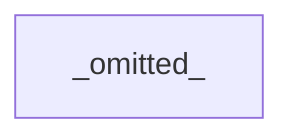
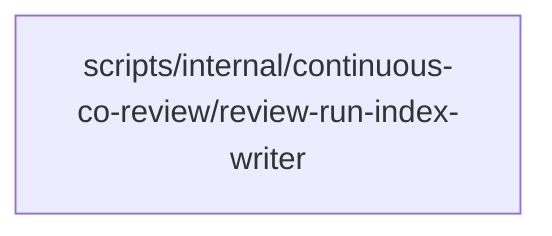

# Review Diagrams: Iteration 010

**Schema**: v1
**Diagram Format**: mermaid

> **⚠️ Review Evidence Warning** _(Form-vs-Meaning Gap Detected)_
>
> This iteration's task tracking declares **11 completed task(s)**, but the git diff against baseline `16bc485f6cb38b783963095ee360481ba8335562` contains **65 file(s)**.
>
> **Severity**: WARNING  
> **Implication**: Review evidence may be incomplete or misleading.
>
> **Possible causes**:
>
> - Implementation work was not committed before scaffolding review artifacts
> - Task status markers in plan.md or review.md do not match actual progress
> - Baseline reference in state.md is stale or incorrect
>
> **Remediation**:
>
> 1. Verify implementation is committed: `git diff 16bc485f6cb38b783963095ee360481ba8335562...HEAD --stat`
> 2. If uncommitted work exists: `git add . && git commit -m "Implementation complete"`
> 3. Re-run scaffolder with `-Force` flag to regenerate review artifacts after commit
> 4. Re-run `validate-governance.ps1` to clear pre-review commit gate error
>
> _See Proposal 073 (Review Evidence Integrity) for background on this validation._

---

## Structure Diagram

## Flow Diagram

## Omissions

- Structure diagram omitted: inter-module edges (0) below threshold (2).

## Local View Hints

- specs\197-continuous-co-review\iterations\010\review-diagrams.md
