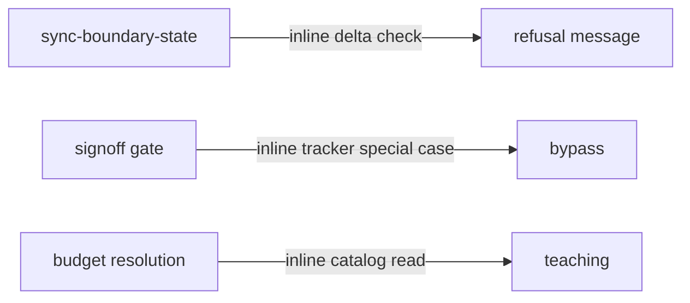
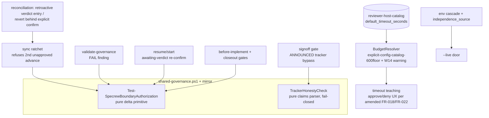
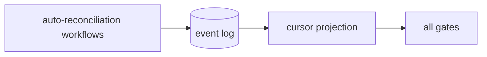

# Design Analysis - Feature 198-beta2-hardening / Iteration 002

**Feature**: 198-beta2-hardening
**Iteration**: 002 — governance correctness core
**Date**: 2026-07-11
**Spec**: file:///C:/Dev/specrew-beta2-hardening/specs/198-beta2-hardening/spec.md

## Problem Framing

Iteration 002 lands the bundle's severest correctness item and the
deterministic-honesty batch: the #2906 boundary-authorization ratchet with
its reconciliation flows (FR-001..FR-007), the W13 tracker honesty check
(FR-020), the per-host review budgets in the catalog with the downgrade
warning and timeout teaching (FR-021/FR-022), and the live-door
independence defaulting (FR-023). Tasks T007–T012, 7.0 SP planned.

Iteration 001 delivered live fixtures for exactly this work: two
verdict-capture latency incidents (specify, review-signoff) bridged by the
F-174 backstop, a real retroactive re-confirm flow, the reviewer timing
data the catalog rows need (copilot 61–82s ×2, codex 240–410s ×5), and the
evidence-staleness pain W13 exists to scope. The two maintainer amendments
(spend-allowance semantics; approvals-bind-the-decision-not-keystrokes)
bind the W16 teaching-text shape delivered here.

Binding constraints carried in: hooks are surfacing-only (A2), one
approval advances one boundary, fail directions per the I3 asymmetric
package (honesty check fail-closed; catalog reader tolerant), T096/D5 at
input provenance with the amended approve/deny UX, ProviderMirrorParity
for every extension-script change, paired honesty tests (NFR-007).

## Key Design Decision Points

1. Where the shared authorization primitive lives and which call sites
   consume it (the A2 covering set vs a narrower landing).
2. How reconciliation executes: message-taught flows vs first-class
   recorded operations (retroactive approval; revert behind explicit
   confirm).
3. How the honesty check binds to the signoff gate (announced gate-level
   bypass, mechanism b) and what "claims" parse deterministically.
4. Whether the banked self-host reviewer timings satisfy the clarify
   measurement intent, or the consumer test project must re-measure.
5. How the W16 timeout teaching renders under the amended approval UX
   (agent asks approve/deny; human never copy-pastes).

## Alternatives

### Option A: Simplest — inline checks, message-only reconciliation

**Approach**: Add the delta check inline in `sync-boundary-state.ps1`
only; reconciliation is taught in the refusal message but not recorded as
first-class operations; the catalog column is read inline where needed;
W13 lands as a signoff-gate special case without a reusable claims parser.

**Architectural pattern**: scripted transaction, per-site logic.



**Quality features considered**: covers the headline behaviors, but the
delta logic exists once per site by copy (validator and resume/start
would drift from sync), reconciliation leaves no distinct verdict-history
record (retroactive approvals indistinguishable from normal ones —
against FR-005), and an unreusable claims parser makes the consumer-side
W13 regression tests brittle.

**Effort estimate**: 5 SP.

**Reversibility cost**: medium-high — the covering set would be
re-plumbed later, and un-recorded reconciliations cannot be backfilled.

**Trade-offs**:

- (+) Smallest diff to sync.
- (-) Violates the A2 covering-set decision (one primitive, four
  consumers) by construction.
- (-) FR-005's "recorded distinctly" cannot be satisfied by message text.

### Option B: Reasonable — one primitive, covering set, recorded reconciliation (workshop-bound shape)

**Approach**: Resurrect `Test-SpecrewBoundaryAuthorization` in
`shared-governance.ps1` (+ mirror) as THE pure delta primitive; consume it
from four call sites per A2: the sync ratchet (refuses a second
unapproved advance, loud, names the skipped boundary and both doors), a
governance-validator FAIL finding, the resume/start awaiting-verdict
re-confirm surface, and the existing hard gates. Reconciliation becomes
first-class: retroactive approval writes a `kind: retroactive`
verdict-history entry (FR-005); reversion targets the recorded
AuthCommitHash and executes only behind an explicit human confirm.
`TrackerHonestyCheck` lands as a pure function (canonical-enum claims
parser: task statuses, capacity line, test counts) consumed by the
signoff gate as an ANNOUNCED evidence-freshness acceptance (mechanism b);
fail-closed on any parse ambiguity. The catalog gains
`default_timeout_seconds` rows — antigravity 900, claude 600 (clarify),
plus copilot 300 and codex 600 derived from the iteration-001 field
timings (copilot 61–82s observed → 300 with ample headroom; codex
240–410s observed → 600); `BudgetResolver` implements explicit → config →
catalog → 600-floor with the W14 warning keyed off the RESOLVED value;
the timeout/halt teachings render per the amended FR-018/FR-022 UX (the
agent asks approve/deny and executes on recorded approval). The live door
applies the `--list-hosts` env cascade and records `independence_source`.
Paired tests throughout, with iteration-001's field incidents encoded as
fixtures (capture-latency re-confirm; retroactive approval; the
reconcile-toward-truth vs falsify-forward pair).

**Architectural pattern**: one pure primitive behind stable seams; data
in the catalog; recorded state transitions (the repo doctrine, A1/A2).



**Quality features considered**: the covering set makes drift between
call sites impossible (one primitive); recorded reconciliation satisfies
FR-005 auditably; the pure claims parser gets its own unit fixtures and
serves the consumer-side W13 tests later; catalog rows are additive with
the tolerant reader (I3); the teaching texts carry zero internal
identifiers (message-content tests per SC-007's amended shape).

**Effort estimate**: 7 SP.

**Reversibility cost**: low — pure functions + data rows + recorded
transitions.

**Trade-offs**:

- (+) Realizes A2/A3/S3/S4 and both maintainer amendments exactly.
- (+) Iteration-001's live incidents become regression fixtures.
- (-) ~2 SP over the simplest landing (the covering set and recorded
  reconciliation are the cost).

### Option C: By the book — event-sourced boundary state machine

**Approach**: rewrite boundary enforcement as an event-sourced state
machine (every crossing/verdict an immutable event, projections for
cursor state), with automated reconciliation workflows and a migration
for existing `start-context.json` state.

**Architectural pattern**: event sourcing + projections.



**Quality features considered**: maximal auditability, but it rewrites a
working F-174 mechanical-record design mid-release-hold, needs a state
migration for every existing consumer, and automated reconciliation
contradicts the one-approval-one-boundary trust model.

**Effort estimate**: 14+ SP.

**Reversibility cost**: high.

**Trade-offs**:

- (+) Perfect audit trail.
- (-) Over-scoped for a hardening bundle; migration risk for every
  consumer; automation where the trust model demands a human.

## Crew Recommendation

**Option B.** It is the workshop-bound shape (A2's covering set, A3's
fail direction, S3's amended teaching UX, S4's provenance) with
iteration-001's field incidents as its test fixtures; both rejected
alternatives break a recorded decision — one collapses the covering set,
the other rewrites a working trust model mid-hold (rationales in their
trade-off tables above).

## Measurement Question (decision point 4, needs the human verdict)

The clarify answer scoped codex/copilot measurements to "the consumer
test project during iteration 002". Iteration 001 banked real timings on
the SELF-HOST repo instead — a larger, harder review target (copilot
61–82s ×2; codex 240–410s ×5). **Crew position**: these are conservative
upper-bound measurements (the consumer test project is smaller), so the
proposed catalog rows (copilot 300, codex 600) already carry generous
headroom; a separate consumer-project measurement pass adds cost without
changing the rows. Recommend: accept the self-host timings as the
measurement evidence and record that reading in the Human Decision;
antigravity keeps its clarify-set 900.

## Capacity Model

7.0 SP planned (T007 1.5, T008 1.5, T009 0.5, T010 2.0, T011 1.0, T012
0.5) against the 26 cap — with the retro calibration (review at ~2× while
the pre-W12 loop runs) making the honest forecast ~9 SP wall-clock
inclusive of review rounds. Defer order if a slice spills: T012 first
(smallest, lowest coupling), then T009.

## Applicable Lenses

- **architecture-core**
  - Addressed: Option B is the A2 covering-set decision realized — one
    pure primitive, four consumers; the simplest alternative was rejected
    in the comparison precisely for per-site copies that drift.
- **security-compliance**
  - Addressed: reconciliation keeps the human at input provenance
    (retroactive approvals recorded distinctly; revert behind explicit
    confirm); the teaching texts follow the amended T096 reading (the
    agent asks approve/deny; the human never copy-pastes); D5 untouched.
- **component-design**
  - Addressed: Option B builds exactly the map's governance-core
    components (BoundaryAuthorizationCheck, BoundarySyncRatchet,
    GovernanceValidator call site, TrackerHonestyCheck, BudgetResolver,
    LiveDoorIdentity) with the catalog as the only harness-data seam.
- **requirements-nfr**
  - Addressed: every honesty invariant here ships paired (ratchet
    refuse/advance, reconcile-toward-truth/falsify-forward,
    downgrade-warns/upgrade-silent, cascade-resolves/unverified-stays)
    plus message-content assertions for the transparency attribute.
- **data-storage**
  - Addressed: catalog rows additive with the tolerant reader (absent →
    600 floor, I3); verdict-history entries gain the `kind` field
    (additive); no new stores.
- **integration-api**
  - Addressed: the resolution-order contract (explicit → config → catalog
    → floor) and the verdict-history record shape are the public
    surfaces; both evolve additively per I3.
- **devops-operations**
  - Addressed: no CI surface changes this iteration; the validator call
    site rides the existing lane; mirror parity for every extension
    script touched.
- **observability-resilience**
  - Addressed: the ratchet refusal, the announced W13 bypass, the W14
    warning, and the timeout teaching are all loud, consumer-legible
    surfaces with run-id/commit correlation; failure modes map to the
    lens's agreed trace table.
- **code-implementation**
  - Addressed: pure functions in shared-governance with the six F-198
    custom rules binding (mirror parity, paired tests, scratch probes not
    needed this slice); canonical enums only in the claims parser.

## Co-Design Record

**Decomposition vocabulary**: data seams / host-neutral governed scripts
(A1, human-agreed at the workshop).

**Human-agreed**: yes — the ratchet flow, the covering-set table, and the
W13 honesty-check flow were co-designed and approved at the
architecture-core lens (A2/A3, "Yes for all"); the component placements
at the component-design lens (map approved as rendered); the teaching UX
re-designed by two maintainer rulings mid-iteration-001 (recorded as spec
amendments).

### Agreed component-to-responsibility map (iteration 002 slice)

```text
   GOVERNANCE CORE (shared-governance.ps1 + .specify mirror)
   BoundaryAuthorizationCheck — THE pure delta primitive (position vs
                                last_authorized_boundary)
   TrackerHonestyCheck        — pure claims parser (canonical enums);
                                fail-closed on ambiguity
        ▲ consumed by
   BoundarySyncRatchet (sync-boundary-state) — refuses 2nd unapproved
        advance; teaches both reconciliation doors
   GovernanceValidator — FAIL finding on unreconciled skip
   Resume/start re-confirm — awaiting-verdict surface (F-174 extension)
   Signoff gate — ANNOUNCED tracker-only evidence acceptance (mechanism b)

   DATA SEAM
   ReviewerHostCatalog — + default_timeout_seconds rows
        ▲ consumed by
   BudgetResolver — explicit → config → catalog → 600 floor; W14 warning
        off the RESOLVED value; teaching per amended approve/deny UX
   LiveDoorIdentity — env cascade (flag → SPECREW_HOST →
        SPECREW_ACTIVE_HOST) + independence_source provenance
```

### Agreed flow (from the workshop, the ratchet on a non-stopping host)

```text
  agent calls sync (boundary N) → mechanical record (F-174 unchanged)
      → delta ≤ 1 → pending-verdict recorded, proceed
      → delta > 1 → REFUSE loud: names skipped boundary + both doors
            → human retro-approves → cursor advances, entry kind=retroactive
            → human declines → revert to AuthCommitHash after explicit confirm
```

## Roadmap Fit

- Iteration 003 consumes the ratchet's teaching-shape precedent for its
  W11/W12 allowance UX (T020 as amended) and inherits the field-fix
  groundwork (console-immune git, glob-collapsed excludes, copilot
  vector).
- Iteration 004's release step depends on this iteration's honest
  verdict-history (the closeout gates call the same primitive).

## Human Decision

- **Decision verdict**: approved for plan with Option B (maintainer chose
  option 1 — "Approve as-is — proceed with Option B and the defaults" —
  at the rendered design gate stop, 2026-07-11; hook-captured transcript
  verdict).
- **Chosen Option**: Option B — one primitive, covering set, recorded
  reconciliation.
- **Reason**: the workshop-bound shape (A2/A3/S3/S4 + both maintainer
  amendments) with iteration-001 field incidents as fixtures; defaults
  accepted, including the measurement-evidence reading (self-host
  timings accepted as conservative upper bounds; no separate
  consumer-project measurement pass) and the catalog values
  (copilot 300, codex 600, claude 600, antigravity 900).
- **Modifications**: None.
- **Design-analysis draft commit**: `3386dbf1`
- **Decision recorded in commit**: recorded with the iteration-002
  lens-applicability record in the commit that carries this section
  (gate packet persisted in the follow-up gates commit).
