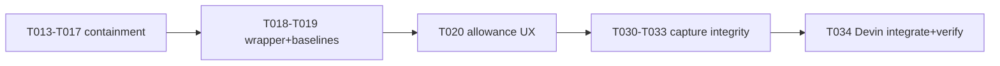
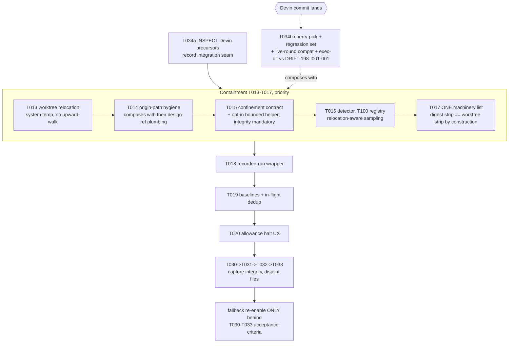

# Design Analysis - Feature 198-beta2-hardening / Iteration 003

**Feature**: 198-beta2-hardening
**Iteration**: 003 — reviewer containment + round economy + capture integrity
**Date**: 2026-07-11
**Spec**: file:///C:/Dev/specrew-beta2-hardening/specs/198-beta2-hardening/spec.md

## Problem Framing

Iteration 003 lands three workstreams: reviewer containment (FR-008..FR-013,
203 W1-W6: worktree relocation, origin-path hygiene, confinement contract,
detector, ONE machinery list, stripped-paths teaching), the round-economy
remainder (FR-014..FR-019: recorded-run wrapper, checkpoint baselines +
in-flight dedup, the spend-allowance halt UX), and the capture-integrity
addendum born from this feature's own field incidents (FR-041..FR-044,
T030-T033: machinery-turn exclusion, tokenizer tightening, exact-sequence
regression fixtures, the append-only ledger correction door).

Iteration 002 supplied unusually strong field input: two fabricated
authorizations with an identical ~37s post-packet signature (DEC-198-GOV-001/
003, both excised under maintainer approval; the fallback capture is DISABLED
interim and stays so until T030-T033's re-enable criteria pass), the
cycle-blind ratchet reworked into ONE shared cycle-scoped matcher
(DEC-198-GOV-002 + the run-2594b7b5 catch), a full 12-entry ledger audit
proving the fallback 0-for-7 honest-at-record-time and naming the missing
temporal-ordering guard, and five independent-review catches - two of them
test-integrity classes now carried as review lenses (fixture hermeticity;
in-worktree suite execution - the retro's hardened action 1 originally bound this as
REQUIRED bounded verification, SUPERSEDED by the option-1 decision (2026-07-11,
DRIFT-198-I003-003): auto per-review verification removed, T018 owns runner-observed
verification, bounded helper opt-in only).

**Incoming shared-engine dependency (maintainer-instructed at the 003
planning approval)**: the Devin crew's FORTHCOMING design-context validation
commit on branch `200-devin-cli-host` (repo
file:///C:/Dev/specrew-200-devin-cli-host - crew mid-iteration-004). Landed
precursors on their branch: `a697cefe` (comma-split `--design-context-ref` +
loud warn on unresolvable refs; touches `worktree-reviewer.ps1`,
`specrew-review.ps1`) and `ec90e1b6` (design-ref plumbing + digest exec-bit
restoration; touches `co-review-service.ps1`, `reviewed-state-digest.ps1` +
tests - the exec-bit half addresses our DRIFT-198-I001-001 materialization
class). Doctrine: INSPECT and reuse/cherry-pick, never reimplement;
post-integration compatibility + regression verification is mandatory (T034)
because both crews modify the same co-review machinery - our T013/T014/T017
edit the very files their commits touch.

Binding constraints carried in: containment + T020 keep priority (capture
work sized here, never displacing them); the fallback stays disabled until
the documented re-enable criteria pass; hooks surfacing-only; one approval
one boundary; paired honesty tests (NFR-007); ProviderMirrorParity;
consumer-legible teaching with zero internal identifiers (SC-007 amended).

## Key Design Decision Points

1. Execution order under serial single-implementer execution: where the
   capture-integrity block and the Devin integration sit relative to the
   prioritized containment chain (T013-T017) and T020.
2. The Devin integration strategy for the OVERLAPPING files
   (worktree-reviewer.ps1, digest surfaces): integrate-at-landing checkpoint
   vs end-loaded vs block-on-dependency.
3. The ONE machinery list (T017): a path-granular data file both strips
   consume by construction (digest strip == worktree strip).
4. The capture-integrity redesign shape (T030-T033): which guards gate the
   fallback re-enable, and the FR-044 correction-door record shape.
5. Worktree relocation (T013) + detector (T016) interplay: relocation must
   not blind the T100-registry containment sampling.

## Alternatives

### Option A: Simplest — strict serial, integration last

**Approach**: Execute in plain priority order - T013..T017, T018, T019,
T020, then T030..T033 - and run T034 (inspect + cherry-pick + verify) at the
END, whenever the Devin commit has landed.

**Architectural pattern**: serial pipeline, end-loaded integration.



**Quality features considered**: trivially simple sequencing and the literal
priority reading - but it maximizes the integration conflict surface: every
one of our worktree-reviewer/digest edits lands BEFORE their fix is
inspected, so the cherry-pick arrives onto a maximally-diverged file set and
the compat verification happens once, at the end, where rework is most
expensive. It also reads their landed precursors last, forfeiting free
design input for T013/T014/T017.

**Effort estimate**: 12.0 SP planned (+ end-loaded rework risk on the
overlap files, realistically +1-1.5 SP if their commit lands mid-iteration).

**Reversibility cost**: medium — rework concentrated at the end.

**Trade-offs**:

- (+) Simplest order; zero coordination thinking.
- (-) End-loaded integration on files two crews are editing is the
  known-worst merge shape.
- (-) Their precursors already contain design input our containment tasks
  should compose with (design-ref plumbing sits in the same functions T014
  rewrites).

### Option B: Reasonable — priority order with a front-loaded inspection and an at-landing integration checkpoint

**Approach**: Keep the maintainer's priority order intact - containment
first, then T018-T020, capture-integrity last - but split T034 into its two
natural halves. **T034a (inspection, ~0.25 SP) runs FIRST**: read the landed
precursors (`a697cefe`, `ec90e1b6`) and the forthcoming commit's shape as
soon as it exists, and record the integration seam (which functions in
worktree-reviewer.ps1 / reviewed-state-digest.ps1 their work owns, which
ours touch) so T013/T014/T017 are DESIGNED to compose with it rather than
collide. **T034b (cherry-pick + compat/regression verification, ~0.5 SP)
executes at the landing checkpoint** - the moment their commit is available,
wherever the iteration then stands: cherry-pick (never reimplement), run the
co-review engine regression set (worktree/digest/signoff-gate suites), run
one live review round as the compatibility proof, and verify the exec-bit
restoration against the DRIFT-198-I001-001 class. Capture-integrity
(T030-T033) stays last as the disjoint-file block (ConversationCaptureAccessor,
shared-governance ledger surface): T030 machinery-turn exclusion -> T031
tokenizer tightening (+ temporal-ordering guard from the audit, + the
GOV-002/003 cursor invariant) -> T032 exact-sequence fixtures (the two live
fabrications replayed verbatim, promoting the interim C17 regressions to the
redesigned path) -> T033 append-only correction door (invalidation records
carrying original-entry identity, correcting authority, reason, timestamp,
resulting boundary state; every effective-state reader honors invalidations;
the six premature-record audit findings become its first annotation
candidates). The fallback re-enables ONLY when all four pass their
acceptance criteria - the interim disable and its test contract are the
gate.

**Architectural pattern**: priority-ordered serial execution with one
dependency checkpoint; data-file seam for the machinery list; guarded
re-enable behind paired acceptance tests.



**Quality features considered**: priority preserved exactly (containment and
T020 never displaced); the inspection is nearly free and de-risks the three
overlap tasks; the at-landing checkpoint puts the compat verification at the
cheapest possible point instead of the most expensive; capture-integrity's
disjoint file surface means its position cannot conflict with anything; the
re-enable is a tested gate, not a judgment call; every 002 field incident
becomes a fixture.

**Effort estimate**: 12.0 SP planned (T013 1.0, T014 1.0, T015 0.5, T016
1.0, T017 1.5, T018 1.0, T019 1.5, T020 1.0, T030 0.75, T031 0.5, T032 0.5,
T033 1.0, T034 0.75 split 0.25/0.5) - provisional values confirmed as
sized. (The draft first said 11.5 - an addition error against these same
rows, caught at self-review before the gate; the rows are authoritative:
containment 5.0 + round economy 3.5 + capture 2.75 + integration 0.75.)

**Reversibility cost**: low — the checkpoint is a scheduling device, not a
structure; all new logic is pure functions + data + recorded transitions.

**Trade-offs**:

- (+) Minimal double-rework on the two-crew overlap files; free design input
  before the overlap tasks start.
- (+) Priority instruction honored literally; capture block cannot displace
  anything (disjoint files, last position).
- (-) One scheduling interrupt (T034b) whose timing is external — bounded to
  ~0.5 SP whenever it fires.

### Option C: By the book — block on the dependency, integrate first

**Approach**: Wait for the Devin commit; run T034 in full first; then
execute containment on the fully-integrated engine, then the rest.

**Architectural pattern**: dependency-first pipeline.


**Quality features considered**: zero merge risk on the overlap files - but
the iteration start blocks on external timing the crew does not control,
while stable 0.40.0 is HELD on this feature (DEC-197-REL-001); an unbounded
wait trades a bounded ~0.5 SP rework risk for unbounded calendar risk.

**Effort estimate**: 12.0 SP planned + unbounded calendar wait.

**Reversibility cost**: low technically; high schedule cost.

**Trade-offs**:

- (+) Cleanest possible integration.
- (-) Blocks a release-holding iteration on another crew's timing; the
  maintainer's instruction ("forthcoming... during design analysis") asks
  for the dependency to be RECORDED and planned around, not waited on.

## Crew Recommendation

**Option B.** It is the only shape that honors all three binding
instructions simultaneously - containment/T020 priority intact, the Devin
fix inspected-and-reused at the cheapest point instead of reimplemented or
end-merged, and the capture block sized-in-place on disjoint files with the
fallback re-enable behind tested acceptance criteria. Both rejected
alternatives fail an instruction each: one end-loads the two-crew merge
onto maximally-diverged files, the other blocks a release-holding iteration
on external timing (rationales in their trade-off tables above).

## Capacity Model

12.0 SP planned (containment 5.0, round-economy 3.5, capture-integrity
2.75, integration 0.75 sized as 0.25 + 0.5) against the 26 cap - honest
forecast ~14 SP wall-clock with the pre-T020 review tax (the 002 retro
calibration holds until T020 itself lands mid-iteration). Defer order if a
slice spills: T033 first (the correction door can slip to iteration 004
with an explicit maintainer decision - FR-044 has no downstream dependent
this release), then T032; NEVER T013-T017, T020 (priority instruction), nor
T030/T031 (the live fabrication class the interim disable is holding shut).

## Applicable Lenses

- **architecture-core**
  - Addressed: Option B keeps the one-primitive doctrine on both fronts -
    the ONE machinery list is a single data file both strips consume by
    construction (T017), and the capture redesign extends the ONE
    cycle-scoped matcher family instead of adding per-site readers (the
    GOV-002 lesson realized as structure).
- **security-compliance**
  - Addressed: the fallback re-enable is gated on paired acceptance tests
    for the exact fabrication sequences (T032 replays both live incidents);
    the correction door APPENDS invalidation records under human authority -
    never silent deletion (the maintainer's binding shape); containment
    keeps the reviewer trusted-but-confined (relocation + detector +
    contract; never mid-flight kills).
- **component-design**
  - Addressed: T013-T017 build the containment components on the agreed map
    (WorktreeRelocator, BundleHygiene, ConfinementContract,
    ContainmentDetector on the T100 registry, MachineryList data seam);
    T030-T033 stay inside ConversationCaptureAccessor + the
    shared-governance ledger surface - no new component sprawl.
- **requirements-nfr**
  - Addressed: every guard ships paired (relocation works / upward-walk
    fails; detector flags / false-kill guarded; wrapper records / caller
    numbers rejected; machinery-turn excluded / genuine turn captures;
    tokenizer refuses scold-text / accepts real verdicts; correction door
    appends / effective-state honors) with message-content assertions on
    the teaching surfaces.
- **data-storage**
  - Addressed: the machinery list is one versioned data file (the deny-list
    precedent); invalidation records are additive entries in the existing
    verdict-history store (no new store, no migration); catalog untouched.
- **integration-api**
  - Addressed: the Devin integration seam is recorded BEFORE the overlap
    tasks start (T034a); the cherry-pick + regression + live-round
    verification is the compatibility contract between crews (T034b); the
    ReviewRequest design-context surface stays theirs - we consume, not
    fork.
- **devops-operations**
  - Addressed: mirror parity on every extension-script change; the
    regression set + live round after integration ride existing lanes; the
    relocation keeps worktrees out of the repo tree so CI checkouts never
    see them.
- **observability-resilience**
  - Addressed: containment violations are loud origin-side records (never
    silent, never mid-flight kills); the allowance halt (T020) is the
    consumer-legible spend-guard surface per the amended FR-018/FR-019; the
    interim-disable reason string stays legible in capture telemetry until
    re-enable.
- **code-implementation**
  - Addressed: pure functions + data seams under the six F-198 custom
    rules; the two 002 test-integrity lessons are binding here - every new
    test builds its own fixture (hermeticity lens) and the confinement
    bounded-verification helper (timeout/process containment, bounded output,
    post-run mutation detection) is an EXPLICIT OPT-IN API - the orchestrator
    does NOT auto-run it (option-1 decision 2026-07-11, DRIFT-198-I003-003);
    runner-observed verification evidence is T018's one-time recorded-run job;
    reviewer-invocation integrity (pre/post hash; only .review/findings.jsonl
    writable) is MANDATORY; confinement is MONITORED, not OS-enforced.

## Co-Design Record

**Decomposition vocabulary**: data seams / host-neutral governed scripts
(A1, human-agreed at the workshop).

**Human-agreed**: yes — the containment shape (W1-W3 + W4 cheap detector,
S1), path-granular machinery list (S2), the 600-floor budget doctrine (S3),
and the spend-allowance semantics (maintainer amendment) were workshop
decisions; the capture-integrity requirements are maintainer-instructed
verbatim (retro approve-with-instructions + the DEC-198-GOV-003 interim
mitigation instructions); the Devin integration doctrine is
maintainer-instructed at the 003 planning approval.

### Agreed component-to-responsibility map (iteration 003 slice)

```text
   CONTAINMENT (scripts/internal/continuous-co-review/**)
   WorktreeRelocator     — materialize OUTSIDE origin root (system temp);
                           upward-walk cannot resolve origin (T013)
   BundleHygiene         — strip/relativize origin-absolute paths from
                           reviewer-visible context (T014; composes with
                           Devin design-ref plumbing in the same functions)
   ConfinementContract   — slim prompt + spawn contract: worktree-only rules +
                           what-is-absent teaching; MONITORED confinement (not
                           OS-enforced) + MANDATORY reviewer-invocation integrity;
                           bounded-verification helper OPT-IN only, T018 owns
                           runner-observed verification (T015; option-1 2026-07-11)
   ContainmentDetector   — T100-registry cwd/commandline sampling; loud
                           containment-violated record; never mid-flight
                           kill (T016)
   MachineryList         — ONE path-granular data file; digest strip ==
                           worktree strip by construction (T017)

   ROUND ECONOMY
   RecordedRunWrapper    — Invoke-ContinuousCoReviewRecordedTestRun runs
                           Pester -PassThru itself; caller numbers rejected
                           (T018)
   CheckpointBaselines   — last-REVIEWED identity as next baseline;
                           in-flight dedup per lineage (T019)
   AllowanceHaltUX       — consumer-legible spend-guard halt; every round
                           counts; zero internal identifiers (T020)

   CAPTURE INTEGRITY (scripts/internal/bootstrap/ + shared-governance)
   MachineryTurnFilter   — hook-injected/agent-authored turns are never
                           verdict evidence (T030)
   VerdictTokenizer      — approval-shaped mention/scold text never parses;
                           temporal-ordering + cursor-invariant guards (T031)
   FabricationFixtures   — both live incidents replayed verbatim; re-enable
                           acceptance surface (T032)
   CorrectionDoor        — append-only invalidation records; effective-state
                           readers honor them (T033)

   TWO-CREW SEAM
   DevinIntegration      — T034a inspect precursors FIRST; T034b cherry-pick
                           + regression set + live-round compat at landing
```

### Agreed flow (the at-landing integration checkpoint)

```text
  T034a (day 1): read a697cefe + ec90e1b6 → record the seam
      → T013/T014/T017 designed to compose, not collide
  ... iteration proceeds in priority order ...
  Devin commit lands (external) → CHECKPOINT T034b:
      cherry-pick (never reimplement)
      → PRESERVE strict fail-before-execution for explicitly-supplied
        unresolved design-context refs (cca79708; never soften to a warn;
        tests mirror 7f/7g: reviewer never invoked on invalid refs)
      → co-review regression set (worktree/digest/signoff suites)
      → one live review round (compat proof)
      → exec-bit restoration verified vs DRIFT-198-I001-001
      → MECHANICAL conflicts (line/rename/formatting, plumbing shape):
        resolve toward THEIR design-context seam, ours adapts
      → SEMANTIC conflicts (anything changing containment, authorization,
        evidence integrity, or fail-closed behavior): ESCALATE to the
        maintainer - never auto-resolved (maintainer instruction,
        2026-07-11 send-back)
```

## Roadmap Fit

- Iteration 004 (distribution + release v0.40.0-beta2) depends on this
  iteration's containment being live (the release ships the worktree
  engine) and consumes T020's halt-UX shape for its closeout teaching; the
  fallback re-enable decision lands before the release tag or the disable
  ships as the beta2 posture (documented either way).
- The Devin crew's Feature 200 merges after ours or alongside; T034b's
  compat verification is the two-crew contract either way.

## Human Decision

- **Decision verdict**: Option B chosen by the maintainer (2026-07-11,
  typed at the design-gate exchange: "Option B is the correct technical
  choice... Keep Option B"). The lifecycle boundary (plan -> tasks) was
  deliberately NOT advanced by that message ("No lifecycle advancement is
  authorized by this response") - its verdict is captured at the clean
  boundary packet that followed.
- **Chosen Option**: Option B — priority order + front-loaded inspection +
  at-landing integration checkpoint; capture-integrity last on disjoint
  files; fallback re-enable only behind T030-T033 acceptance criteria.
- **Reason**: the only shape honoring all three binding instructions at
  once (containment/T020 priority; inspect-and-reuse the Devin fix at the
  cheapest point; capture block sized-in-place).
- **Modifications (maintainer-typed)**: conflict-resolution doctrine
  refined — MECHANICAL conflicts resolve toward the Devin-owned
  design-context seam; SEMANTIC conflicts that change containment,
  authorization, evidence integrity, or fail-closed behavior are ESCALATED
  to the maintainer, never auto-resolved (recorded in the agreed flow
  above and binding on T034b).
- **Design-analysis draft commit**: `93dc37d2`
- **Decision recorded in commit**: the commit carrying this section.
