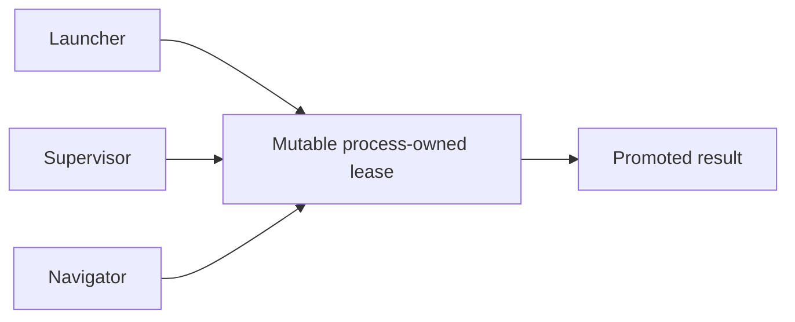

# Design Analysis — Feature 198 / Iteration 005 Architectural Reassessment

**Feature**: 198-beta2-hardening
**Iteration**: 005 — failed lease design reassessment and replacement architecture
**Date**: 2026-07-16
**Status**: design complete; execution replan required; no implementation boundary authorized
**Spec**: file:///C:/Dev/specrew-beta2-hardening/specs/198-beta2-hardening/spec.md
**Workshop index**: file:///C:/Dev/specrew-beta2-hardening/specs/198-beta2-hardening/iterations/005/lens-applicability.json

## Problem Framing

The final authorized Iteration 005 review found eight blocking defects after repeated point fixes. The dominant failures were architectural:

1. Missing or failed authority helpers promoted uncertainty into permission.
2. Mutable one-file lease operations used different non-atomic read/validate/write techniques.
3. Result schema and run identity were not enforced by the authority-consuming navigator.
4. Host support claims exceeded executable probe evidence.
5. A plan-level injected timestamp obscured per-command runtime truth.

The old design made a process-owned lease both execution coordination and later result authority. Parent-to-supervisor handoff, self-adoption, mutable pending targets, owner release, orphan reclamation, and navigator promotion consequently shared a fragile file. Further point fixes would preserve that coupling and recreate the failure class.

The replacement must remain deliberately small: trusted-but-fallible external reviewers, dependency-free JSON, unique immutable files, OS lifecycle control, strict result ingress, exact Git currentness, and no general transaction/event/telemetry platform.

## Human-Confirmed Requirements

- Review code now and preserve a target abstraction for later gates/artifacts.
- Run reviewers in disposable external worktrees without Specrew skills/hooks and without origin mutation authority.
- Communicate through a synchronous CLI prompt plus bounded JSON and human Markdown result files.
- Implement all five supported reviewer harnesses, not one reference adapter.
- Control process trees and runtime on Windows, macOS, and Linux.
- Bind every result to the exact reviewed target and disclose later target movement.
- Keep findings from partial or moved reviews useful, while requiring a separately authorized complete rerun.
- Let only humans increase review allowance; make every actual invocation consume a slot.
- Prefer stability and measurable cost/performance optimization over aggressive isolation or framework breadth.
- Prevent generic five-section Stop follow-ups while an active workshop question is awaiting the human.

## Key Design Decision Points

1. Separate campaign-level allowance/re-review policy from one external invocation and from active concurrency coordination.
2. Choose the minimum durable authority store and atomic publication semantics that remain safe across multiple processes.
3. Bind origin isolation, frozen target identity, later currentness, and partial-finding usefulness without allowing moved evidence to approve current code.
4. Define one controller/adapter contract and prove real completeness across five harnesses and three operating systems.
5. Establish timeout, crash recovery, terminal-result, retry, finding-lineage, retrospective, and directly observed timing semantics.
6. Bound Beta2 to production code review plus a target-neutral fixture while preserving production gate/artifact breadth for Beta3.
7. Split the 30–34 SP replacement into capacity-compliant implementation slices without representing the first slice as release-complete.

## Alternatives

### Option A: Simplest — continue hardening the mutable process-owned lease

**Approach**: Retain the one-file lease, add a uniform CAS helper, make every authority fallback fail closed, and patch consumer validation.

**Architectural pattern**: mutable lease-centered coordinator with patched consumer gates.



**Quality features considered**: smallest code delta and reuse of the current launcher/supervisor/navigator split, but authority, process ownership, pending targets, recovery, and promotion remain coupled.

**Effort estimate**: 8–12 SP initially, with high repeat-review/rework risk.

**Reversibility cost**: high because every further patch deepens reliance on the failed lease authority.

**Trade-offs**:

- (+) Smallest immediate diff.
- (-) Preserves process handoff, mutable pending target, scattered spend/recovery, and lease-based terminal authority.
- (-) Repeats the point-fix strategy that exhausted the authorized review rounds.

### Option B: Reasonable — campaign/run state machines with immutable JSON facts and ports/adapters

**Approach**: Place `ReviewCampaign` above one-invocation `ReviewRun` state machines. Use run-owned immutable claim generations for active execution and durable terminal run/result facts for later validation/applicability. Keep policy pure and mechanisms behind ports; publish unique facts with atomic `CreateNew`.

**Architectural pattern**: state-machine core with ports/adapters and a bounded immutable lifecycle journal.


**Quality features considered**: fail-closed authority, explicit allowance/spend, target neutrality, five-harness and three-platform variation, deterministic recovery, exact currentness, useful partial evidence, and bounded performance signals without a database.

**Effort estimate**: 30–34 SP including proof and expected review/rework, split as a 16 SP authority foundation plus 17 SP production-completeness baseline.

**Reversibility cost**: medium. Legacy state stays read-only and the new store has one cutover, while ports keep harness/OS/target mechanisms replaceable.

**Trade-offs**:

- (+) Removes process-owner handoff and shared result filenames.
- (+) Makes authority, spend, recovery, and evidence applicability explicit and testable.
- (+) Supports later target adapters without implementing their production breadth in Beta2.
- (-) Requires a real rewrite and two implementation iterations before Beta2 can release.

### Option C: By-the-book — SQLite transactions or a general append-only event store

**Approach**: Centralize authority, concurrency, and recovery in a transactional database or generic event framework with migrations and query projections.

**Architectural pattern**: transactional repository or generalized event sourcing.


**Quality features considered**: strong multi-record transactions and standardized querying, but at the cost of native packaging, migration, replay/projection, compaction, and support complexity for a small local store.

**Effort estimate**: 40+ SP including cross-platform packaging, migrations, recovery, and tests.

**Reversibility cost**: high because data access, packaging, and operations become coupled to the chosen persistence framework.

**Trade-offs**:

- (+) Multi-record transactional semantics.
- (-) Disproportionate dependency, migration, packaging, replay, and pruning burden.
- (-) Violates the simplicity-first constraint without evidence that local JSON volume needs it.

### Option D — hardened sandbox and isolated identity/home for an untrusted reviewer

Treat the reviewer as hostile and add network/filesystem jail, isolated credentials, and host-specific sandbox policy.

**Rejected for Beta2**. The reviewer is trusted but fallible. Disposable external worktrees, controlled environment, origin containment detection, and OS process-tree control address the confirmed risks while preserving stable harness authentication and execution.

## Selected Architecture

```text
ReviewCommand / RetroEvidenceReader
               |
               v
ReviewCampaignCoordinator -----> ReviewRunCoordinator -----> ResultIngestor
               |                         |                         |
               v                         v                         v
 ReviewCampaignPolicy          ReviewRunStateMachine       ResultAcceptancePolicy
                                         |                 FindingLineagePolicy
                                         v
 Campaign | Run | Claim | Target | Harness | Runtime | Clock ports
     ^        ^      ^       ^        ^         ^         ^
     |        |      |       |        |         |         |
 JsonReviewStore   Git target |  five harnesses  |    SystemClock
                            non-code fixture      |
                                 Windows Job Object
                                 Linux cgroup
                                 macOS process group
```

The core makes decisions without filesystem, process, Git, harness, or wall-clock calls. Application coordinators sequence work through ports. Infrastructure adapters implement volatile mechanisms. Logical component boundaries do not require one class/file each.

## Co-Design Record

### Interface and consumer responsibilities

- `ReviewCommand` — starts, monitors, and reports campaigns/runs through the CLI.
- `RetroEvidenceReader` — supplies deduplicated validated finding provenance to retrospective generation without parsing Markdown.

### Application responsibilities

- `ReviewCampaignCoordinator` — owns target lineage, human grants, reservations/spend, ordered reruns, and current-result selection.
- `ReviewRunCoordinator` — sequences one target freeze, claim, invocation, termination, ingestion, and publication.
- `ResultIngestor` — validates candidate schema/identity and publishes the terminal machine result plus Markdown projection.

### Core responsibilities

- `ReviewCampaignPolicy` — decides whether another run is permitted from immutable allowance facts.
- `ReviewRunStateMachine` — defines legal states/transitions for one provider invocation.
- `ResultAcceptancePolicy` — decides completeness, currentness, relevance, and approval applicability.
- `FindingLineagePolicy` — links findings across partial, complete, moved-snapshot, and rerun results.

### Port responsibilities

- `CampaignRepository` — sole logical mutation path for campaign and allowance facts.
- `RunRepository` — sole logical mutation path for run, result, validation, and classification facts.
- `ClaimRepository` — atomically acquires/retires immutable claim generations.
- `ReviewTargetPort` — freezes and identifies code or later non-code targets.
- `HarnessPort` — translates the common invocation into a supported reviewer CLI.
- `RuntimePort` — launches, monitors, times out, and terminates complete process trees.
- `ClockPort` — supplies system-observed production time and explicit deterministic test time.

### Infrastructure responsibilities

- `JsonReviewStore` — implements campaign/run/claim repositories using unique immutable JSON facts.
- `GitWorktreeTarget` — creates the external frozen code target and computes currentness identity.
- `ReviewerHostCatalog` — single data seam for executable, prompt mode, contract support, and runtime defaults.
- `ClaudeAdapter`, `CodexAdapter`, `CopilotAdapter`, `CursorAdapter`, `AntigravityAdapter` — native invocation/output translation for every supported harness.
- `WindowsJobObjectRuntime`, `LinuxCgroupRuntime`, `MacProcessGroupRuntime` — native process-tree control.
- `SystemClock` — UTC timestamps plus monotonic durations with production provenance.
- `NonCodeTargetContractFixture`, `ReviewerExecutableFixture` — prove target neutrality and deterministic adapter failure behavior.

### Agreed key flow — successful review

```text
human grant
 -> ReviewCommand requests review
 -> ReviewCampaignCoordinator reserves allowance
 -> ReviewRunCoordinator freezes target + acquires claim generation
 -> selected HarnessAdapter builds native invocation
 -> RuntimeAdapter supervises external reviewer
 -> ResultIngestor validates candidate JSON/run/target identity
 -> repository publishes terminal result + validation/classification
 -> ResultAcceptancePolicy checks exact current target
 -> claim release fact is created
 -> CLI shows outcome; RetroEvidenceReader later exposes finding lineage
```

### Agreed key flow — timeout and rerun

```text
deadline
 -> RuntimeAdapter kills complete tree
 -> verifies every process dead and closes streams
 -> ResultIngestor validates bounded partial findings
 -> publishes incomplete timed-out result + Markdown reason
 -> claim release fact is created; spent allowance remains spent
 -> campaign reserves another existing grant or asks human for more
 -> new run_id performs the required complete rerun
```

**Human-agreed**: yes — the maintainer accepted the complete rendered component map, responsibilities, successful flow, timeout/rerun flow, and later macOS runtime reconciliation during the per-lens workshop.

## Data and Coordination Design

```text
review-store/
  campaigns/<campaign-id>/
    grants/ reservations/ spend/
    runs/<run-id>/
      requested.json
      running.json
      terminal.json
      result.json
      validation.json
      classification.json
      report.md
  claims/<lineage-id>/
    claim-0001-held.json
    claim-0001-released.json
    claim-0002-held.json
    claim-0002-abandoned.json
```

- Every invocation has a unique run directory; target digest identifies what was reviewed, while run ID identifies the invocation.
- Claim acquisition reads the highest generation and atomically creates the next held filename. A matching immutable released/abandoned fact retires it.
- Process identity supplies liveness evidence only and never becomes authority ownership.
- Human grants, reservations, provider spend, and pre-invocation release are immutable facts.
- Every invoked run publishes one terminal `result.json`, including controller-generated timeout/failure envelopes.
- Legacy lease/run state is read-only historical evidence. Cutover must make exactly one authority path active; no legacy result can be promoted into the new campaign store automatically.
- Facts carry `schema_version`. Unsupported or invalid authority fails closed. Beta2 has no automatic migration/pruning framework.

## Integration Contract

```text
ReviewInvocation
  schema_version, campaign_id, run_id, target_digest,
  snapshot_path, review_scope, prompt_path,
  candidate_result_path, candidate_report_path, deadline

ReviewerResult
  schema_version, run_id, target_digest,
  completion, verdict, runtime_outcome, termination_verified,
  summary, findings[]
```

Reviewers write candidate output only. Controller-owned outcomes include `completed`, `preflight-failed`, `launch-failed`, `timed-out`, `terminated`, `invalid-output`, `identity-mismatch`, and `containment-violated`. A finding ID is local to a run; controller-owned lineage performs cross-run matching.

The public CLI remains synchronous. There is no daemon, queue, network API, webhook, or streaming requirement. Adapters use the stable native prompt mechanism and existing conformance-backed authentication/configuration. They never retry invisibly.

## Authority and Failure Invariants

1. No result approves a target unless result schema/identity, invocation/spend, termination, containment, and exact currentness are all proven.
2. `snapshot-moved` findings stay visible and useful but cannot approve or freshly block the current target.
3. At most one active claim generation exists per lineage and spend never exceeds human grants.
4. An actual invocation remains spent after timeout/crash; only proven pre-invocation failure releases allowance.
5. Partial findings are advisory and seed a separate complete rerun.
6. Timeout result publication occurs only after complete-tree death is verified.
7. Identical recovery facts are idempotent; conflicting facts fail closed as corruption.
8. Markdown, progress heartbeats, process activity, and optional token counts are informational, never authority.
9. The origin repository alone mutates product code; review repositories alone mutate review authority records.
10. External execution is not exactly-once; the system promises at-most-one authoritative selected result, visible run identities, and honest spend.

## Observability, Performance, and Cost

- CLI stages and ~30-second low-cost heartbeats show elapsed/remaining time, liveness, and output activity without claiming semantic progress.
- Finding counts appear only from complete schema-valid checkpoints.
- Production timing reads the live clock per attempt and records UTC plus monotonic duration; injected clocks are test-only.
- Cheap preflight precedes spend. Git worktrees share objects. Prompts contain bounded scope/delta/unresolved-finding summaries, not source content.
- Re-review focus uses delta and lineage while the complete frozen snapshot remains accessible and covered.
- Required hashes are computed at pre/post integrity points, not in heartbeats.
- Phase timings and safe usage/cost numbers are recorded where exposed.
- Failure fixtures avoid AI spend; live proof is one bounded review per harness.

## Proof Strategy

```text
five paid live smokes
  -> Claude, Codex, Copilot, Cursor, Antigravity once each
  -> distributed across Windows, macOS, Linux

deterministic matrix
  -> all adapters on three OSes
  -> every runtime kills a descendant tree
  -> malformed/identity/timeout/interruption/recovery faults
```

The five-harness and three-platform sets are both complete without paying for all fifteen combinations. A specific untested pair remains unclaimed.

## Scope Boundary and Roadmap

### Beta2 release blocker

- Shared campaign/run state-machine foundation.
- Immutable JSON campaign/run/claim repositories and recovery.
- Production Git code-review target plus thin non-code fixture.
- Common process/file result contract and all five real harness adapters.
- Windows, macOS, and Linux runtime control.
- Status/progress, timeout/partial results, finding lineage/retro projection, performance/cost signals, and workshop-intermediate Stop behavior.

### Beta3 iteration A — production generic gate/artifact adapters

Estimated 12–16 SP, midpoint 14. Add production target adapters, target-specific identity/scope policies, fixtures, and compatibility evidence using the same foundation.

### Beta3 iteration B — prioritized lifecycle profiles

Estimated 8–12 SP, midpoint 10. Add first-class profiles only for prioritized artifact families rather than bespoke implementations for every artifact.

## Capacity and Recommended Execution Split

The replacement Beta2 slice is estimated at 30–34 SP including review/rework. One iteration would exceed both the normal 20 SP discipline and the current 26 SP project cap.

### Recommended split — pending plan verdict

| Slice | Scope | Estimate |
|---|---|---:|
| Next iteration: authority foundation | Pure policies/state machines; JSON campaign/run/claim stores; allowance/recovery; target/currentness; result ingestion; common contract; CLI orchestration; target and executable fixtures | 16 SP |
| Following iteration: production completeness | Five harness adapters; Windows/macOS/Linux runtime adapters; status/heartbeat/performance; retro projection; workshop Stop; three-OS matrix; five live smokes; legacy cutover/docs; integration review/rework | 17 SP |
| **Total** | Beta2 replacement | **33 SP** |

The first slice is not release-complete and MUST NOT be represented as satisfying multi-harness support. Beta2 remains blocked until the second slice supplies all five real adapters and the complete proof matrix.

### Rejected capacity alternatives

- One 33 SP iteration: overcommitted and repeats the context/complexity failure that caused the reassessment.
- Defer real harness/platform breadth to Beta3: contradicts the maintainer-confirmed Beta2 completeness requirement.
- Raise the cap: hides the task volume instead of isolating coherent authority-foundation and production-proof risks.

## Crew Recommendation

**Recommended: Option B** — campaign/run state machines with immutable JSON facts and ports/adapters, delivered through the two capacity-compliant Beta2 slices. It is the only option that removes the failed lease coupling, satisfies the confirmed five-harness/three-platform completeness requirement, preserves useful partial findings and exact currentness, and stays dependency-free. Option A repeats the failed point-fix approach; Option C adds unjustified persistence infrastructure; Option D applies a hostile-reviewer threat model the maintainer explicitly rejected.

## Plan Obligations

- Supersede the current Iteration 005 task block; do not append point-fixes to T035–T040.
- Create capacity-compliant new iteration plans with exact FR-057–FR-065 and SC-017–SC-021 traceability.
- Define a single cutover step that disables legacy promotion before new campaign authority is enabled.
- Scaffold state, drift log, hardening gate, plan, and tasks before implementation.
- Include expected review/rework effort and the five bounded real smokes explicitly.
- Preserve existing unrelated Beta2 deliverables and do not alter FR-054's approved deferral.
- Require a new human plan/tasks verdict before any replacement code is implemented.

## Applicable Lenses

- **architecture-core**
  - Addressed: `ReviewCampaign` owns allowance/lineage and sequences one-invocation `ReviewRun` state machines; active claims are subordinate coordination, while terminal result facts govern later authority.
- **security-compliance**
  - Addressed: trusted-but-fallible reviewers use external disposable worktrees, controlled stable environments, origin containment, strict result ingress, safe audit, and fail-closed missing authority without a hardened sandbox.
- **data-storage**
  - Addressed: dependency-free JSON uses unique run directories, immutable stage/result/allowance facts, run-owned claim generations, deterministic recovery, versioning, conservative retention, and no generic lock/CAS/database/event store.
- **integration-api**
  - Addressed: a synchronous versioned ReviewInvocation/ReviewerResult process-file contract is implemented by all five harness adapters; controller-owned staging validation and runtime classification protect authority.
- **observability-resilience**
  - Addressed: informational stage/liveness/activity is separated from authority evidence; timeout publishes only after verified tree death; partial findings, recovery, timing provenance, safe diagnostics, and retro evidence are explicit.
- **component-design**
  - Addressed: the full layered component/responsibility map names interface, application, core, ports, JSON/Git/harness/OS/clock adapters, and both successful and timeout/rerun flows.
- **requirements-nfr**
  - Addressed: P0 integrity/stability/authority/containment/recovery and P1 diagnostic/performance/cost/traceability/workshop UX have measurable SC-017–SC-021 proof obligations and explicit non-driving scale exclusions.
- **code-implementation**
  - Addressed: the existing PowerShell rule manifest now binds pure core functions, repository-only atomic `CreateNew`, no hidden retry/new dependency, strict schema mapping, three-OS fixtures, five live smokes, and P1 evidence-driven performance.

## Human Decision

- **Chosen Option**: Option B — campaign/run state machines, immutable JSON facts, and ports/adapters.
- **Reason**: The maintainer repeatedly prioritized simplicity and stability while requiring complete five-harness implementation, OS runtime control, exact target binding, reusable partial findings, explicit reruns/allowance, and performance awareness. Option B satisfies those needs without retaining the failed process-owned lease or adding a database/event framework.
- **Modifications and instructions**: repository code remains the sole code-mutation authority; review repositories are the sole review-state mutation authority; all five harnesses and all three OS runtimes are Beta2 completeness requirements; timeout reason must be written after verified kill; findings feed retrospective evidence; production gate/artifact adapters remain Beta3; performance is P1 below stability/integrity; workshop intermediate stops suppress the generic packet.
- **Workshop evidence baseline commit**: `b19f01df8691bc125bd656a954623601e6620b0f` (pre-reassessment implementation HEAD; not represented as the later design-decision commit).
- **Reviewed workshop checkpoint**: `0650461165dc5db4bc285b0dfa27e5d64fcb7f87` (the exact consolidated design shown at the gate).
- **Decision verdict**: approved for plan with Option B.
- **Verdict evidence**: the maintainer replied `1` on 2026-07-16 to the rendered three-option design gate where option 1 was **approved for plan with Option B**.
- **Decision record commit**: pending the focused commit that first contains this verdict; it will be resolved before the pre-plan gate runs.
- **Boundary status**: design-analysis to plan authorized; tasks and implementation remain unauthorized.
