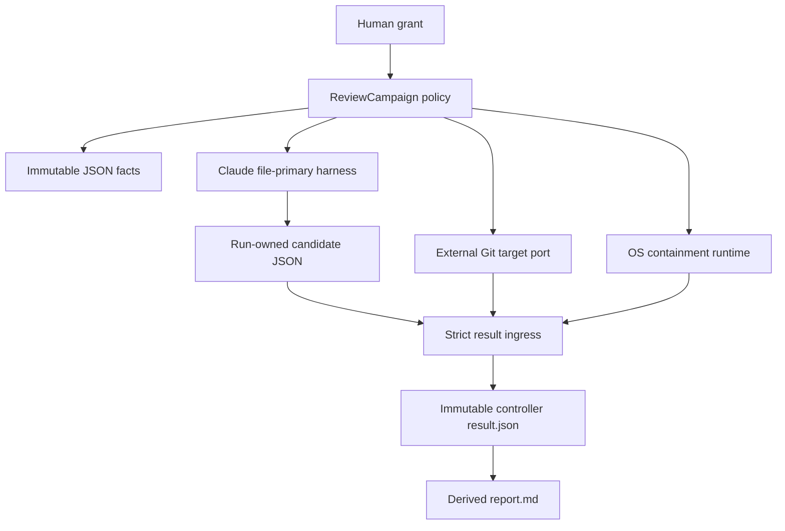
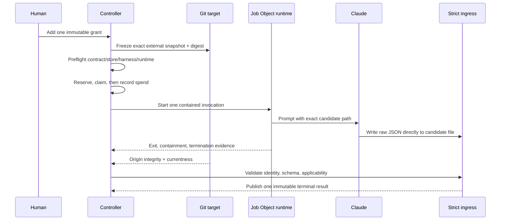

# Review Diagrams: Iteration 006

**Schema**: v1
**Diagram Format**: mermaid

## Authority Structure

## One-Invocation Review Flow

## Trust and Deferral Boundary

- The repository remains the sole code-mutation authority; the reviewer sees a disposable copy.
- Campaign/run repositories are the sole review-state mutation authority.
- Iteration 006 proves the shared foundation and one Claude file-primary slice only.
- The other harness adapters, production Linux/macOS/Windows runtime matrix, live smokes, and progress-to-retro projection remain Iteration 007.
