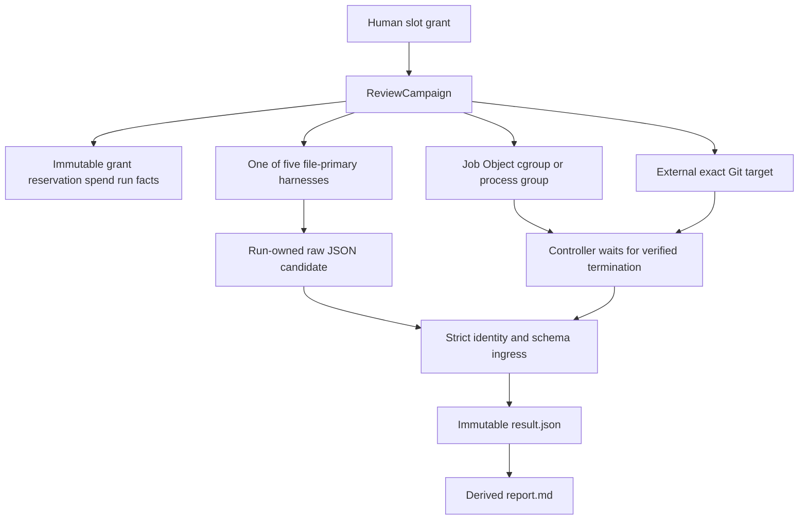
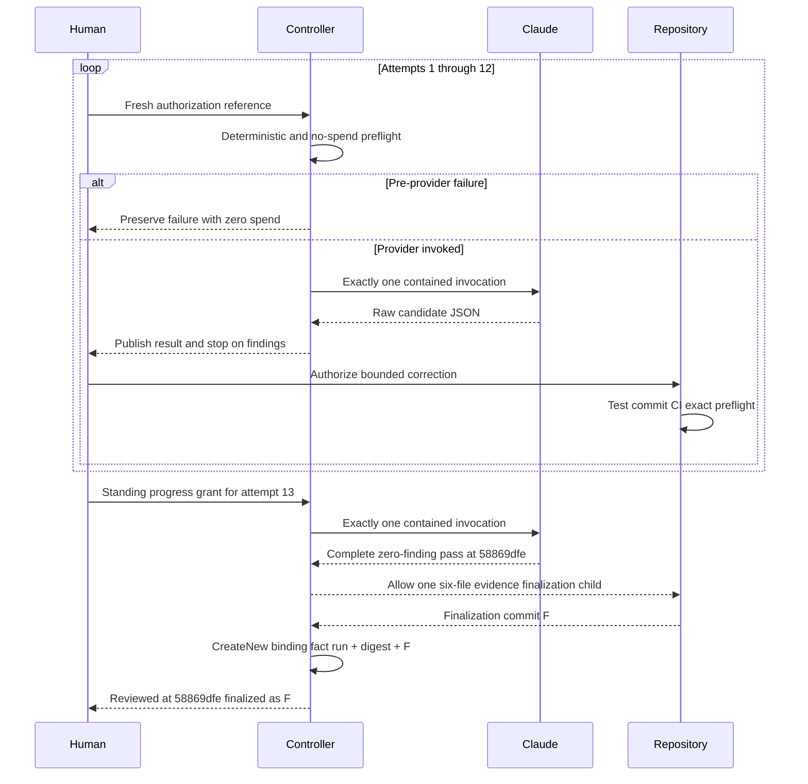
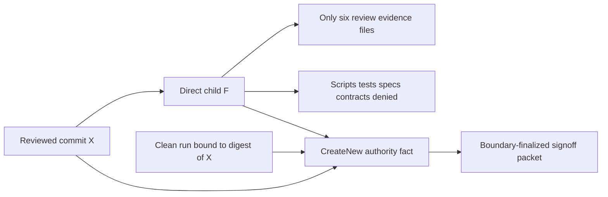
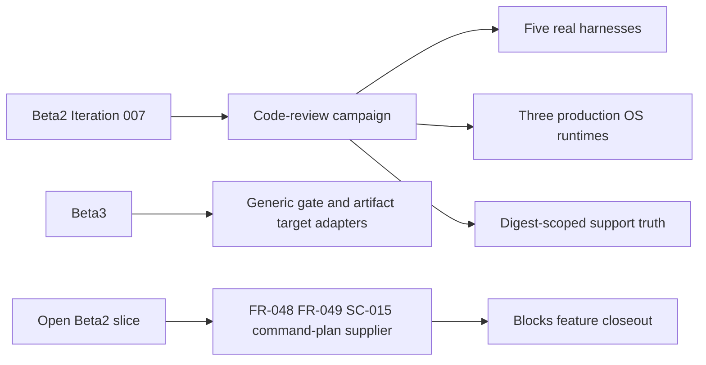

# Review Diagrams: Iteration 007

**Schema**: v1
**Diagram Format**: mermaid

## Production Review Authority

## T061 Correction and Signoff Sequence

## Bounded Finalization Envelope

## Support and Deferral Boundary

The diagrams intentionally separate reviewer execution from code mutation: only the repository may mutate product code, only the campaign controller may publish review authority, and the finalization child cannot carry implementation changes.
