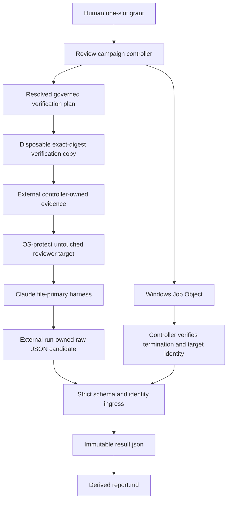
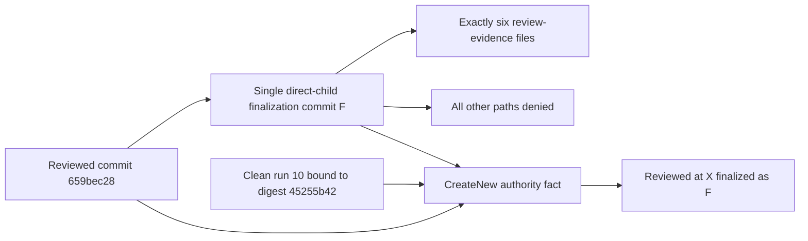
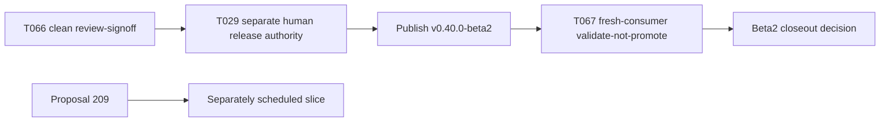

# Review Diagrams: Iteration 008

**Schema**: v1
**Diagram Format**: mermaid

## Verification and Review Authority



## T066 Attempt and Correction Sequence

```mermaid
sequenceDiagram
  participant H as Human
  participant C as Controller
  participant R as Repository
  participant A as Claude
  H->>C: Attempts 01 and 02 grants
  C->>A: One invocation each
  A-->>C: Findings plus red verification evidence
  C-->>H: Stop; no hidden retry
  H->>R: Authorize corrections
  H->>C: Attempts 03 and 04 grants
  C-->>H: Preflight failure; zero provider spend
  loop Attempts 05 through 09
    H->>C: Fresh progress grant
    C->>A: Exactly one invocation
    C-->>H: Publish findings or containment failure
    H->>R: Authorize bounded correction
  end
  C-->>H: Third integrity recurrence; non-convergence stop
  H->>R: Authorize T071 diagnostic and containment replan
  R->>R: Disposable verification plus external evidence plus read-only target
  R->>R: 73-suite registry and three-OS CI pass
  H->>C: Exact attempt 10 grant
  C->>A: One contained invocation at 659bec28
  A-->>C: Complete zero-finding pass
  C-->>H: Prepare review-signoff boundary
```

## Bounded Finalization Envelope



## Release Boundary



The diagrams separate repository mutation, controller evidence publication, paid reviewer execution, and release authority. Clean review cannot publish the beta; publication cannot imply stable promotion.
