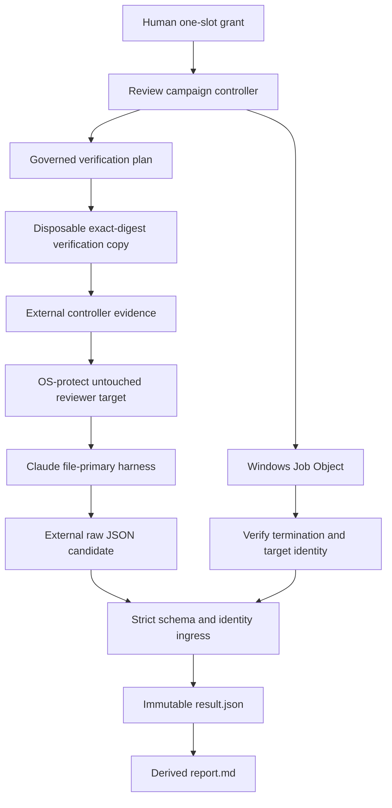
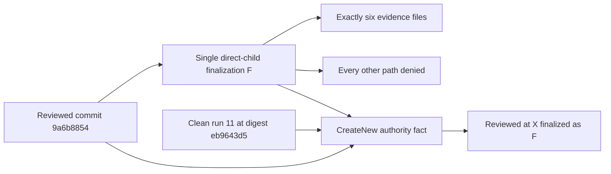
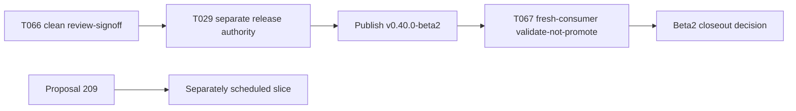

# Review Diagrams: Iteration 008

**Schema**: v1
**Diagram Format**: mermaid

## Verification and Review Authority



## T066 Correction Sequence

```mermaid
sequenceDiagram
  participant H as Human
  participant C as Controller
  participant R as Repository
  participant A as Claude
  loop Attempts 01 through 09
    H->>C: Fresh authorization
    alt Pre-provider failure
      C-->>H: Zero-spend result
    else Provider invoked
      C->>A: Exactly one invocation
      C-->>H: Findings or containment failure
      H->>R: Bounded correction
    end
  end
  C-->>H: Third integrity recurrence; non-convergence stop
  H->>R: T071 diagnostic and containment replan
  H->>C: Attempt 10 grant
  C->>A: One invocation at 659bec28
  A-->>C: Clean pass
  C-->>R: Provider-free finalization probe refuses classifier mismatch
  R->>R: Add precise local-settings classifier and paired tests
  H->>C: Attempt 11 grant
  C->>A: One invocation at 9a6b8854
  A-->>C: Complete zero-finding pass
  C-->>H: Prepare review-signoff boundary
```

## Bounded Finalization Envelope



## Release Boundary



The diagrams separate repository mutation, controller evidence publication, paid reviewer execution, and release authority. Clean review cannot publish the beta; publication cannot imply stable promotion.
