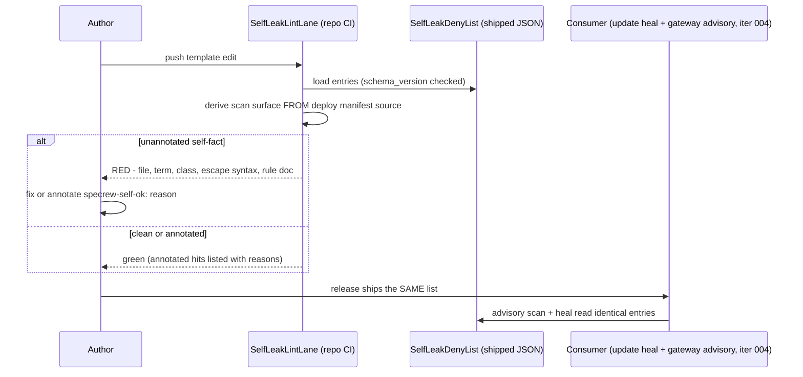
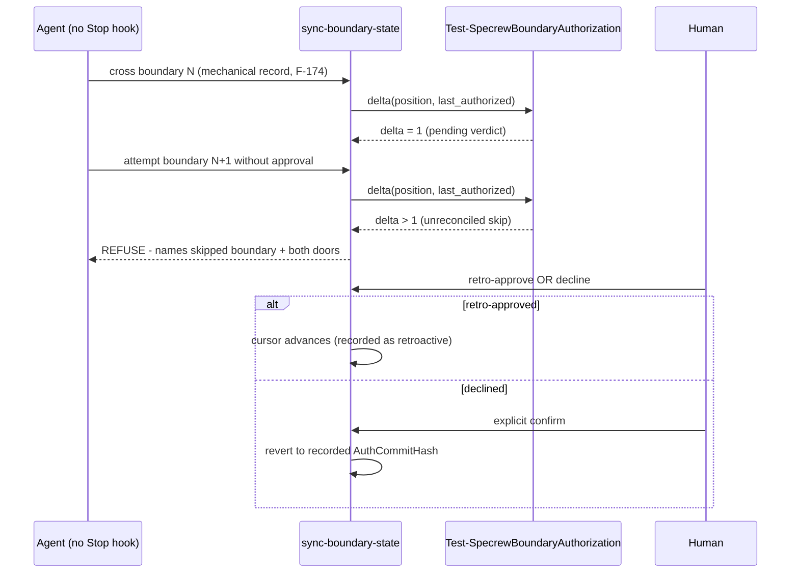
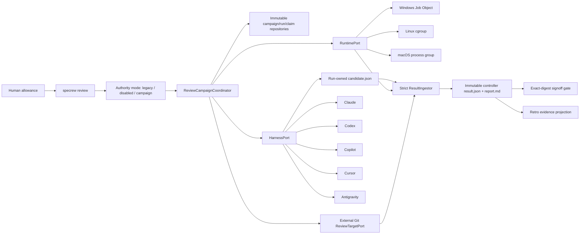
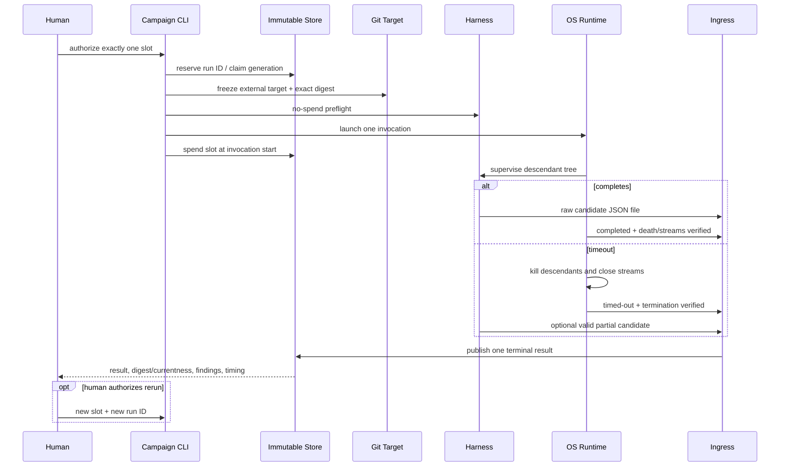
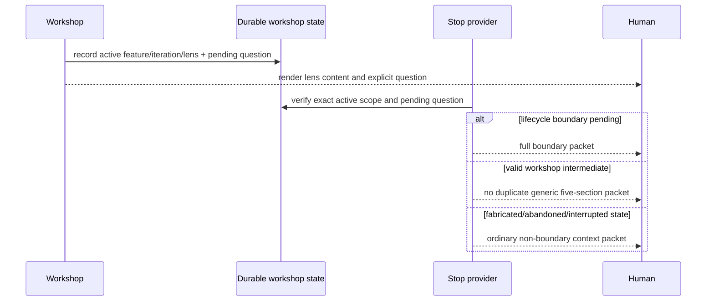
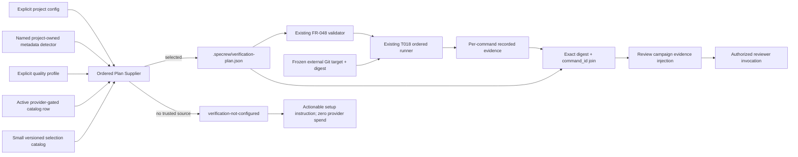

# Review Diagrams: 0.40.0-beta2 Hardening Bundle

**Feature**: 198-beta2-hardening
**Phase**: Iteration 008 planning (Beta2 finish line)

## Component diagram (feature-wide, per the agreed map)

```mermaid
flowchart TB
  subgraph Lanes[CI lanes and templates]
    SLL[SelfLeakLintLane]
    PFT[PromptFixtureTest]
    MGT[MethodologyGateTemplate]
    WKT[WorkKindTemplate]
  end
  subgraph Deploy[Deploy and heal surface]
    TSI[TemplateSurfaceInstaller]
    IB[InitBootstrap]
    UH[UpdateHealer]
  end
  subgraph Runtime[Reviewer runtime]
    WM[WorktreeMaterializer]
    RBB[ReviewerBundleBuilder]
    SPB[SlimPromptBuilder]
    CD[ContainmentDetector]
    RTR[RecordedTestRunner]
    CN[CheckpointNavigator]
    RCG[RoundCeilingGovernor]
    BR[BudgetResolver]
    LDI[LiveDoorIdentity]
  end
  subgraph Core[Governance core]
    BSR[BoundarySyncRatchet] --> BAC[BoundaryAuthorizationCheck]
    GV[GovernanceValidator] --> BAC
    DI[DigestIdentity] --> THC[TrackerHonestyCheck]
    RMR[ReleaseModelResolver]
  end
  subgraph Data[Data seams]
    DL[SelfLeakDenyList]
    MPL[MachineryPathList]
    RHC[ReviewerHostCatalog]
    RG[RepositoryGovernance]
    TP[ToolchainPins]
  end
  Lanes --> Core
  Deploy --> Core
  Runtime --> Core
  Core --> Data
  SLL --> DL
  WM --> MPL
  DI --> MPL
  BR --> RHC
  RMR --> RG
  IB --> TP
```



## Sequence: the deny-list single-truth loop (iteration 001 canonical flow)



## Sequence: boundary ratchet on a non-stopping host (iteration 002 canonical flow)



## Component: controlled external review replacement (iterations 006/007)



The reviewer never writes the origin repository or terminal authority. The repository is the sole code-mutation
authority; campaign repositories are the sole review-state mutation authority.

## Sequence: one paid run, timeout, and visible rerun



## Sequence: workshop intermediate Stop



## Component: verification-plan supplier and production injection (iteration 008)



The selector supplies commands but never executes them. The existing FR-048/T018 path owns validation,
execution, and evidence. Review reads the frozen target, does not mutate the origin, and refuses provider spend
when selection is absent or invalid.

## Sequence: finish-line release and published-beta proof

```mermaid
sequenceDiagram
  participant Project as Downstream fixture
  participant Supplier
  participant Runner as T018 Runner
  participant Campaign
  participant CI as Three-OS CI
  participant Human
  participant Release as Tag workflow
  participant Consumer as Fresh consumer
  Project->>Supplier: explicit config / named metadata / profile / provider
  Supplier->>Runner: canonical selected plan
  Runner->>Runner: execute in order; record every attempt
  Runner->>Campaign: exact-digest + command-id evidence
  Campaign->>Campaign: inject matching bounded evidence
  Campaign->>CI: deterministic suite and governance proof
  CI-->>Human: pre-release gates and independent review result
  Human->>Release: separately authorize v0.40.0-beta2
  Release-->>Consumer: published beta bits
  Consumer-->>Human: SC-014 friction-class PASS/FAIL evidence
  Note over Human,Consumer: Stable promotion remains separate
```
