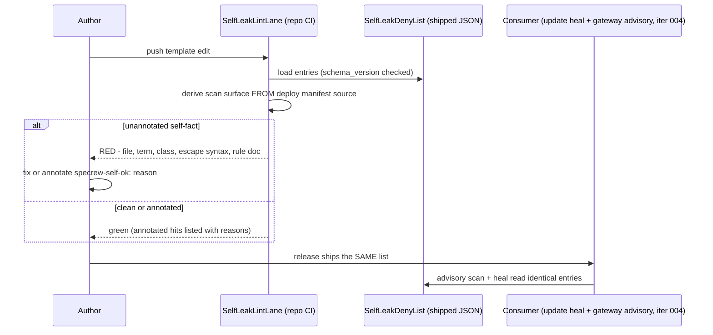
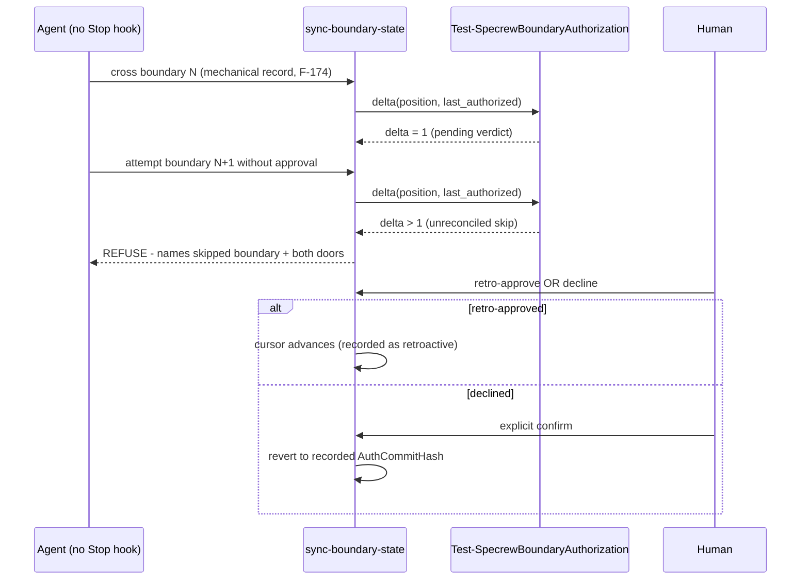

# Review Diagrams: 0.40.0-beta2 Hardening Bundle

**Feature**: 198-beta2-hardening
**Phase**: pre-implementation (planning artifact for reviewer)

## Component diagram (feature-wide, per the agreed map)

```mermaid
flowchart TB
  subgraph Lanes[CI lanes and templates]
    SLL[SelfLeakLintLane]
    PFT[PromptFixtureTest]
    MGT[MethodologyGateTemplate]
    WKT[WorkKindTemplate]
  end
  subgraph Deploy[Deploy and heal surface]
    TSI[TemplateSurfaceInstaller]
    IB[InitBootstrap]
    UH[UpdateHealer]
  end
  subgraph Runtime[Reviewer runtime]
    WM[WorktreeMaterializer]
    RBB[ReviewerBundleBuilder]
    SPB[SlimPromptBuilder]
    CD[ContainmentDetector]
    RTR[RecordedTestRunner]
    CN[CheckpointNavigator]
    RCG[RoundCeilingGovernor]
    BR[BudgetResolver]
    LDI[LiveDoorIdentity]
  end
  subgraph Core[Governance core]
    BSR[BoundarySyncRatchet] --> BAC[BoundaryAuthorizationCheck]
    GV[GovernanceValidator] --> BAC
    DI[DigestIdentity] --> THC[TrackerHonestyCheck]
    RMR[ReleaseModelResolver]
  end
  subgraph Data[Data seams]
    DL[SelfLeakDenyList]
    MPL[MachineryPathList]
    RHC[ReviewerHostCatalog]
    RG[RepositoryGovernance]
    TP[ToolchainPins]
  end
  Lanes --> Core
  Deploy --> Core
  Runtime --> Core
  Core --> Data
  SLL --> DL
  WM --> MPL
  DI --> MPL
  BR --> RHC
  RMR --> RG
  IB --> TP
```

## Sequence: the deny-list single-truth loop (iteration 001 canonical flow)

## Sequence: boundary ratchet on a non-stopping host (iteration 002 canonical flow)

