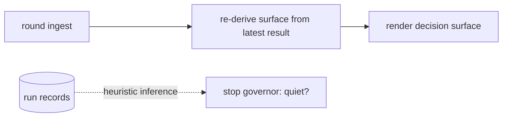
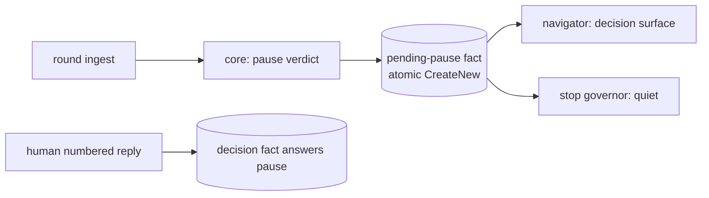
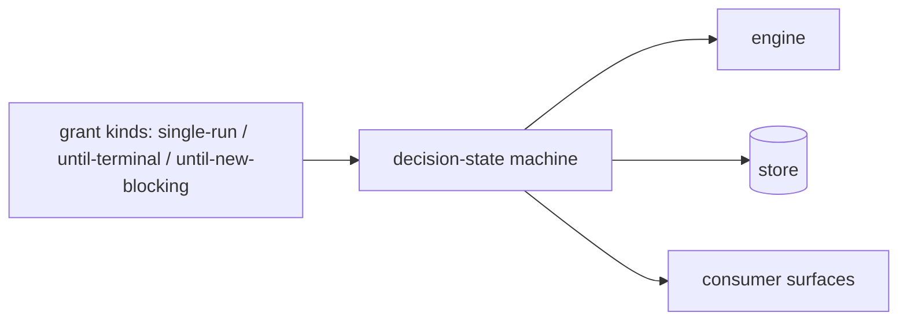

# Design Analysis: 199-beta3-stabilization, Iteration 001

**Feature**: 199-beta3-stabilization
**Iteration**: 001
**Date**: 2026-08-10
**Status**: presented for the design-gate verdict

## Problem framing

Beta2's campaign machinery has review quality but no review economics, a stop surface
with three disagreeing authorities, a verdict-capture layer with reproduced defects, an
integrity check that refuses the most common consumer install path, no first-run
bootstrap, and consumer surfaces written in internal vocabulary. The acceptance bar: a
consumer completes their first feature without an endless review loop, a wedged gate,
or a sentence they cannot understand. Scope is CLOSED to the ledger's ten Beta3 items
plus two human-ruled additions (the markdownlint CI chore; the FR-010 prompt-submit
amendment).

## Key Design Decision Points

(Bound by the workshop; carried as constraints.)

- Decomposition: existing core/store/orchestrator/navigator layering, no new layers.
- Pause ownership: the orchestrator's terminal state — engine exits after every round.
- Stop authority: the route classifier consults the signoff-gate store, suppresses on
  authorized in-flight runs, ignores records-only deltas; a pending pause decision is
  a sanctioned quiet state.
- Landing: stop-here composes verification + residual acceptance + gate sync as one
  action.
- The open point this analysis decides: HOW the pending pause decision is represented.

## Alternatives

### Option A - Simplest: derived pause state

- **Approach**: no persisted pause fact — the decision surface is re-derived from the
  latest run result at render time, and the stop governor infers quietness from run
  records.
- **Architectural pattern**: projection-only; heuristic state inference over existing
  run facts.
- **Quality features considered**: simplicity (no new schema); weak on state
  integrity, auditability, and resume fidelity — the quiet state is inferred, never
  recorded.
- **Effort estimate**: ~1.5 SP.
- **Reversibility cost**: low — nothing persisted to migrate away from.
- **Trade-offs**: the quiet-state read becomes heuristic, straining the human-bound
  sanctioned-state semantics (architecture D3 addition); a resumed session re-renders
  lossily; budget fixtures would pin inference behavior instead of a fact.



### Option B - Reasonable: first-class pending-pause fact (RECOMMENDED)

- **Approach**: the orchestrator's round terminal writes a pending-pause fact to the
  review authority store; the decision surface renders from the fact; the human's
  numbered reply is the only writer of the answering decision fact; the stop governor
  reads the fact directly for the quiet state; resume re-renders it verbatim.
- **Architectural pattern**: normalize-state + immutability-intent — immutable facts
  in the single review authority store (atomic FileMode.CreateNew), projections
  render; object-invariants guard impossible states (an unanswered pause coexisting
  with a running round).
- **Quality features considered**: state integrity, auditability, resume fidelity,
  quiet-state exactness, testability (budget and pause fixtures pin facts).
- **Effort estimate**: ~2.5 SP (inside the ledger's F8 fast-core envelope).
- **Reversibility cost**: low-moderate — one fact schema plus reads; beta4's decision
  pipeline supersedes it cleanly (replacement note recorded).
- **Trade-offs**: one more fact schema in a store beta4 rebuilds; one extra atomic
  write per round.



### Option C - By-the-book: decision-state machine with grant kinds

- **Approach**: a full decision pipeline modeling grant kinds (single-run /
  until-terminal / until-new-blocking) with a formal decision-state machine.
- **Architectural pattern**: explicit state machine plus disposition-vocabulary
  expansion across engine, store, and surfaces.
- **Quality features considered**: expressiveness, forward-compatibility; maximal
  authorization fidelity.
- **Effort estimate**: 8–12 SP (the ledger's own estimate for the vocabulary
  cluster).
- **Reversibility cost**: high — a vocabulary shipped to consumers is a compatibility
  surface.
- **Trade-offs**: preempts beta4's disposition-cluster design spike and is explicitly
  out of the closed beta3 scope per the maintainer's split ruling. Not meaningfully
  available to this iteration; listed because it IS the distinct by-the-book shape
  beta4 will design properly.



## Crew recommendation

Option B. It is the smallest representation that satisfies every bound constraint
honestly, and its beta4 replacement path is clean (the fact schema is superseded by
beta4's decision pipeline; the decision-surface contract survives).

## Beta4 replacement notes (per bridge item — mandated by the feature)

- Pause plumbing (orchestrator terminal + pending-pause fact): replaced by beta4's
  redesigned disposition/economics pipeline; the decision-surface contract is durable.
- Stop-authority checks (consult/suppress/records-only): subsumed by beta4's
  stop-surface state model (author-attributed deltas, in-flight modeling);
  consult-before-block ordering and pending-decision-quiet are the durable semantics.
- Composed landing: beta4's disposition vocabulary replaces the acceptance
  primitives; the one-action landing UX contract is durable.

## Co-Design Record

Human-agreed: yes

**Co-design agreed by the maintainer, 2026-08-10**: component map approved as drawn
(no renames, splits, merges, or reassignments requested); stop-here and pause flows
walked and agreed; Option B chosen ("Option B — the pending-pause fact").

### Agreed component map

```text
                       CONSUMER-FACING RENDERING (navigators)
  ┌──────────────────────────────────────────────────────────────────────┐
  │ co-review navigators (decision surface, stop blocks, gloss helper)   │
  │ bootstrap-provider + prompt-surgery (banner: full prerelease version)│
  └───────────────┬──────────────────────────────────────────────────────┘
                  v
                ORCHESTRATORS (workflow)
  ┌──────────────────────────────────────────────────────────────────────┐
  │ review-campaign-orchestrator  [BRIDGE]                               │
  │   round terminal = PAUSE; composed stop-here landing                 │
  │ specrew-init + verification-plan-materializer  [durable]             │
  └───────────────┬──────────────────────────────────────────────────────┘
                  v
                AUTHORITY CORE (pure decisions)
  ┌──────────────────────────────────────────────────────────────────────┐
  │ review-authority-core  [bridge+durable]                              │
  │   per-campaign budget (4, reviewer-invoked-only), pause verdicts     │
  │ signoff-evidence-gate route classifier  [BRIDGE]                     │
  │   consult gate store → suppress in-flight → ignore records-only →    │
  │   pending-pause = quiet                                              │
  └───────────────┬──────────────────────────────────────────────────────┘
                  v
                STORE (immutable facts)
  ┌──────────────────────────────────────────────────────────────────────┐
  │ review-authority-store  [durable]                                    │
  │   reparse-tag discrimination; NEW pending-pause fact (Option B)      │
  │ signoff-gate store (latest.json + history) — unchanged, now consulted│
  └──────────────────────────────────────────────────────────────────────┘

  SIDE RAILS: capture (ConversationCaptureAccessor + hooks deploy/doctor);
  reviewer contract & catalog (host rows + reviewer prompt); instruction/CI/
  records (packet templates + sync skills, markdownlint CI, 009/010 + notes)
```

### Component responsibilities (every component, named)

- `review-campaign-orchestrator` — terminates every round into the pause; owns the
  one-action stop-here landing (verification -> residual acceptance -> gate sync). [bridge]
- `specrew-init` / `verification-plan-materializer` — scaffolds the starter
  verification plan with the env_refs default list. [durable]
- `review-authority-core` — pure decisions: per-campaign budget of 4,
  reviewer-invoked-only spend, pause-verdict computation. [bridge+durable]
- `review-signoff-evidence-gate` route classifier — the single stop authority:
  consults the recorded gate decision, suppresses on authorized in-flight runs,
  ignores records-only deltas, treats a pending pause decision as quiet. [bridge]
- `review-authority-store` — reparse-tag discrimination (cloud family
  hydrate-then-verify, links refused, unknown fail-closed); the pending-pause fact. [durable]
- signoff-gate store — untouched; becomes the consulted authority. [unchanged]
- co-review navigators — decision surface + stop blocks in the consumer register via
  the new gloss helper (id + title). [durable]
- `specrew-bootstrap-provider` + `coordinator-prompt-surgery` — full prerelease
  version render. [durable]
- `ConversationCaptureAccessor` — approve-phrase-first, scan-past-non-verdict-turns,
  plain-English boundary-word immunity; prompt-submit primary. [durable]
- `deploy-refocus-hooks` + hooks doctor — registered-event reconciliation + drift
  flag. [durable]
- `reviewer-host-catalog` — codex 900 s row; timeout message names the window flag. [durable]
- reviewer prompt assembly — verdict-goal contract (blessed clean verdict, concrete
  failure scenarios, ranked + capped). [durable]
- packet templates + sync skills — one-message decision stops; never-sync-in-the-
  verdict-turn rule. [durable]
- CI workflow — markdownlint-cli install (198-carried chore). [chore]
- records — 009/010 wording fix; release notes with the beta4 claim sentence. [records-only]

### Activation-premise alignment (added 2026-08-10, maintainer-ruled during execution)

The campaign surface activates only when the coverage delta contains implementation. The
non-implementation classes are exactly two: the methodology machinery (via the single
FR-012 resolver) and the `specs/` lifecycle records tree. **A docs-only delta therefore
keeps the surface LIVE — deliberately** (maintainer ruling, 2026-08-10): documentation is
reviewable product content, and the conservative direction is the one that keeps the gate
consulted. Every unresolved input (trunk, resolver, git call) also keeps the surface live,
so quiet is reachable only from a fully resolved, genuinely records-only delta.

### T007 design record — verification-plan scaffolding (maintainer input, 2026-08-10)

Three constraints, recorded from the maintainer's ruling after DRIFT-199-I001-008/-010
showed the beta2 definition was per-machine and unreconstructible from the repository:

1. **Tracked by default.** The scaffolded plan is committed to the tree the reviewer
   reads, or the design rules otherwise and records why. A verification definition that
   survives neither a clone nor a new worktree is not a definition the evidence chain can
   cite.
2. **References must not rot silently.** Feature and iteration references are derived, or
   staleness is detectable. The beta2 plan hardcoded `f198.i008` in both its `plan_id` and
   its `-IterationPath`; nothing surfaced that it no longer matched the active work.
1a. **`PSModulePath` is a measured question, not a judged one** (maintainer, 2026-08-10).
   Every governed project's plan carries at least one PowerShell-invoked command (the
   governance validator), so this is a stack-default question. T007 runs the validator
   once under a scrubbed environment WITHOUT `PSModulePath` and lets the result decide
   whether the PowerShell stack default carries it. The measurement is recorded; the
   reasoning is not a substitute for it.
1b. **Per-context verification scope** (maintainer, 2026-08-10). The full deterministic
   registry is the RELEASE GATE lane, not the slice lane. A slice review points its
   verification command at the suites the slice actually touches; the full registry is
   kept for the certification round. The plan legitimately DIFFERS between those
   contexts, and T007's scaffolding should express that distinction rather than emit one
   lane for every purpose.
1c. **Timeout-fits-window consistency check** (maintainer, 2026-08-10). Per-command
   `timeout_seconds` and the round window are currently unrelated numbers with no
   consistency check, so a plan that cannot possibly pass is accepted, burns the full
   window, and reports a sealed failure (DRIFT-199-I001-012 is the reproduction: a
   1200 s command inside a 900 s round). The cheap half — validate at PLAN-VALIDATION
   time that command timeouts fit the configured window, with a message naming BOTH
   numbers — belongs here because T007 scaffolds plans anyway. Implement it only if it
   is a few lines; otherwise route it to beta4. Sizing guidance to carry: verification
   consuming more than roughly half the round window is the wrong shape, because the
   reviewer needs the remainder.
3. **Provenance — the intended end state.** The validation lane is ALREADY decided at the
   devops-operations lens and recorded there in prose, then re-invented by hand as
   configuration. The intended shape is that `verification-plan.json` becomes the devops
   lens's machine-readable output exactly as `implementation-rules.yml` is the
   code-implementation lens's: the workshop decides, the artifact carries, the engine
   reads. **For beta3**: scaffold the stack-default plan as FR-012 specifies and record
   this derivation-from-lens shape as the intended design. Implement the derivation only
   if reading an existing lens record proves to be a few lines; otherwise route it to
   beta4 with the `implementation-rules.yml` symmetry named as the precedent.

### Pause-state rulings (maintainer, 2026-08-10, during T001)

**A superseded pause confers no quiet.** A pending pause is recorded AGAINST a tree state,
and the human answers it by changing that tree. If the quiet check did not compare the
pause's target against the current tree, a stale pause would quiet a tree it never
described. That is the review-stale class in a new place and in its dangerous direction: a
stale RESULT merely nags for a fresh review, whereas a stale PAUSE would SILENCE the
surface. **Ruling**: a pause whose target no longer matches the current tree is
SUPERSEDED — it stops conferring quiet and the surface returns to its ordinary route.
Absent or unresolved input fails closed (no quiet). Pinned by
`Test-ReviewCampaignPendingPauseQuiet` and its fixtures.

**A pause never suppresses a boundary-releasing result** (maintainer ruling 2026-08-10, accepted after
DRIFT-199-I001-018). A pause over a clean result has no demand to suppress: its own recommendation is
that stopping here completes the sign-off, so withholding the release withholds something already
earned. What a pause legitimately suppresses is a DEMAND — do not nag for another review or another
disposition while one is already sitting with the human — and releasing what they need in order to
answer is not a demand.

**The residual, CHECKED rather than assumed, and it was a second form of the same wedge.** Nothing in
the tree retires a pause fact: `Write-ReviewCampaignPauseDecisionFact` exists in the store and has NO
caller anywhere in `scripts/`, so a pause lingers until the tree moves and supersedes it. That is
benign for a clean pass (the release exemption covers it) and benign after any tree change (a
superseded pause confers nothing), but it was NOT benign for a findings result the human had
explicitly ACCEPTED: the acceptance is an answer to the pause recorded through a different instrument,
and exempting only the clean pass left that case wedged in exactly the way the clean case had been.
**Ruling recorded as a deliberate choice**: a pause does not survive a human acceptance of the same
result either, while a `require-correction` disposition is NOT an acceptance and the pause still
quiets — a human who asked for a fix has not accepted, whatever else they also said. Both directions
are pinned. Retiring the pause fact itself stays unbuilt and routes to beta4; the release recognising
the answer is what makes the lingering fact harmless, and that is the property the fixtures hold.

**The allowance reset is prose, never a numbered option.** A refusal must name its exact
next step (the U4 rule, and today's wedge lesson: an unsatisfiable, undeclinable surface
is the acceptance bar failing). But a sanctioned bypass rendered as a numbered choice
becomes one keystroke inside the very flow the budget exists to interrupt, and the
budget's whole value is that exhaustion FEELS different from an ordinary continuation.
**Ruling**: on exhaustion the numbered list carries only stop-here and abandon; the reset
command is stated in prose within the refusal. The structural removal of the continue
option stands, and the fixture pins that continue is ABSENT rather than discouraged.

### T003 design record — the two governors, and why FR-007 READS a store (maintainer-confirmed, 2026-08-10)

**FR-007's consult is a READ of the signoff-gate decision store, never a live gate call, and the
reason is structural rather than stylistic.** When campaign authority is enabled,
`Get-ContinuousCoReviewSignoffGateDecision` is a thin wrapper that calls
`Get-ReviewCampaignVerdictPacketDecision` — the very function doing the consulting. A live consult
would therefore have the packet decision ask the gate while the gate asks the packet decision, and
neither terminates. The spec already names the store rather than the gate ("the campaign stop surface
MUST consult the signoff-gate decision store") and resolves the empty case explicitly: with no
recorded decision the surface evaluates as it does today.

**Store-reading is not a staleness hole, and this is the sentence to read if that worry arises.** A
recorded ALLOW confers `review-current` only when its `reviewed_digest` equals the CURRENT digest —
which is the superseded-pause discipline of the ruling above, applied to the gate decision instead of
to a pause. A gate decision describing a tree that has moved on confers nothing, exactly as a
superseded pause confers nothing. Both are the same rule: evidence is bound to the tree it describes,
and the dangerous direction for both is SILENCING, so both fail closed. The store record spells the
tree `current_tree_id` while the decision logic asks for `reviewed_digest`; normalization happens in
the reader so the decision function stays a pure function over plain shapes and its fixtures stay
store-free.

**The two-governor adjudication, ruled after the collision fired three times live.** The boundary
evidence gate and the campaign block can instruct opposite things in the same stop: the gate needs a
recorded crossing's verdict marker or the human's answer cannot be captured at all, while the
campaign block said, unconditionally, to emit no marker. **Ruling**: the recorded crossing WINS.
Controller truth naming an exact pending authorization outranks the campaign block's clause, which
governs ITSELF — it describes what that block is, not what the lifecycle owes. Under the other
reading a recorded crossing becomes unanswerable and the lifecycle wedges on a review the human may
not even owe yet. Two constraints came with it: deferring on the MARKER is not withdrawing the
BLOCK (the review position is unchanged and still stated), and only a well-formed crossing — one
naming its destination — outranks the clause. The block now STATES the adjudication and names the
crossing, because the failure this fixes is that a consumer could not have made the call.

### T004 part 3 design constraints — verdict capture wiring (maintainer, 2026-08-10, WRITTEN BEFORE THE CODE)

Recorded ahead of implementation deliberately: this part changes **when** a verdict is written while
touching the wiring that drifts, so the constraints must bind whoever implements it.

**TWO failure directions get pinned, not one.**

- **DOUBLE-capture** — both paths fire and one verdict becomes two authorizations. This is the
  FABRICATION direction, and it is the unrecoverable one: a false authorization in the ledger is
  indistinguishable from a real one.
- **ZERO-capture** — neither path fires and the verdict is lost. Already lived through; recoverable,
  because the human re-states.

**Required fixtures**, all three:

1. Prompt-submit is PRIMARY: it fires, and Stop does **not** double-write.
2. Prompt-submit is ABSENT — the real stale-wiring condition from T067, not a hypothetical — and the
   Stop-time fallback still captures.
3. Both wired: exactly **ONE** authorization fact exists for one verdict.

**The writer is IDEMPOTENT on (crossing + verdict text)**, rather than relying on the two paths never
overlapping. Belt and braces at the STORE, because the wiring is precisely what drifts — the same
reasoning that put the class guards in a permanent lane rather than trusting selection.

**WHAT ALREADY EXISTS, read from source rather than assumed (2026-08-10).** Two facts change the shape
of this part, and both were measured before any code was written:

- **Prompt-submit capture is ALREADY WIRED, so the double-write risk is LIVE today, not hypothetical.**
  `Invoke-SpecrewBoundaryVerdictCapture` is the one write path and BOTH hooks reach it:
  `HandoverStore.ps1` calls it on `UserPromptSubmit`/`PreInvocation` (returning early) and again at
  Stop when `$isEndOfTurn`. The first bullet of this task is therefore already built; the work is the
  idempotency and the wiring reconciliation.
- **An idempotence guard exists but is keyed on the CURSOR, not on crossing + verdict text.**
  `Add-SpecrewBoundaryAuthorization` (shared-governance.ps1) no-ops when the cursor already sits on
  the authorized boundary AND the newest history entry has the same `to_boundary`. Its own comment
  calls it "narrow by design". It does prevent today's ordinary double-write — prompt-submit writes,
  the cursor advances, Stop's re-fire no-ops — but it is wrong in BOTH directions the maintainer's
  key would get right:
  - **Zero-capture direction**: it cannot tell two DIFFERENT verdicts for the same boundary apart, so
    a genuine re-approval after a send-back cycles back to the same boundary is swallowed as a
    duplicate and its instruction text is lost.
  - **Double-capture direction**: it depends on the cursor having advanced. If the state write fails
    midway, or the two paths interleave before it lands, both can append.

  Keying on **crossing + verdict text** is strictly better in both: it swallows only a TRUE duplicate
  and lets a genuinely different verdict through. A stable entry identity already exists to build on —
  `Get-SpecrewBoundaryAuthorizationEntryId` mints `auth-<sha256>`. Note the writer is MIRRORED in two
  trees (`extensions/...` and `.specify/extensions/...`); both must move together, and the deployed
  mirror has its own structural parity guard.

**Sequencing note carried from the session that recorded this**: the classifier (FR-010
leading-approval precedence) and the marker-forward reader are both DONE and green, so part 3 is pure
wiring and ordering. Its two suites — `tests/bootstrap/ConversationCapture.Tests.ps1` and
`tests/integration/verdict-capture-blocks.tests.ps1`, the latter carrying 23 not-approve cases and the
T032 fabrication fixtures — are now in the permanent class-guard lane and must be read before either
file is touched.

### Agreed flows

**Stop-here landing** (the flow that used to wedge):

```text
human types 2
  -> orchestrator landing action:
       run frozen-tree verification (existing bounded run)
    -> core validates identity-bound residual acceptance
    -> store writes the acceptance facts
    -> gate sync runs; classifier consults signoff-gate/latest.json -> allow
  -> navigator: "review is signed off; N minor findings saved as follow-ups"
     (one message, zero manual untangling)
```

**Pause** (every round):

```text
ingest -> core computes pause verdict -> store writes pending-pause fact
  -> navigator renders decision surface -> engine exits
  -> stop governor reads the fact -> quiet
```

## Human Decision

**Verdict (verbatim)**: `approved for plan with Option B`
**Given**: 2026-08-10, by the maintainer, at the design-gate stop rendered over the
committed draft `aa50fc94`.
**Chosen option**: B — the first-class pending-pause fact in the review authority
store. No modifications or added instructions accompanied the verdict; the one
discussion prompt (a second sanctioned writer for the pause fact) was approved at its
default: human-reply-only, no expiry.
**Transcription disclosure**: this decision is agent-transcribed from the maintainer's
typed reply in the governing session (the established design-verdict transcription
path); the commit containing this record is the decision commit, cited in the durable
gate packet under `gates/`.
