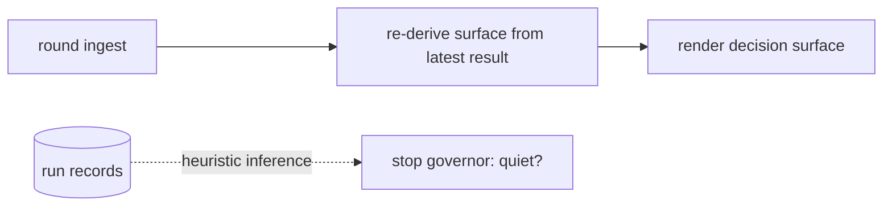
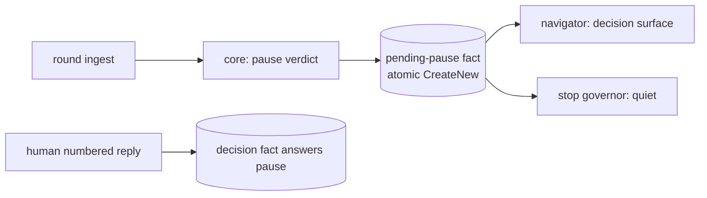
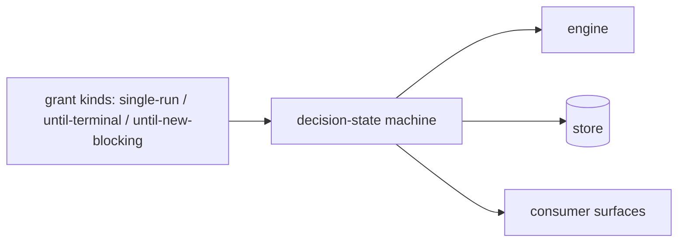

# Design Analysis: 199-beta3-stabilization, Iteration 001

**Feature**: 199-beta3-stabilization
**Iteration**: 001
**Date**: 2026-08-10
**Status**: presented for the design-gate verdict

## Problem framing

Beta2's campaign machinery has review quality but no review economics, a stop surface
with three disagreeing authorities, a verdict-capture layer with reproduced defects, an
integrity check that refuses the most common consumer install path, no first-run
bootstrap, and consumer surfaces written in internal vocabulary. The acceptance bar: a
consumer completes their first feature without an endless review loop, a wedged gate,
or a sentence they cannot understand. Scope is CLOSED to the ledger's ten Beta3 items
plus two human-ruled additions (the markdownlint CI chore; the FR-010 prompt-submit
amendment).

## Key Design Decision Points

(Bound by the workshop; carried as constraints.)

- Decomposition: existing core/store/orchestrator/navigator layering, no new layers.
- Pause ownership: the orchestrator's terminal state — engine exits after every round.
- Stop authority: the route classifier consults the signoff-gate store, suppresses on
  authorized in-flight runs, ignores records-only deltas; a pending pause decision is
  a sanctioned quiet state.
- Landing: stop-here composes verification + residual acceptance + gate sync as one
  action.
- The open point this analysis decides: HOW the pending pause decision is represented.

## Alternatives

### Option A - Simplest: derived pause state

- **Approach**: no persisted pause fact — the decision surface is re-derived from the
  latest run result at render time, and the stop governor infers quietness from run
  records.
- **Architectural pattern**: projection-only; heuristic state inference over existing
  run facts.
- **Quality features considered**: simplicity (no new schema); weak on state
  integrity, auditability, and resume fidelity — the quiet state is inferred, never
  recorded.
- **Effort estimate**: ~1.5 SP.
- **Reversibility cost**: low — nothing persisted to migrate away from.
- **Trade-offs**: the quiet-state read becomes heuristic, straining the human-bound
  sanctioned-state semantics (architecture D3 addition); a resumed session re-renders
  lossily; budget fixtures would pin inference behavior instead of a fact.



### Option B - Reasonable: first-class pending-pause fact (RECOMMENDED)

- **Approach**: the orchestrator's round terminal writes a pending-pause fact to the
  review authority store; the decision surface renders from the fact; the human's
  numbered reply is the only writer of the answering decision fact; the stop governor
  reads the fact directly for the quiet state; resume re-renders it verbatim.
- **Architectural pattern**: normalize-state + immutability-intent — immutable facts
  in the single review authority store (atomic FileMode.CreateNew), projections
  render; object-invariants guard impossible states (an unanswered pause coexisting
  with a running round).
- **Quality features considered**: state integrity, auditability, resume fidelity,
  quiet-state exactness, testability (budget and pause fixtures pin facts).
- **Effort estimate**: ~2.5 SP (inside the ledger's F8 fast-core envelope).
- **Reversibility cost**: low-moderate — one fact schema plus reads; beta4's decision
  pipeline supersedes it cleanly (replacement note recorded).
- **Trade-offs**: one more fact schema in a store beta4 rebuilds; one extra atomic
  write per round.



### Option C - By-the-book: decision-state machine with grant kinds

- **Approach**: a full decision pipeline modeling grant kinds (single-run /
  until-terminal / until-new-blocking) with a formal decision-state machine.
- **Architectural pattern**: explicit state machine plus disposition-vocabulary
  expansion across engine, store, and surfaces.
- **Quality features considered**: expressiveness, forward-compatibility; maximal
  authorization fidelity.
- **Effort estimate**: 8–12 SP (the ledger's own estimate for the vocabulary
  cluster).
- **Reversibility cost**: high — a vocabulary shipped to consumers is a compatibility
  surface.
- **Trade-offs**: preempts beta4's disposition-cluster design spike and is explicitly
  out of the closed beta3 scope per the maintainer's split ruling. Not meaningfully
  available to this iteration; listed because it IS the distinct by-the-book shape
  beta4 will design properly.



## Crew recommendation

Option B. It is the smallest representation that satisfies every bound constraint
honestly, and its beta4 replacement path is clean (the fact schema is superseded by
beta4's decision pipeline; the decision-surface contract survives).

## Beta4 replacement notes (per bridge item — mandated by the feature)

- Pause plumbing (orchestrator terminal + pending-pause fact): replaced by beta4's
  redesigned disposition/economics pipeline; the decision-surface contract is durable.
- Stop-authority checks (consult/suppress/records-only): subsumed by beta4's
  stop-surface state model (author-attributed deltas, in-flight modeling);
  consult-before-block ordering and pending-decision-quiet are the durable semantics.
- Composed landing: beta4's disposition vocabulary replaces the acceptance
  primitives; the one-action landing UX contract is durable.

## Co-Design Record

Human-agreed: yes

**Co-design agreed by the maintainer, 2026-08-10**: component map approved as drawn
(no renames, splits, merges, or reassignments requested); stop-here and pause flows
walked and agreed; Option B chosen ("Option B — the pending-pause fact").

### Agreed component map

```text
                       CONSUMER-FACING RENDERING (navigators)
  ┌──────────────────────────────────────────────────────────────────────┐
  │ co-review navigators (decision surface, stop blocks, gloss helper)   │
  │ bootstrap-provider + prompt-surgery (banner: full prerelease version)│
  └───────────────┬──────────────────────────────────────────────────────┘
                  v
                ORCHESTRATORS (workflow)
  ┌──────────────────────────────────────────────────────────────────────┐
  │ review-campaign-orchestrator  [BRIDGE]                               │
  │   round terminal = PAUSE; composed stop-here landing                 │
  │ specrew-init + verification-plan-materializer  [durable]             │
  └───────────────┬──────────────────────────────────────────────────────┘
                  v
                AUTHORITY CORE (pure decisions)
  ┌──────────────────────────────────────────────────────────────────────┐
  │ review-authority-core  [bridge+durable]                              │
  │   per-campaign budget (4, reviewer-invoked-only), pause verdicts     │
  │ signoff-evidence-gate route classifier  [BRIDGE]                     │
  │   consult gate store → suppress in-flight → ignore records-only →    │
  │   pending-pause = quiet                                              │
  └───────────────┬──────────────────────────────────────────────────────┘
                  v
                STORE (immutable facts)
  ┌──────────────────────────────────────────────────────────────────────┐
  │ review-authority-store  [durable]                                    │
  │   reparse-tag discrimination; NEW pending-pause fact (Option B)      │
  │ signoff-gate store (latest.json + history) — unchanged, now consulted│
  └──────────────────────────────────────────────────────────────────────┘

  SIDE RAILS: capture (ConversationCaptureAccessor + hooks deploy/doctor);
  reviewer contract & catalog (host rows + reviewer prompt); instruction/CI/
  records (packet templates + sync skills, markdownlint CI, 009/010 + notes)
```

### Component responsibilities (every component, named)

- `review-campaign-orchestrator` — terminates every round into the pause; owns the
  one-action stop-here landing (verification -> residual acceptance -> gate sync). [bridge]
- `specrew-init` / `verification-plan-materializer` — scaffolds the starter
  verification plan with the env_refs default list. [durable]
- `review-authority-core` — pure decisions: per-campaign budget of 4,
  reviewer-invoked-only spend, pause-verdict computation. [bridge+durable]
- `review-signoff-evidence-gate` route classifier — the single stop authority:
  consults the recorded gate decision, suppresses on authorized in-flight runs,
  ignores records-only deltas, treats a pending pause decision as quiet. [bridge]
- `review-authority-store` — reparse-tag discrimination (cloud family
  hydrate-then-verify, links refused, unknown fail-closed); the pending-pause fact. [durable]
- signoff-gate store — untouched; becomes the consulted authority. [unchanged]
- co-review navigators — decision surface + stop blocks in the consumer register via
  the new gloss helper (id + title). [durable]
- `specrew-bootstrap-provider` + `coordinator-prompt-surgery` — full prerelease
  version render. [durable]
- `ConversationCaptureAccessor` — approve-phrase-first, scan-past-non-verdict-turns,
  plain-English boundary-word immunity; prompt-submit primary. [durable]
- `deploy-refocus-hooks` + hooks doctor — registered-event reconciliation + drift
  flag. [durable]
- `reviewer-host-catalog` — codex 900 s row; timeout message names the window flag. [durable]
- reviewer prompt assembly — verdict-goal contract (blessed clean verdict, concrete
  failure scenarios, ranked + capped). [durable]
- packet templates + sync skills — one-message decision stops; never-sync-in-the-
  verdict-turn rule. [durable]
- CI workflow — markdownlint-cli install (198-carried chore). [chore]
- records — 009/010 wording fix; release notes with the beta4 claim sentence. [records-only]

### Activation-premise alignment (added 2026-08-10, maintainer-ruled during execution)

The campaign surface activates only when the coverage delta contains implementation. The
non-implementation classes are exactly two: the methodology machinery (via the single
FR-012 resolver) and the `specs/` lifecycle records tree. **A docs-only delta therefore
keeps the surface LIVE — deliberately** (maintainer ruling, 2026-08-10): documentation is
reviewable product content, and the conservative direction is the one that keeps the gate
consulted. Every unresolved input (trunk, resolver, git call) also keeps the surface live,
so quiet is reachable only from a fully resolved, genuinely records-only delta.

### T007 design record — verification-plan scaffolding (maintainer input, 2026-08-10)

Three constraints, recorded from the maintainer's ruling after DRIFT-199-I001-008/-010
showed the beta2 definition was per-machine and unreconstructible from the repository:

1. **Tracked by default.** The scaffolded plan is committed to the tree the reviewer
   reads, or the design rules otherwise and records why. A verification definition that
   survives neither a clone nor a new worktree is not a definition the evidence chain can
   cite.
2. **References must not rot silently.** Feature and iteration references are derived, or
   staleness is detectable. The beta2 plan hardcoded `f198.i008` in both its `plan_id` and
   its `-IterationPath`; nothing surfaced that it no longer matched the active work.
3. **Provenance — the intended end state.** The validation lane is ALREADY decided at the
   devops-operations lens and recorded there in prose, then re-invented by hand as
   configuration. The intended shape is that `verification-plan.json` becomes the devops
   lens's machine-readable output exactly as `implementation-rules.yml` is the
   code-implementation lens's: the workshop decides, the artifact carries, the engine
   reads. **For beta3**: scaffold the stack-default plan as FR-012 specifies and record
   this derivation-from-lens shape as the intended design. Implement the derivation only
   if reading an existing lens record proves to be a few lines; otherwise route it to
   beta4 with the `implementation-rules.yml` symmetry named as the precedent.

### Agreed flows

**Stop-here landing** (the flow that used to wedge):

```text
human types 2
  -> orchestrator landing action:
       run frozen-tree verification (existing bounded run)
    -> core validates identity-bound residual acceptance
    -> store writes the acceptance facts
    -> gate sync runs; classifier consults signoff-gate/latest.json -> allow
  -> navigator: "review is signed off; N minor findings saved as follow-ups"
     (one message, zero manual untangling)
```

**Pause** (every round):

```text
ingest -> core computes pause verdict -> store writes pending-pause fact
  -> navigator renders decision surface -> engine exits
  -> stop governor reads the fact -> quiet
```

## Human Decision

**Verdict (verbatim)**: `approved for plan with Option B`
**Given**: 2026-08-10, by the maintainer, at the design-gate stop rendered over the
committed draft `aa50fc94`.
**Chosen option**: B — the first-class pending-pause fact in the review authority
store. No modifications or added instructions accompanied the verdict; the one
discussion prompt (a second sanctioned writer for the pause fact) was approved at its
default: human-reply-only, no expiry.
**Transcription disclosure**: this decision is agent-transcribed from the maintainer's
typed reply in the governing session (the established design-verdict transcription
path); the commit containing this record is the decision commit, cited in the durable
gate packet under `gates/`.
