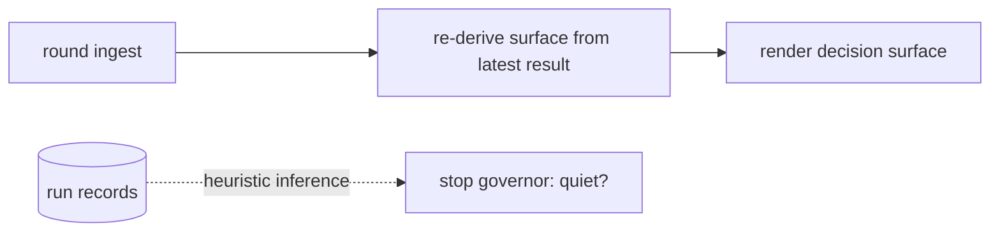
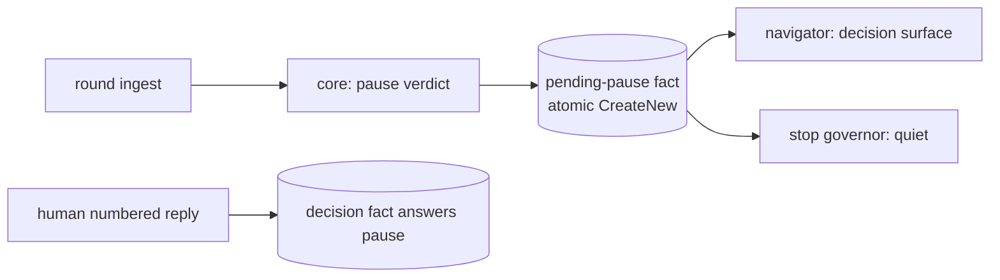
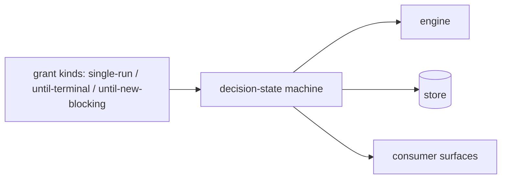

# Design Analysis: 199-beta3-stabilization, Iteration 001

**Feature**: 199-beta3-stabilization
**Iteration**: 001
**Date**: 2026-08-10
**Status**: presented for the design-gate verdict

## Problem framing

Beta2's campaign machinery has review quality but no review economics, a stop surface
with three disagreeing authorities, a verdict-capture layer with reproduced defects, an
integrity check that refuses the most common consumer install path, no first-run
bootstrap, and consumer surfaces written in internal vocabulary. The acceptance bar: a
consumer completes their first feature without an endless review loop, a wedged gate,
or a sentence they cannot understand. Scope is CLOSED to the ledger's ten Beta3 items
plus two human-ruled additions (the markdownlint CI chore; the FR-010 prompt-submit
amendment).

## Key Design Decision Points

(Bound by the workshop; carried as constraints.)

- Decomposition: existing core/store/orchestrator/navigator layering, no new layers.
- Pause ownership: the orchestrator's terminal state — engine exits after every round.
- Stop authority: the route classifier consults the signoff-gate store, suppresses on
  authorized in-flight runs, ignores records-only deltas; a pending pause decision is
  a sanctioned quiet state.
- Landing: stop-here composes verification + residual acceptance + gate sync as one
  action.
- The open point this analysis decides: HOW the pending pause decision is represented.

## Alternatives

### Option A - Simplest: derived pause state

- **Approach**: no persisted pause fact — the decision surface is re-derived from the
  latest run result at render time, and the stop governor infers quietness from run
  records.
- **Architectural pattern**: projection-only; heuristic state inference over existing
  run facts.
- **Quality features considered**: simplicity (no new schema); weak on state
  integrity, auditability, and resume fidelity — the quiet state is inferred, never
  recorded.
- **Effort estimate**: ~1.5 SP.
- **Reversibility cost**: low — nothing persisted to migrate away from.
- **Trade-offs**: the quiet-state read becomes heuristic, straining the human-bound
  sanctioned-state semantics (architecture D3 addition); a resumed session re-renders
  lossily; budget fixtures would pin inference behavior instead of a fact.



### Option B - Reasonable: first-class pending-pause fact (RECOMMENDED)

- **Approach**: the orchestrator's round terminal writes a pending-pause fact to the
  review authority store; the decision surface renders from the fact; the human's
  numbered reply is the only writer of the answering decision fact; the stop governor
  reads the fact directly for the quiet state; resume re-renders it verbatim.
- **Architectural pattern**: normalize-state + immutability-intent — immutable facts
  in the single review authority store (atomic FileMode.CreateNew), projections
  render; object-invariants guard impossible states (an unanswered pause coexisting
  with a running round).
- **Quality features considered**: state integrity, auditability, resume fidelity,
  quiet-state exactness, testability (budget and pause fixtures pin facts).
- **Effort estimate**: ~2.5 SP (inside the ledger's F8 fast-core envelope).
- **Reversibility cost**: low-moderate — one fact schema plus reads; beta4's decision
  pipeline supersedes it cleanly (replacement note recorded).
- **Trade-offs**: one more fact schema in a store beta4 rebuilds; one extra atomic
  write per round.



### Option C - By-the-book: decision-state machine with grant kinds

- **Approach**: a full decision pipeline modeling grant kinds (single-run /
  until-terminal / until-new-blocking) with a formal decision-state machine.
- **Architectural pattern**: explicit state machine plus disposition-vocabulary
  expansion across engine, store, and surfaces.
- **Quality features considered**: expressiveness, forward-compatibility; maximal
  authorization fidelity.
- **Effort estimate**: 8–12 SP (the ledger's own estimate for the vocabulary
  cluster).
- **Reversibility cost**: high — a vocabulary shipped to consumers is a compatibility
  surface.
- **Trade-offs**: preempts beta4's disposition-cluster design spike and is explicitly
  out of the closed beta3 scope per the maintainer's split ruling. Not meaningfully
  available to this iteration; listed because it IS the distinct by-the-book shape
  beta4 will design properly.



## Crew recommendation

Option B. It is the smallest representation that satisfies every bound constraint
honestly, and its beta4 replacement path is clean (the fact schema is superseded by
beta4's decision pipeline; the decision-surface contract survives).

## Beta4 replacement notes (per bridge item — mandated by the feature)

- Pause plumbing (orchestrator terminal + pending-pause fact): replaced by beta4's
  redesigned disposition/economics pipeline; the decision-surface contract is durable.
- Stop-authority checks (consult/suppress/records-only): subsumed by beta4's
  stop-surface state model (author-attributed deltas, in-flight modeling);
  consult-before-block ordering and pending-decision-quiet are the durable semantics.
- Composed landing: beta4's disposition vocabulary replaces the acceptance
  primitives; the one-action landing UX contract is durable.

## Co-Design Record

Human-agreed: yes

**Co-design agreed by the maintainer, 2026-08-10**: component map approved as drawn
(no renames, splits, merges, or reassignments requested); stop-here and pause flows
walked and agreed; Option B chosen ("Option B — the pending-pause fact").

### Agreed component map

```text
                       CONSUMER-FACING RENDERING (navigators)
  ┌──────────────────────────────────────────────────────────────────────┐
  │ co-review navigators (decision surface, stop blocks, gloss helper)   │
  │ bootstrap-provider + prompt-surgery (banner: full prerelease version)│
  └───────────────┬──────────────────────────────────────────────────────┘
                  v
                ORCHESTRATORS (workflow)
  ┌──────────────────────────────────────────────────────────────────────┐
  │ review-campaign-orchestrator  [BRIDGE]                               │
  │   round terminal = PAUSE; composed stop-here landing                 │
  │ specrew-init + verification-plan-materializer  [durable]             │
  └───────────────┬──────────────────────────────────────────────────────┘
                  v
                AUTHORITY CORE (pure decisions)
  ┌──────────────────────────────────────────────────────────────────────┐
  │ review-authority-core  [bridge+durable]                              │
  │   per-campaign budget (4, reviewer-invoked-only), pause verdicts     │
  │ signoff-evidence-gate route classifier  [BRIDGE]                     │
  │   consult gate store → suppress in-flight → ignore records-only →    │
  │   pending-pause = quiet                                              │
  └───────────────┬──────────────────────────────────────────────────────┘
                  v
                STORE (immutable facts)
  ┌──────────────────────────────────────────────────────────────────────┐
  │ review-authority-store  [durable]                                    │
  │   reparse-tag discrimination; NEW pending-pause fact (Option B)      │
  │ signoff-gate store (latest.json + history) — unchanged, now consulted│
  └──────────────────────────────────────────────────────────────────────┘

  SIDE RAILS: capture (ConversationCaptureAccessor + hooks deploy/doctor);
  reviewer contract & catalog (host rows + reviewer prompt); instruction/CI/
  records (packet templates + sync skills, markdownlint CI, 009/010 + notes)
```

### Component responsibilities (every component, named)

- `review-campaign-orchestrator` — terminates every round into the pause; owns the
  one-action stop-here landing (verification -> residual acceptance -> gate sync). [bridge]
- `specrew-init` / `verification-plan-materializer` — scaffolds the starter
  verification plan with the env_refs default list. [durable]
- `review-authority-core` — pure decisions: per-campaign budget of 4,
  reviewer-invoked-only spend, pause-verdict computation. [bridge+durable]
- `review-signoff-evidence-gate` route classifier — the single stop authority:
  consults the recorded gate decision, suppresses on authorized in-flight runs,
  ignores records-only deltas, treats a pending pause decision as quiet. [bridge]
- `review-authority-store` — reparse-tag discrimination (cloud family
  hydrate-then-verify, links refused, unknown fail-closed); the pending-pause fact. [durable]
- signoff-gate store — untouched; becomes the consulted authority. [unchanged]
- co-review navigators — decision surface + stop blocks in the consumer register via
  the new gloss helper (id + title). [durable]
- `specrew-bootstrap-provider` + `coordinator-prompt-surgery` — full prerelease
  version render. [durable]
- `ConversationCaptureAccessor` — approve-phrase-first, scan-past-non-verdict-turns,
  plain-English boundary-word immunity; prompt-submit primary. [durable]
- `deploy-refocus-hooks` + hooks doctor — registered-event reconciliation + drift
  flag. [durable]
- `reviewer-host-catalog` — codex 900 s row; timeout message names the window flag. [durable]
- reviewer prompt assembly — verdict-goal contract (blessed clean verdict, concrete
  failure scenarios, ranked + capped). [durable]
- packet templates + sync skills — one-message decision stops; never-sync-in-the-
  verdict-turn rule. [durable]
- CI workflow — markdownlint-cli install (198-carried chore). [chore]
- records — 009/010 wording fix; release notes with the beta4 claim sentence. [records-only]

### Activation-premise alignment (added 2026-08-10, maintainer-ruled during execution)

The campaign surface activates only when the coverage delta contains implementation. The
non-implementation classes are exactly two: the methodology machinery (via the single
FR-012 resolver) and the `specs/` lifecycle records tree. **A docs-only delta therefore
keeps the surface LIVE — deliberately** (maintainer ruling, 2026-08-10): documentation is
reviewable product content, and the conservative direction is the one that keeps the gate
consulted. Every unresolved input (trunk, resolver, git call) also keeps the surface live,
so quiet is reachable only from a fully resolved, genuinely records-only delta.

### T007 design record — verification-plan scaffolding (maintainer input, 2026-08-10)

Three constraints, recorded from the maintainer's ruling after DRIFT-199-I001-008/-010
showed the beta2 definition was per-machine and unreconstructible from the repository:

1. **Tracked by default.** The scaffolded plan is committed to the tree the reviewer
   reads, or the design rules otherwise and records why. A verification definition that
   survives neither a clone nor a new worktree is not a definition the evidence chain can
   cite.
2. **References must not rot silently.** Feature and iteration references are derived, or
   staleness is detectable. The beta2 plan hardcoded `f198.i008` in both its `plan_id` and
   its `-IterationPath`; nothing surfaced that it no longer matched the active work.
1a. **`PSModulePath` is a measured question, not a judged one** (maintainer, 2026-08-10).
   Every governed project's plan carries at least one PowerShell-invoked command (the
   governance validator), so this is a stack-default question. T007 runs the validator
   once under a scrubbed environment WITHOUT `PSModulePath` and lets the result decide
   whether the PowerShell stack default carries it. The measurement is recorded; the
   reasoning is not a substitute for it.
1b. **Per-context verification scope** (maintainer, 2026-08-10). The full deterministic
   registry is the RELEASE GATE lane, not the slice lane. A slice review points its
   verification command at the suites the slice actually touches; the full registry is
   kept for the certification round. The plan legitimately DIFFERS between those
   contexts, and T007's scaffolding should express that distinction rather than emit one
   lane for every purpose.
1c. **Timeout-fits-window consistency check** (maintainer, 2026-08-10). Per-command
   `timeout_seconds` and the round window are currently unrelated numbers with no
   consistency check, so a plan that cannot possibly pass is accepted, burns the full
   window, and reports a sealed failure (DRIFT-199-I001-012 is the reproduction: a
   1200 s command inside a 900 s round). The cheap half — validate at PLAN-VALIDATION
   time that command timeouts fit the configured window, with a message naming BOTH
   numbers — belongs here because T007 scaffolds plans anyway. Implement it only if it
   is a few lines; otherwise route it to beta4. Sizing guidance to carry: verification
   consuming more than roughly half the round window is the wrong shape, because the
   reviewer needs the remainder.
3. **Provenance — the intended end state.** The validation lane is ALREADY decided at the
   devops-operations lens and recorded there in prose, then re-invented by hand as
   configuration. The intended shape is that `verification-plan.json` becomes the devops
   lens's machine-readable output exactly as `implementation-rules.yml` is the
   code-implementation lens's: the workshop decides, the artifact carries, the engine
   reads. **For beta3**: scaffold the stack-default plan as FR-012 specifies and record
   this derivation-from-lens shape as the intended design. Implement the derivation only
   if reading an existing lens record proves to be a few lines; otherwise route it to
   beta4 with the `implementation-rules.yml` symmetry named as the precedent.

### Pause-state rulings (maintainer, 2026-08-10, during T001)

**A superseded pause confers no quiet.** A pending pause is recorded AGAINST a tree state,
and the human answers it by changing that tree. If the quiet check did not compare the
pause's target against the current tree, a stale pause would quiet a tree it never
described. That is the review-stale class in a new place and in its dangerous direction: a
stale RESULT merely nags for a fresh review, whereas a stale PAUSE would SILENCE the
surface. **Ruling**: a pause whose target no longer matches the current tree is
SUPERSEDED — it stops conferring quiet and the surface returns to its ordinary route.
Absent or unresolved input fails closed (no quiet). Pinned by
`Test-ReviewCampaignPendingPauseQuiet` and its fixtures.

**A pause never suppresses a boundary-releasing result** (maintainer ruling 2026-08-10, accepted after
DRIFT-199-I001-018). A pause over a clean result has no demand to suppress: its own recommendation is
that stopping here completes the sign-off, so withholding the release withholds something already
earned. What a pause legitimately suppresses is a DEMAND — do not nag for another review or another
disposition while one is already sitting with the human — and releasing what they need in order to
answer is not a demand.

**The residual, CHECKED rather than assumed, and it was a second form of the same wedge.** Nothing in
the tree retires a pause fact: `Write-ReviewCampaignPauseDecisionFact` exists in the store and has NO
caller anywhere in `scripts/`, so a pause lingers until the tree moves and supersedes it. That is
benign for a clean pass (the release exemption covers it) and benign after any tree change (a
superseded pause confers nothing), but it was NOT benign for a findings result the human had
explicitly ACCEPTED: the acceptance is an answer to the pause recorded through a different instrument,
and exempting only the clean pass left that case wedged in exactly the way the clean case had been.
**Ruling recorded as a deliberate choice**: a pause does not survive a human acceptance of the same
result either, while a `require-correction` disposition is NOT an acceptance and the pause still
quiets — a human who asked for a fix has not accepted, whatever else they also said. Both directions
are pinned. Retiring the pause fact itself stays unbuilt and routes to beta4; the release recognising
the answer is what makes the lingering fact harmless, and that is the property the fixtures hold.

**The allowance reset is prose, never a numbered option.** A refusal must name its exact
next step (the U4 rule, and today's wedge lesson: an unsatisfiable, undeclinable surface
is the acceptance bar failing). But a sanctioned bypass rendered as a numbered choice
becomes one keystroke inside the very flow the budget exists to interrupt, and the
budget's whole value is that exhaustion FEELS different from an ordinary continuation.
**Ruling**: on exhaustion the numbered list carries only stop-here and abandon; the reset
command is stated in prose within the refusal. The structural removal of the continue
option stands, and the fixture pins that continue is ABSENT rather than discouraged.

### T003 design record — the two governors, and why FR-007 READS a store (maintainer-confirmed, 2026-08-10)

**FR-007's consult is a READ of the signoff-gate decision store, never a live gate call, and the
reason is structural rather than stylistic.** When campaign authority is enabled,
`Get-ContinuousCoReviewSignoffGateDecision` is a thin wrapper that calls
`Get-ReviewCampaignVerdictPacketDecision` — the very function doing the consulting. A live consult
would therefore have the packet decision ask the gate while the gate asks the packet decision, and
neither terminates. The spec already names the store rather than the gate ("the campaign stop surface
MUST consult the signoff-gate decision store") and resolves the empty case explicitly: with no
recorded decision the surface evaluates as it does today.

**Store-reading is not a staleness hole, and this is the sentence to read if that worry arises.** A
recorded ALLOW confers `review-current` only when its `reviewed_digest` equals the CURRENT digest —
which is the superseded-pause discipline of the ruling above, applied to the gate decision instead of
to a pause. A gate decision describing a tree that has moved on confers nothing, exactly as a
superseded pause confers nothing. Both are the same rule: evidence is bound to the tree it describes,
and the dangerous direction for both is SILENCING, so both fail closed. The store record spells the
tree `current_tree_id` while the decision logic asks for `reviewed_digest`; normalization happens in
the reader so the decision function stays a pure function over plain shapes and its fixtures stay
store-free.

**The two-governor adjudication, ruled after the collision fired three times live.** The boundary
evidence gate and the campaign block can instruct opposite things in the same stop: the gate needs a
recorded crossing's verdict marker or the human's answer cannot be captured at all, while the
campaign block said, unconditionally, to emit no marker. **Ruling**: the recorded crossing WINS.
Controller truth naming an exact pending authorization outranks the campaign block's clause, which
governs ITSELF — it describes what that block is, not what the lifecycle owes. Under the other
reading a recorded crossing becomes unanswerable and the lifecycle wedges on a review the human may
not even owe yet. Two constraints came with it: deferring on the MARKER is not withdrawing the
BLOCK (the review position is unchanged and still stated), and only a well-formed crossing — one
naming its destination — outranks the clause. The block now STATES the adjudication and names the
crossing, because the failure this fixes is that a consumer could not have made the call.

### T004 part 3 design constraints — verdict capture wiring (maintainer, 2026-08-10, WRITTEN BEFORE THE CODE)

Recorded ahead of implementation deliberately: this part changes **when** a verdict is written while
touching the wiring that drifts, so the constraints must bind whoever implements it.

**TWO failure directions get pinned, not one.**

- **DOUBLE-capture** — both paths fire and one verdict becomes two authorizations. This is the
  FABRICATION direction, and it is the unrecoverable one: a false authorization in the ledger is
  indistinguishable from a real one.
- **ZERO-capture** — neither path fires and the verdict is lost. Already lived through; recoverable,
  because the human re-states.

**Required fixtures**, all three:

1. Prompt-submit is PRIMARY: it fires, and Stop does **not** double-write.
2. Prompt-submit is ABSENT — the real stale-wiring condition from T067, not a hypothetical — and the
   Stop-time fallback still captures.
3. Both wired: exactly **ONE** authorization fact exists for one verdict.

**The writer is IDEMPOTENT on (crossing + verdict text)**, rather than relying on the two paths never
overlapping. Belt and braces at the STORE, because the wiring is precisely what drifts — the same
reasoning that put the class guards in a permanent lane rather than trusting selection.

**WHAT ALREADY EXISTS, read from source rather than assumed (2026-08-10).** Two facts change the shape
of this part, and both were measured before any code was written:

- **Prompt-submit capture is ALREADY WIRED, so the double-write risk is LIVE today, not hypothetical.**
  `Invoke-SpecrewBoundaryVerdictCapture` is the one write path and BOTH hooks reach it:
  `HandoverStore.ps1` calls it on `UserPromptSubmit`/`PreInvocation` (returning early) and again at
  Stop when `$isEndOfTurn`. The first bullet of this task is therefore already built; the work is the
  idempotency and the wiring reconciliation.
- **An idempotence guard exists but is keyed on the CURSOR, not on crossing + verdict text.**
  `Add-SpecrewBoundaryAuthorization` (shared-governance.ps1) no-ops when the cursor already sits on
  the authorized boundary AND the newest history entry has the same `to_boundary`. Its own comment
  calls it "narrow by design". It does prevent today's ordinary double-write — prompt-submit writes,
  the cursor advances, Stop's re-fire no-ops — but it is wrong in BOTH directions the maintainer's
  key would get right:
  - **Zero-capture direction**: it cannot tell two DIFFERENT verdicts for the same boundary apart, so
    a genuine re-approval after a send-back cycles back to the same boundary is swallowed as a
    duplicate and its instruction text is lost.
  - **Double-capture direction**: it depends on the cursor having advanced. If the state write fails
    midway, or the two paths interleave before it lands, both can append.

  Keying on **crossing + verdict text** is strictly better in both: it swallows only a TRUE duplicate
  and lets a genuinely different verdict through. A stable entry identity already exists to build on —
  `Get-SpecrewBoundaryAuthorizationEntryId` mints `auth-<sha256>`. Note the writer is MIRRORED in two
  trees (`extensions/...` and `.specify/extensions/...`); both must move together, and the deployed
  mirror has its own structural parity guard.

**WHAT THE IDEMPOTENCY CHANGE ACTUALLY BOUGHT — measured, and it CORRECTS the reading above
(2026-08-10).** The first draft of this record said the cursor-keyed guard was wrong in both
directions. Only one half survived measurement, and the record is corrected rather than left to read
as if both were confirmed:

- **ZERO-capture — CONFIRMED and FIXED.** Driven against the pre-patch writer, a genuinely DIFFERENT
  verdict for the same boundary was swallowed as a duplicate. That is the assertion that fails RED
  before the change and passes after it, so it is the measured behaviour change.
- **DOUBLE-capture — NOT reachable through the hooks today, and the guard is a true BACKSTOP.** The
  three double-capture fixtures pass with OR without the change, because protection currently comes
  from a layer above: the capture consumes the pending crossing, so the Stop re-fire returns
  `not-pending` and never reaches the writer at all. Claiming the writer guard fixed a live
  double-write would be false.

That is exactly the shape the maintainer's constraint asked for — "belt and braces at the STORE,
because the wiring is precisely what drifts". The protection that exists today lives in the wiring;
the writer guard is what still holds when the wiring moves. It is recorded as a backstop, not as a
repair, so a later reader does not mistake a passing fixture for a defect that was caught.

A first attempt keyed on `from_boundary` as well was written and DISCARDED before commit: the second
write arrives after the cursor has advanced, so its `from_boundary` is the destination itself, and the
guard could never have matched a real duplicate. Recorded because unreachable code that looks like a
safety mechanism is worse than none.

**LIMIT OF THE EVIDENCE** (maintainer ruling 2026-08-10, accepted as-is): the backstop is proven AT THE
WRITER by a direct-call fixture and UNPROVEN THROUGH THE HOOKS, because the only way to exercise it end
to end is fault injection on the crossing-consumption write — more machinery than the risk warrants. A
backstop that fired today would mean the primary protection had already failed, so "latent" is its
correct state; a passing suite here is not end-to-end coverage, and a later reader should not read it
as such.

**Sequencing note carried from the session that recorded this**: the classifier (FR-010
leading-approval precedence) and the marker-forward reader are both DONE and green, so part 3 is pure
wiring and ordering. Its two suites — `tests/bootstrap/ConversationCapture.Tests.ps1` and
`tests/integration/verdict-capture-blocks.tests.ps1`, the latter carrying 23 not-approve cases and the
T032 fabrication fixtures — are now in the permanent class-guard lane and must be read before either
file is touched.

### T010 addition — a handback packet must NAME the action that resumes the work (maintainer, from a live observation)

Folded into T010's packet-template work alongside the consumer-language and one-message-stop rules.

**The rule**: "What I Need From You: Nothing" is honest ONLY when the work genuinely continues without
the human. A session that stopped because it ran out of context needs a fresh session started — and
that is an action only the human can take, so "nothing" there is FALSE, and it is the last line they
read.

**Why it belongs with the consumer-language work rather than beside it**: it is the same defect class.
The other rules stop a packet using vocabulary the consumer does not share; this one stops a packet
being *inertly* honest — every individual sentence true, while the one thing the human must do goes
unsaid. Both leave a consumer unable to act on a surface that looks complete.

**How it should land**: the packet's closing section names the resuming action whenever the stop was
not self-resuming — "start a fresh session and point it at the handover" for a context-exhausted stop,
"reply with the approval phrase" at a verdict boundary, "nothing — the next step runs automatically"
only when that is literally true. The template should make the no-action case the one that has to be
justified, not the default.

### T006 design record — reparse-tag discrimination, MEASURED before any code (2026-08-10)

The hard unknown in T006 was how to tell a cloud placeholder from a symlink without shelling out on a
hot path. Measured on this machine rather than reasoned about:

| Probe | attrs | ReparsePoint | `LinkTarget` | `LinkType` | real tag (`fsutil`) |
| --- | --- | --- | --- | --- | --- |
| ordinary file | `0x00000020` | no | null | — | not a reparse point |
| ordinary dir | `0x00000010` | no | null | — | not a reparse point |
| symlink (file) | `0x00000420` | yes | the target path | `SymbolicLink` | `0xa000000c` |
| junction (dir) | `0x00000410` | yes | the target path | `Junction` | `0xa0000003` |

**The discriminator is already in .NET — no P/Invoke and no subprocess.** `FileSystemInfo.LinkType`
names the redirecting family exactly, and `LinkTarget` is non-null only for those. That matters beyond
convenience: `fsutil` would be a subprocess on a path walked per component, and this repository has
already been bitten once by a subprocess on a per-path loop (the `git config core.ignorecase` call
that silently hung the Linux CI review suite). The classifier must not repeat it.

**The three dispositions, and the fail direction of each:**

- **REFUSE — the redirecting family.** `LinkType` is `SymbolicLink` or `Junction`. This is exactly
  today's behaviour for these two, so the existing refusal fixtures stay green and untouched; the task
  requires that they do.
- **HYDRATE then hash-verify — the cloud-files family.** ReparsePoint set, `LinkTarget` NULL, and one
  of `FILE_ATTRIBUTE_RECALL_ON_DATA_ACCESS` (`0x00400000`), `FILE_ATTRIBUTE_RECALL_ON_OPEN`
  (`0x00040000`) or `FILE_ATTRIBUTE_OFFLINE` (`0x00001000`). A placeholder is not a redirect: the file
  IS the file, its content merely is not local yet. Refusing it is what makes the product unusable on
  the default CurrentUser install (DRIFT-199-I001-005, where the sanctioned remediation door itself
  was unreachable).
- **FAIL CLOSED — everything else.** ReparsePoint set and neither of the above. An ALLOWLIST, so an
  unrecognised tag refuses rather than being admitted; the safe direction here is refusal, the mirror
  of FR-009's allowlist where the safe direction was nagging.

**Fixtures use the real tag constants** (`0xa000000c` symlink, `0xa0000003` junction, `0x9000001a`
plus the cloud-family mask) as data, cross-checked against live `fsutil` output for the two families
this machine can materialise. The classifier itself stays attribute-based; the constants pin that the
mapping describes the real tags rather than an invented vocabulary.

**Three sites must move together** (the task's "symmetric" requirement), all sharing the one
classifier: `Get-ReviewAuthorityStorePath` (authority store, root + every component),
`Assert-SpecrewReviewRuntimePathContained` and `Get-SpecrewReviewRuntimeManagedTextSha256`
(module install), and the frozen-snapshot check.

**Correction, measured while wiring the sites (2026-08-10)**: the third group above — "the
frozen-snapshot check" — does not exist. A tree-wide search for reparse handling finds exactly two
engine files, `review-authority-store.ps1` (2 checks) and `review-engine-resolution.ps1` (3), and the
frozen-snapshot path (`Test-GitReviewTargetSnapshotIntegrity`) hashes worktree sources with no reparse
refusal to discriminate. The five checks that exist were moved; no refusal was invented in the snapshot
path to match this record, since that would have ADDED a refusal under the banner of removing one.
Recorded as DRIFT-199-I001-021.

**The OneDrive hydration leg is a MANUAL measurement** on the recorded T067-class environment, per the
task: an agent cannot materialise a cloud placeholder on a local volume, so that proof line is
transcribed from the maintainer's install and scoped to it. The classifier's cloud branch is therefore
unit-testable by attribute synthesis but its END-TO-END hydration is human-measured — the same
limit-of-evidence discipline recorded for T004's backstop, and it should be recorded as such rather
than implied by a green suite.

### T007 design record — the bootstrap deadlock's exact cause, MEASURED before any code (2026-08-10)

Same discipline as T006: the unknowns are measured and the shape is decided before the first edit.

**The deadlock is not a missing mechanism — it is an empty catalog.** A materializer already exists
(`Invoke-ContinuousCoReviewVerificationPlanMaterialization`) driven by
`extensions/specrew-speckit/data/verification-plan-catalog.json`. Read from that file, not inferred:

| Catalog section | Rows | Selects when |
| --- | --- | --- |
| `project_metadata` | 1 | `package.json` declares a REAL `scripts.test` (npm's placeholder is rejected) |
| `quality_profiles` | 5 | the project EXPLICITLY declares that profile id |
| `providers` | **0** | never — the section is empty |

So a project with no `package.json` and no declared quality profile matches nothing and falls through to
`verification-not-configured`. **This repository is exactly that project** — PowerShell, no `package.json` —
which is why DRIFT-199-I001-008 reproduced here and why the first authorized campaign round died at
preflight. A fresh project of any non-npm stack hits it identically.

**The selector's precedence, read from `Select-ContinuousCoReviewVerificationPlan`**: project-config
(explicit `.specrew/verification-plan.json`) -> project-detected -> profile-selected -> provider-gated ->
`verification-not-configured`.

**Decision: T007 scaffolds TIER ONE, the explicit plan file.** The task says `specrew init` scaffolds the
starter plan, and that is also the maintainer's DRIFT-199-I001-010 ruling — the verification definition
must live in the tree the reviewer reads, not beside it. A generated-and-hash-marked plan would be
invisible to the consumer; a committed starter file is one they can read, edit, and diff. Adding a
"baseline" tier to the selector instead was rejected for that reason, not for cost.

**Constraint that decides the template shape — the plan schema is CLOSED.** Measured in
`verification-plan-contract.ps1`: the plan admits `schema_version`, `plan_id`, `commands` and nothing
else, and each command admits a fixed twelve-name set, both with the explicit rationale that "no secret
values can ride an unrecognized field". Templates therefore CANNOT live inside the plan as an extra key
or a disabled-command flag without reopening a containment rule that exists for secrets. The starter
plan ships the governance-validator command only — one command that genuinely runs and passes in every
governed project — and the dotnet/npm build-test templates ship BESIDE it as a copy-from example, not as
plan content.

**The env_refs default is settled by measurement, not judgement**: the N4 list including `TMPDIR`, and
WITHOUT `PSModulePath` — `pwsh` reconstitutes a full default module path when the variable is absent, so
the env_ref is not load-bearing (transcribed in the drift log against the maintainer's standing
instruction).

**The integration point already exists, measured 2026-08-10**: `specrew-init.ps1:919-922` ALREADY calls
`Invoke-ContinuousCoReviewVerificationPlanMaterialization`, and `specrew-update.ps1:1482` does too. Init
is not missing a step — it runs the materializer and is handed `verification-not-configured`, because
nothing in the catalog matches. So the change belongs in the MATERIALIZER, not in the init flow: both
entry points then inherit it, and it stays unit-testable without standing up a full init.

**The shape that follows from the selector's own precedence**: when the state is
`verification-not-configured` AND no plan file exists, write the starter as an EXPLICIT plan with NO
generated-marker. On every later run it is then found by the `$planExists` branch and preserved as
`preserved-explicit-plan` — the consumer owns it, and no refresh can silently overwrite or remove it.
Writing it as a MARKED generated plan would be wrong: the materializer removes a generated plan when
selection turns unconfigured, so the starter would delete itself on the next run.

**ANSWERED BY MEASUREMENT 2026-08-10 — the starter ships a GENERIC command, no placeholder and no
run-time resolver.** Both questions below were run rather than reasoned about:

| Question | Measurement |
| --- | --- |
| Does the DEPLOYED validator path exist in a consumer tree? | YES — `.specify/extensions/specrew-speckit/scripts/validate-governance.ps1` is present (the source-repo `extensions/...` path also exists here, but the starter must name the deployed one) |
| Does the validator run usefully WITHOUT `-IterationPath`? | **YES.** `exit=0`, 12.3 s, and it RESOLVED THE ACTIVE ITERATION ITSELF: `PASS .../specs/199-beta3-stabilization/iterations/001`, `[validator-timing] mode=scoped iterations_validated=1` |

**Why this is the good outcome rather than merely a convenient one**: DRIFT-199-I001-010 recorded that
the beta2 plan hardcoded `plan_id: f198.i008.signoff.v5` and `-IterationPath
specs/198-beta2-hardening/iterations/008`, so the definition "survives neither a clone, nor a new
worktree, nor a new feature". A command with NO feature/iteration binding survives all three. The starter
is therefore genuinely generic — it does not go stale when the consumer starts their second feature,
which a placeholder would have.

**Superseded**: the two sub-questions below are kept because they record what had to be established, not
because they are still open.

**NEXT UNKNOWN — MEASURE BEFORE WRITING THE STARTER.** This repository's plan invokes the validator as
`extensions/specrew-speckit/scripts/validate-governance.ps1 -ProjectPath . -IterationPath
specs/<feature>/iterations/<NNN> -NoCacheRead -NoParallel`. Two things must be established rather than
assumed:

1. **The downstream path differs** — a deployed project carries
   `.specify/extensions/specrew-speckit/scripts/validate-governance.ps1`, not `extensions/...`. The
   starter must name the path that exists in a CONSUMER's tree, not this source repo's.
2. **`-IterationPath` is feature/iteration-specific, and a starter plan cannot know it.** Whether the
   validator runs usefully WITHOUT it decides the starter's shape: if it does, the starter ships a
   generic command; if it does not, the starter needs either a placeholder the consumer edits or a
   resolver that finds the active iteration at run time. Run it both ways in a scratch project and let
   the result decide — the same discipline as the PSModulePath question, and for the same reason.

### T007 PART 2 — what is already named, and what is genuinely sealed (measured 2026-08-10)

Part 1 (the starter plan) is committed and green. Part 2 is "verification failures name the missing
piece instead of a sealed generic failure", and the first job was to establish what is ALREADY named
rather than rewriting messages that are fine. Read from source:

**Already specific — leave alone.** `verification-plan-contract.ps1` names the element and the rule:
`plan schema_version is required (exactly '1.0' for this contract)`; `env_refs must be an ARRAY of env
var NAMES`; `env_refs entry 'X' looks like a literal 'NAME=value' - only NAMES are allowed (no secret
values)`; `command carries unknown property 'X' (the schema is CLOSED; no secret values can ride an
unrecognized field)`. `verification-plan-runner.ps1` likewise names executable-resolution failures
precisely (`does not exist`, `resolves outside the repository root`, `is not resolvable on the engine's
PATH`), and propagates the contract's own reason for a schema-invalid plan.

**Still owed, in priority order:**

1. **The not-configured message does not name its fix.** `verification-plan-runner.ps1:170` says
   `no supplier output at .specrew/verification-plan.json (FR-049 supplier not configured)` — it names
   the file and the requirement id, and tells the consumer nothing about what to do. Part 1 makes this
   state much rarer (a governed project now gets a starter), which is exactly why the remaining cases
   are the confusing ones: a plan deleted by hand, or a non-governed directory. Cheap, self-contained.
2. **The env_refs "exact line to add" case, which does NOT exist yet.** The runner scrubs the
   environment to the declared names, so a command needing an UNDECLARED variable fails for a reason
   that never mentions environment at all. Naming the missing variable requires knowing which one was
   missing, which the current design cannot know — so this needs a decision about how much to infer,
   not just a better string. **Do not implement it as a guess.**
   **PARTIALLY DELIVERED since this was written**: the derived diagnosis now names *"this command could
   only see these environment variables: PATH, TMPDIR ... if it needs another one, add its NAME to that
   command's env_refs"* — the HINT half, the rule plus the exact place to change it, which is what would
   have ended T067. Still absent: naming WHICH variable was missing, the part needing the inference
   decision.
2b. **THE DEFER-RECORD FORMAT — found in the spec, NOT found in code (measured 2026-08-11).** FR-013's
   acceptance scenario 3 reads: *"Given an invalid plan or a malformed defer record, When the failure
   renders, Then the error names the schema element or required defer format rather than a generic
   verification-command-failed."* But `verification-plan-contract.ps1` contains **no** defer, waiver or
   skip concept at all — there is nothing in the verification path to name.
   The closest EXISTING contract is reviewer-side, `worktree-reviewer.ps1:1104-1114`: a recorded human
   deferral must live in a **worktree-visible** artifact (a drift-log event, a specs decision artifact,
   or a proposal work item), name the issue, record the approving human, and state where the work is
   carried — and a deferral CLAIM without such a record is itself a blocking finding.
   **So FR-013 means one of two things, and it must be settled before code**: (a) the verification plan
   gains a defer concept it does not have, or (b) the requirement is about surfacing the EXISTING
   reviewer-side deferral format when a deferral claim fails validation. **(b) is far more likely** — it
   names a "required defer format" that already exists and is already enforced — but (a) would be new
   machinery in a closed-scope feature, so this is a maintainer scope call rather than an implementer's
   guess.
3. **The genuinely SEALED failure — FR-013's real target.** DRIFT-199-I001-012 recorded a verification
   failure surfacing as `diagnostics-require-command-scoped-disclosure`, where the consumer cannot see
   why their verification failed without a human-authorized diagnostic disclosure. This is the one that
   matters most and the one to treat carefully: it is a GOVERNANCE surface, and loosening it is not a
   message change. Give it fresh context and a design record of its own before touching it.

**Still to decide when T007 resumes**: whether the timeout-versus-window consistency check from
DRIFT-199-I001-012 lands here. Its ruling is conditional on being a few lines, which is a measurement
against the validator's shape rather than a design choice. Note it pairs naturally with item 3, since
both concern a consumer being unable to see why a round failed. The maintainer's ruling is conditional — take it only if it is a few
lines, else beta4 — so it is a measurement against the validator's shape, not a design choice.

### FR-013 — how a sealed failure was improved WITHOUT unsealing anything (maintainer ruling, 2026-08-10)

Recorded prominently because a later reader will otherwise assume this was a loosening. **It was not.
The human-authorized, scoped, redacted disclosure door is untouched, and the stable
`diagnostics-require-command-scoped-disclosure` reason still points at it.**

**The insight the ruling turns on**: what a consumer needs when verification fails is almost never the
command's OUTPUT — it is the FACTS ABOUT the failure, and the engine already owns all of them. Which
command ran, what class of failure, what exit code, how long it took, and the load-bearing one: exactly
which environment variable NAMES the plan allowed through. None of that is output, so none of it is
disclosure.

**T067 is the proof.** Its real cause was an empty child environment with git not on PATH, and an hour
went into a sealed failure that a single derived sentence would have ended — a sentence composable
entirely from the PLAN, with the seal never opened.

**So the shape is a DERIVED-DIAGNOSIS LAYER ABOVE the seal**, not a change to it:
`Get-ContinuousCoReviewVerificationFailureDiagnosis` reads only controller-owned evidence fields
(`command_id`, `exit_code`, `duration_seconds`, `timed_out`, `classification`, `failure_reason`,
`env_refs`) and never touches stdout or stderr. A structural fixture asserts that — the function body,
comments stripped, must not mention `stdout`, `stderr`, `Get-Content`, `ReadAllText` or
`StandardOutput` — so "it does not read output" is a guarded property rather than a promise in a
comment.

**The env_refs line is a HINT, not a diagnosis.** The engine cannot know which variable was missing, so
it names the rule and the exact place to change it and does not guess. An EMPTY env_refs list says so
explicitly rather than omitting the line, because silence there is indistinguishable from "the message
did not mention environment" — which is exactly how T067 stayed mysterious.

**NOT YET WIRED TO THE CONSUMER, and this is the honest half.** The composer and its fixtures exist; the
diagnosis does not yet reach a human. **Until that lands, this is a diagnosis nobody can see**, which is
the same class as the demotion defect and must not be described as done.

**The wiring, traced end to end so it is a mechanical edit rather than a fresh investigation:**

1. `Invoke-ReviewCampaignFrozenVerification`'s failed-command return
   (`review-campaign-orchestrator.ps1:441-449`) gains a `diagnosis` field from the composer. Its
   `reason` stays BYTE-IDENTICAL — three fixtures assert that string by exact equality
   (`verification-plan-end-to-end.Tests.ps1:236`, `review-campaign-verification.Tests.ps1:263` and
   `:341`) and they are correct to: the machine token is a contract and the disclosure pointer.
2. The default verify port (`:728`) currently returns `{ ok; reason }` and drops everything else; it
   carries `diagnosis` through.
3. **The destination, and it is better than the port**: the stop-here landing message (`:780`) already
   embeds the raw reason in consumer prose — *"Stopping here did not finish: the final check on your
   files did not pass (verification-command-failed:build:diagnostics-require-command-scoped-disclosure).
   ... fix what the message above names"*. That sentence tells the human to fix what the message names
   while the message names nothing actionable. **That is the sealed-failure consumer experience in one
   line, and it is exactly where the derived diagnosis belongs.**

### FR-013 — does a completed verification NAME what it ran? MEASURED: no (2026-08-10)

The maintainer's ruling on starter-plan shadowing asked for a measurement before any code: if a
completed verification already names its commands, the gap is visible and nothing is owed.

**Measured, and it does not.** The success path composes `review_scope_suffix` with a COUNT only —
*"one joined record for each of N declared command(s)"* — and that text is REVIEWER-facing. The
consumer-facing pause surface (`Format-ReviewCampaignPauseSurface`) says nothing about verification at
all. So a project whose reviews verify only governance while its tests never run is told "verification
passed" with no way to notice, which is precisely the invisible-degradation class the maintainer named.

**Owed, and small — traced to the exact sentence.** The stop-here landing already tells the consumer,
on SUCCESS: *"Review is signed off. Any remaining minor findings are saved as follow-ups, and the final
check ran on your files exactly as they were."* That last clause is where the naming belongs, because
it is the one place a human is told the check happened. A project verifying only governance should read
something like *"…the final check ran on your files exactly as they were (1 command: Specrew governance
validation)"* — and then the degradation is visible without any shadow-detection at all.

The facts are already in hand at the success return: `$planIds` holds the command ids and
`$selected.plan.commands[].label` holds their human labels. So the change is the same three-step shape
as the diagnosis — carry `command_ids`/labels out of `Invoke-ReviewCampaignFrozenVerification`, through
the verify port, into the landing message — and it reuses the seam the diagnosis wiring just proved.

Explicitly NOT owed: detection of "auto-detection would now match something else". That routes to beta4
if still wanted after this lands, per the maintainer's ruling.

### T008 design record — which failure classes actually charge, READ FROM SOURCE (2026-08-10)

The drift log's evidence note is explicit that this must be measured, not assumed: *"T008's RED fixture
must pin the specific failure classes that do NOT release, rather than assume every infrastructure
failure charges a round."* Ledger F4 says infrastructure failures consume the allowance; the one
observed `preflight-failed` run released correctly. Both cannot be generally true, so the question is
which classes fall on which side.

**Read from `review-authority-core.ps1:1001` (`Resolve-ReviewCampaignReleaseDecision`) — release is
refused in EXACTLY three cases, and only one of them is a candidate defect:**

| Refusal | Meaning | Verdict |
| --- | --- | --- |
| `invoked-slot-remains-spent` | a spend fact exists for this reservation, so the reviewer WAS invoked | **CORRECT** — this is the rule T008 is protecting, not breaking. A round that reached a reviewer is charged. |
| `reservation-already-released` | a release fact already exists | **CORRECT** — idempotence, not a charge. |
| `invalid-reservation` | the reservation fact fails contract validation | **THE CANDIDATE.** A malformed reservation means the slot is never released and the allowance stays consumed, with no reviewer ever invoked. It fails toward CHARGING, which is the F4 direction. |

**And the structural one, above the predicate**: `Complete-ReviewPreInvocationFailure`
(`review-campaign-orchestrator.ps1:581`) only attempts a release `if ($null -ne $Reservation)`. A
failure path that holds a reservation but does not pass it here would charge silently — the predicate
would never be consulted at all. **That is a WIRING question, not a decision question, and this session
has been bitten by exactly that shape three times.**

**ENUMERATED 2026-08-10, and the gap does NOT exist.** All five call sites pass `-Reservation`:

| Line | Path | RuntimeOutcome | Spends passed |
| --- | --- | --- | --- |
| 1288 | frozen verification failed | `preflight-failed` | `@()` |
| 1316 | preflight gate failed (target / protection / harness / runtime) | `preflight-failed` | `@()` |
| 1324 | catch-all around preparation | `preflight-failed` | `@()` |
| 1346 | claim not acquired | `claim-contended` | `@()` |
| 1392 | launch failed before invocation | `launch-failed` | **real `$spends`** |

**The `$spends` split is the part worth noticing.** Only the launch-failed site passes real spend facts,
so if the reviewer HAD been invoked the release is correctly refused (`invoked-slot-remains-spent`) and
the round is charged. The four genuinely pre-invocation paths pass `@()`, so their slots are returned.
**The campaign path therefore already implements the legacy spend-class rule** that
`Get-ContinuousCoReviewRoundSpendClass` encodes and `review-spend-allowance.Tests.ps1:132-151` already
pins: `preflight-failed` consumes NEITHER budget.

### F4 IS ABOUT THE GRANT LEDGER, NOT THE RESERVATION LEDGER (maintainer, 2026-08-10) — and the inferred defect is NOT in the code

**The correction that matters**: the five-path enumeration below measures the RESERVATION ledger, which
is real and already works. **F4 is about the GRANT.** Release restores a reservation; the question is
whether it makes the AUTHORIZATION reusable. Written as planned, the characterization fixture would have
gone green and certified "F4 already worked" while the defect sat one ledger over — the
wrong-thing-certified risk, arriving from a direction neither party had named.

**The maintainer's counts from the T067 store**: grants 26 (each `slots: 1`), reservations 26 (1:1),
releases 4, spends 25, runs 30. Their inferred hypothesis: the release path resolves the reservation
without restoring the grant's slot, so every infrastructure failure cost a fresh authorization.

**VERIFIED IN CODE as instructed, rather than accepted — and the hypothesis does not hold. Grant reuse
is implemented, and it is wired.** Three independent reads:

1. `Get-ReviewCampaignAllowanceState` (`review-authority-core.ps1:913-925`). For a slot with a matching
   reservation: a SPENT reservation goes to `$spent`; an unreleased one goes to `$unreleased` -> `$active`;
   **a released, unspent reservation goes to NEITHER**, so both counts are zero and line 925's `else`
   branch adds the slot back to `available`. A released slot IS available again.
2. **The caller supplies releases.** `review-authority-store.ps1:245-246` reads the `releases` facts and
   passes `-Releases $releases` into `Resolve-ReviewCampaignReservationDecision`. The wiring gap that
   would have made the pure function moot is not present.
3. **Reuse is explicitly designed for.** `review-authority-store.ps1:249-256` carries the comment *"A
   pre-invocation release restores an allowance slot. Each reuse appends an immutable generation"* and
   computes `$generation = $slotReservations.Count + 1` precisely so a slot can be reserved again.

**So the code says a released slot is reusable.** That is a measurement of the CODE, not of T067's
behaviour, and it does not by itself explain the 26:26 ratio.

### RETRACTED — the i008 finding below is WRONG, disproved by measurement (2026-08-10)

**Read this before the section it corrects.** The claim below that i008 left "four released slots never
reused and four fresh authorizations minted instead" is FALSE. **i008 reused every slot it released:
five releases, five reuses**, spread across four grants (one carried generations 001-003, three carried
001-002).

**The error was an identity that silently encodes an assumption.** I computed reuses as
`reservations - grants`, which is only valid if EVERY grant is reserved against. In i008 it is not:
25 grants but only **21 reservation containers**, so four grants were minted and never reserved at all,
and the identity reported 1 reuse where the truth is 5.

**Re-measured directly, counting generation leaf files and true reuses (a reuse being any generation
beyond the first on a grant/slot) rather than deriving them:**

| Store | grants | res containers | res LEAF | releases | spends | REUSES | reuses = releases? |
| --- | --- | --- | --- | --- | --- | --- | --- |
| `cmp-198-beta2-hardening-i008` | 25 | **21** | 26 | 5 | 21 | **5** | **yes** |
| `cmp-198-beta2-hardening-i009` | 8 | 8 | 11 | 3 | 8 | 3 | yes |
| `cmp-198-beta2-hardening-i010` | 1 | 1 | 1 | 0 | 1 | 0 | yes |
| `cmp-198-beta2-hardening-i011` | 6 | 6 | 7 | 1 | 6 | 1 | yes |
| `cmp-199-beta3-stabilization-i001` | 1 | 1 | 3 | 2 | 1 | 2 | yes |
| `cmp-001-linkcheck-i001` (T067) — **RELAYED, NOT VERIFIED HERE** | 26 | 26 | 29 | 4 | 25 | **3** | **NO — 3 of 4** |

**The T067 row is labelled because it is not a measurement I made.** That store is not present in this
machine's worktrees — searched `C:\Dev`, `%USERPROFILE%\source`, `%USERPROFILE%\Documents`, `D:\` — so
nothing here verifies it. Adding relayed numbers to a table of measurements without that label would
repeat the exact class of error this section exists to correct.

**And it is the row that matters.** The five measured stores all show `reuses == releases`; T067 shows
3 of 4. **That single un-reused release is F4's entire surviving evidence.** Reading the five-store
result as "no residue, therefore no F4" deletes the motivation for the disclosure fix — which is why the
guard comment that made exactly that error was corrected rather than trimmed.

**GRANT REUSE WAS NEVER BROKEN.** It works in all five stores, including the earliest, and reuse
generations exist in T067's own store — the campaign where F4 was observed. **NO BISECT**: there is no
regression, so searching for the change that fixed it would be searching for the cause of an event that
did not happen.

**A record asserting a defect the ledger disproves is worse than no record**, which is why this
retraction sits above the section it corrects rather than replacing it — the reasoning is left visible
so the error is legible, not erased.

### F4's REAL residue — a DISCLOSURE gap, not an authority-ledger defect (2026-08-10)

The T067 residue is ONE release with no reuse, and the timeline explains it:

> `21:16:31  grant minted     ref: review-signoff-code-verification-final`
> `21:16:31  run-review-signoff-9 starts`
> `21:17:07  release          res-914d85be... verification-command-failed:governance-validator`
> **-- NO RUN in this window. NO refusal event. The slot sat available. --**
> `21:20:19  grant minted     ref: review-signoff-code-verification-final-2`
> `21:20:54  run-review-signoff-10 spends`

Nothing attempted to reuse the restored slot and got refused. **The slot WAS available, and a fresh
human authorization was minted three minutes later anyway.** So F4 is not a plumbing defect: **when a
pre-invocation release restores a slot, nothing surfaces that the slot is available**, so the human
issues an authorization they did not need. That is a MESSAGE, squarely on the beta3 acceptance bar
("needless friction a consumer cannot see through"), and cheap.

**THE LIMIT, stated rather than closed past**: these facts show no refusal event. They cannot
distinguish *"the tooling asked for a fresh reference"* from *"the human supplied one unprompted."* Do
not assert which. What is provable is that **the slot was available and was not offered.**

**THE FIX — designed, traced, NOT YET BUILT.** The release happens in
`Complete-ReviewPreInvocationFailure` (`review-campaign-orchestrator.ps1:596-607`): it calls
`Resolve-ReviewCampaignReleaseDecision` and writes the release fact when `permitted`. That function
already knows the one fact the human needs — **a slot just came back** — and currently tells nobody.

The shape, and the constraint that decides it:

- `Complete-ReviewPreInvocationFailure` reports whether it restored a slot (it has the decision in
  hand), and appends a consumer sentence to the PERSISTED failure reason, so the run record and its
  report both carry it.
- **The campaign's RETURNED `reason` must stay byte-identical.** Three fixtures assert it by exact
  equality, and the failed-run return at `:1318` uses the local `$reason`, not the ingress result — so
  appending inside `Complete-ReviewPreInvocationFailure` does not disturb them. That separation is why
  this is cheap.
- The remaining wiring is the CLI surface: whichever path prints a failed run to a human needs the
  sentence too, or it reaches only the stored record. **Name that seam before claiming the fix lands** —
  a disclosure that only the record can see is the same class of defect as the demotion and the
  diagnosis, both of which were caught this session at exactly this step.

The sentence should say what is true and nothing more: the review did not start, no round was used, and
**the authorization you already gave is still available** — so it does not need reissuing. It must not
claim the tooling asked for a new one, per the limit above.

**HARD CONSTRAINT — THE SENTENCE MUST NEVER REACH THE RELEASE FACT'S `reason`.** Verified in code:
`Complete-ReviewPreInvocationFailure` passes the SAME `$Reason` to two places:

> `Resolve-ReviewCampaignReleaseDecision -Reason $Reason`  -> becomes the RELEASE FACT's reason
> `Invoke-ReviewResultIngress ... -FailureReason $Reason`  -> the persisted result

The release fact's `reason` is a **machine-classified, immutable** field (`preflight-failed`,
`verification-command-failed:governance-validator:...`) — it is the field releases are counted and
classified BY. A consumer sentence appended into it is permanent ledger pollution and would break any
prefix classification over it, including the counting that produced this very analysis.

**The function's ordering happens to be safe** — the release resolves first (line 603), the ingress runs
last (line 606) — so composing the sentence BETWEEN them works. **The hazard is that `$Reason` is
composed at the CALL SITE**, which is exactly where a developer naturally reaches to append a sentence,
and from there it reaches the release fact. So: **attach the disclosure to the ingress/report path only,
inside this function, after the release decision has been resolved.** Never to `$Reason` at a call site.

This is the same seam class as the dropped demotion mark — right idea, lost one layer down — which is
why it is recorded as a constraint rather than left to be rediscovered.

**THE RENDER SEAM, located (2026-08-11)**: `scripts/specrew-review.ps1:914` prints
`Failure: <failure_reason>` for a campaign run, and **lines 919-922 are already the exact precedent** —
T009's FR-018 timeout guidance, carrying the comment *"the public CLI needs it too, or the timeout stays
sealed exactly where the consumer is standing."* The restored-slot note belongs immediately beside it,
rendered from `slot_restored_note` when `slot_restored` is true. Same file, same block, same argument;
nothing new needs inventing.

**Note the shape that made this cheap**: because the note travels as STRUCTURED DATA rather than inside
`failure_reason`, the CLI can choose its own wording and placement, and the ledger, the returned reason
and the persisted record all stay byte-identical. Had the sentence been appended to the reason string,
this render would have been free but every one of those three would have been polluted.

**Carried all the way to this seam and guarded**: `Complete-ReviewPreInvocationFailure` reports the fact,
all FOUR failed-run returns carry it, and a source guard asserts they do — and asserts there are exactly
four, so a fifth must be considered rather than silently skipped. **That guard immediately caught two
returns a bulk edit had missed** because their indentation differed from their siblings', which is the
staged carry-ledger rule (*where a comment states a rule that matters, add a guard that asserts it*)
paying for itself inside a single sitting.

### F4 ANSWERED BY MEASUREMENT — it was correctly OBSERVED on i008, and it is already FIXED (2026-08-10) — **SEE RETRACTION ABOVE**

Counted directly from the authority stores rather than reasoned about or relayed. Every campaign that
exists, both worktrees:

| Campaign | grants | reservations | releases | spends | `res - spend` = rel? | `res - grants` = rel? |
| --- | --- | --- | --- | --- | --- | --- |
| `cmp-198-beta2-hardening-i008` | 25 | 26 | 5 | 21 | **yes** (5) | **NO — 1, not 5** |
| `cmp-198-beta2-hardening-i009` | 8 | 11 | 3 | 8 | yes (3) | yes (3) |
| `cmp-198-beta2-hardening-i010` | 1 | 1 | 0 | 1 | yes (0) | yes (0) |
| `cmp-198-beta2-hardening-i011` | 6 | 7 | 1 | 6 | yes (1) | yes (1) |
| `cmp-199-beta3-stabilization-i001` (THIS feature) | 1 | 3 | 2 | 1 | yes (2) | yes (2) |

**Two facts fall straight out, and they settle the question:**

1. **`reservations - spends = releases` in ALL FIVE.** Every reservation resolved exactly once, as a
   spend or a release, and none is both. The store is internally consistent — the
   `reservation-both-spent-and-released` worry raised from the relayed counts does not occur. That
   arithmetic signal is now RESOLVED, and it was an artifact of the relayed numbers, not of the store.
2. **`reservations - grants = releases` in FOUR of five — and i008 is the exception.** In i008 there
   were 5 releases but only ONE slot reuse, so **four released slots were never reused and four fresh
   authorizations were minted instead.** That is F4's cost, visible in the ledger. In i009, i010, i011
   and this feature's own i001, every released slot IS reused exactly once.

**So F4 was correctly OBSERVED and is already FIXED.** i008 is the T067-era campaign; the behaviour
changed by i009. **This feature's own campaign is the cleanest possible demonstration: ONE grant
supported THREE reservations, because TWO were released and reused.** A single human authorization
covered three attempts.

That agrees with the three code reads above — a released, unspent slot returns to `available`, the
caller supplies the releases, and reuse appends an immutable generation. Code and ledger now say the
same thing from opposite directions.

**Limits of this evidence, stated rather than implied**: it establishes THAT reuse works now and did not
in i008. It does NOT establish WHICH change fixed it or WHEN, and I have not bisected for that. The
relayed counts (26 / 26 / 4 / 25 / 30) do not match any campaign measured — i008 is the closest at
25 / 26 / 5 / 21 / 26 — so the "1:1, no grant ever reused" reading came from those numbers rather than
from these.

**CONSEQUENCE FOR T008: there is no grant-reuse defect left to repair, and a fixture asserting one would
go RED against correct code.** What T008 should now ship is a CHARACTERIZATION that pins all three
questions — reservation released, spend not fired, **grant reusable** — so the i008 behaviour cannot
return silently. That is a guard, and it must be reported as a guard, not as a fix.

**AN ARITHMETIC SIGNAL IN THE RELAYED COUNTS, raised rather than resolved**: 25 spends + 4 releases = 29
dispositions across 26 reservations. Those cannot all be distinct 1:1 resolutions, and the validator
treats a reservation that is BOTH spent and released as an error
(`reservation-both-spent-and-released`). Either some facts do not map 1:1 to reservations, or the store
holds a state the validator would reject. **Neither the maintainer's inference nor this code read is a
measurement of what T067 actually did**, so the end-to-end reproduction is what settles it — and it
should also reconcile those counts rather than assume them.

**THE FIXTURE MEASURES THREE THINGS, each named so no assertion inherits F4's ambiguity**: does the
RESERVATION release (already true), does the SPEND fire (already correctly false pre-invocation), and —
the one that matters — **is the GRANT reusable afterwards**. Assert the third explicitly, on a real
sequence, and let it decide.

**The single-use grant is BY DESIGN and must not change**: cap = policy ceiling, slot = per-round human
grant. FR-014 asks something narrower — a run that never invoked a reviewer did not consume a round, so
it must leave its grant reusable.

**THE ECONOMICS NUMBER, recorded in the unit the human actually pays in**: **twenty-six human
authorizations for one feature's reviews, twenty-five of them spent.** That is F8's cost stated properly,
and it belongs in the release-notes/economics story rather than only in a ledger.

**SO T008 IS LARGELY "THIS ALREADY WORKED", and must be reported that way** — the honest framing was
committed in advance precisely for this outcome. What genuinely remains open is narrow: the
`invalid-reservation` path, and whether F4's T067 evidence was the SLOT being held by a reservation
rather than a failure charging a round. A fixture over these five paths is still worth writing, because
it converts an enumeration read from source today into a guard that survives the next edit — but it is a
CHARACTERIZATION of existing behaviour, not a repair.

**So the RED fixture has two halves, and only the second is new work:**

1. The three declared outcomes (`preflight-failed`, `claim-contended`, `launch-failed`) with a valid
   reservation and no spend must each release, and the T067 three-failure SEQUENCE must leave the
   allowance intact. Expect much of this to pass ALREADY — the `preflight-failed` case was measured
   releasing correctly in this feature's own run (`run-t003-activation-slice-1`, release fact
   `releases/res-c7aec2d1e10f88a63c15.json`). **Passing cases are not wasted**: they convert an
   observation into a guard, and the honest framing is "this already worked", not "this was repaired".
2. The `invalid-reservation` path, and every call site that could reach the failure path WITHOUT
   passing its reservation. That is where a real charge can still hide.

**THERE ARE TWO COUNTERS, AND CONFLATING THEM IS THE LIKELIEST SOURCE OF F4'S AMBIGUITY** (read from
source 2026-08-10, before any fixture):

| Counter | How it is computed | Does a pre-invocation failure count against it? |
| --- | --- | --- |
| **The pause ROUND BUDGET** (`Get-ReviewCampaignRoundBudgetTotal`, default 4) | `$roundsUsed = $priorRunIds.Count + 1`, where `$priorRunIds` counts runs holding a `pending-pause.json` | **NO.** `Complete-ReviewPreInvocationFailure` returns `Invoke-ReviewResultIngress` DIRECTLY and never calls `Add-ReviewCampaignRoundPause`, so no pending-pause file is written and the run is invisible to this count. |
| **The provider slot ALLOWANCE** (grants -> reservations -> spends/releases) | a reservation HOLDS a slot until a spend or a release resolves it | **Depends entirely on the release firing** — which is the predicate table above. |

**So "the allowance" in F4 is ambiguous, and the two readings give opposite answers.** The pause budget
demonstrably does not charge for infrastructure failures. The slot allowance charges only if the release
does not fire. **That is very likely what the maintainer's hypothesis names**: T067's runs may have
looked like they consumed the allowance because the RESERVATION held the slot, not because the failure
charged a round — and if the release then fired, the slot came back.

The fixture must therefore state WHICH counter it measures at every assertion. An assertion that says
only "the allowance is intact" would inherit the exact ambiguity that made F4 hard to pin.

**THE QUESTION THE FIXTURE MUST ANSWER, not assume (maintainer, 2026-08-10): was F4 correctly diagnosed
in the first place?** Its evidence was T067's runs 1-3 consuming the allowance, yet this feature's own
`preflight-failed` run released cleanly. Both cannot be generally true. **Reproduce the T067
three-failure sequence END TO END and measure whether the allowance is actually consumed.** If it is
not, F4 as recorded is partly a MISDIAGNOSIS — the allowance may have been spent by the RESERVATION
rather than by the failure — and knowing that is worth more than a fix aimed at the wrong mechanism.
Record whichever way it lands.

**Do NOT claim T008 repaired F4 unless a fixture goes RED first.** The distinction between "what my
change fixed" and "what already worked" is a standing method rule here, and this task is the most
likely place in the feature to blur it.

### Agreed flows

**Stop-here landing** (the flow that used to wedge):

```text
human types 2
  -> orchestrator landing action:
       run frozen-tree verification (existing bounded run)
    -> core validates identity-bound residual acceptance
    -> store writes the acceptance facts
    -> gate sync runs; classifier consults signoff-gate/latest.json -> allow
  -> navigator: "review is signed off; N minor findings saved as follow-ups"
     (one message, zero manual untangling)
```

**Pause** (every round):

```text
ingest -> core computes pause verdict -> store writes pending-pause fact
  -> navigator renders decision surface -> engine exits
  -> stop governor reads the fact -> quiet
```

## Human Decision

**Verdict (verbatim)**: `approved for plan with Option B`
**Given**: 2026-08-10, by the maintainer, at the design-gate stop rendered over the
committed draft `aa50fc94`.
**Chosen option**: B — the first-class pending-pause fact in the review authority
store. No modifications or added instructions accompanied the verdict; the one
discussion prompt (a second sanctioned writer for the pause fact) was approved at its
default: human-reply-only, no expiry.
**Transcription disclosure**: this decision is agent-transcribed from the maintainer's
typed reply in the governing session (the established design-verdict transcription
path); the commit containing this record is the decision commit, cited in the durable
gate packet under `gates/`.
