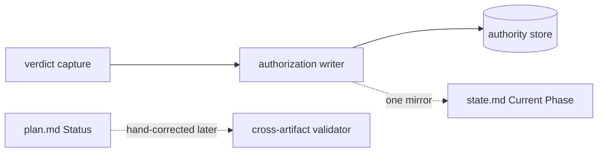
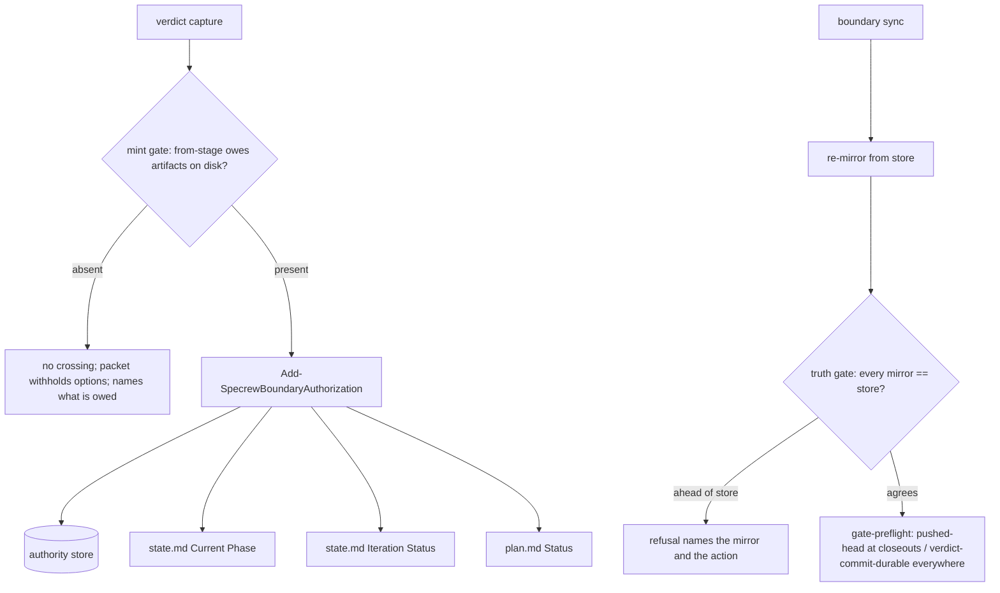
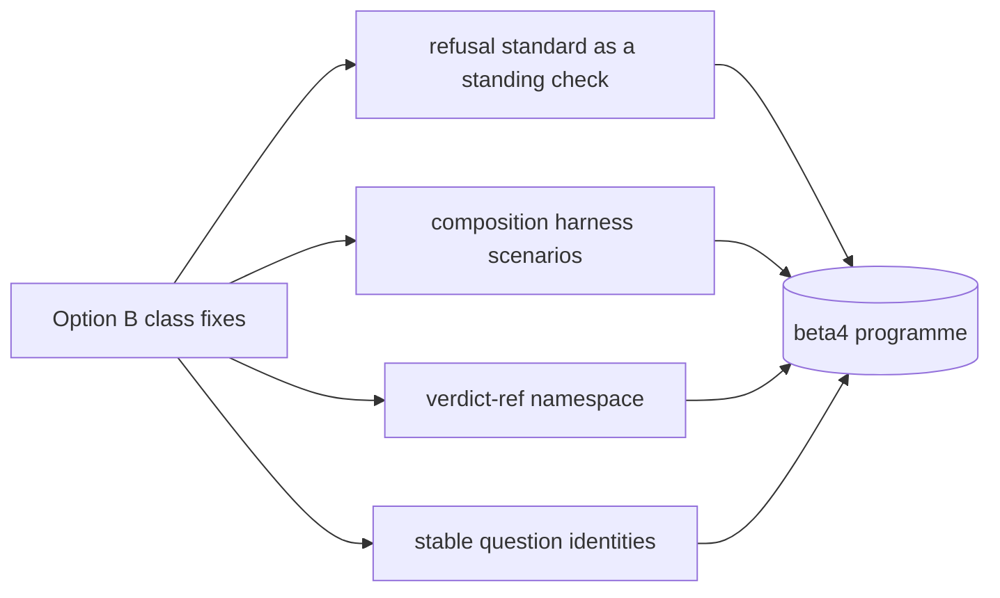

# Design Analysis: 199-beta3-stabilization, Iteration 002

**Feature**: 199-beta3-stabilization
**Iteration**: 002
**Date**: 2026-08-29
**Spec**: file:///C:/Dev/specrew-beta3-stabilization/specs/199-beta3-stabilization/spec.md
**Status**: decided - Option B, modified (2026-08-29)

## Problem Framing

Two live walks against the released beta3 build (KeyContextAI; HelloWinUIReactive) found four
findings that block the tag and five that cost a first-time user their trust before the tool has
earned it. Thirty-three review rounds on this feature produced none of them, because they live in
how the machinery meets a person rather than in the code it inspects. The scope is the ten-item
tag batch of the 2026-08-29 crew report as accepted and corrected by the maintainer, plus the
capture-silence defect against the existing FR-010: FR-024 through FR-033 (spec.md, User Story 8).
Two of the ten reproduced themselves on the shipping tree at the very next boundary after being
catalogued, with the maintainer watching (DRIFT-199-I002-001). The constraints are the standing rules of that report: mutation
proving on every fix, no recognizer widened, no gate that caught something real weakened, every
touched refusal meeting the refusal standard, mirrored copies byte-identical, one covering round on
the shipping tree over the whole delta since tree `1b50ae60`. The six items ruled out and the UX
programme are beta4 by decision.

The design question this analysis decides is not *what* to fix - the report settled that - but at
what scope: the instance, or the class each instance belongs to. Four classes recur across the
ten: an authority written without its mirrors (inert-control family), one check carrying two jobs
under one name, a discipline that is stated in several places and contradicts itself, and a demand
that does not know which actor owes it (TB-1's empty-stage packet, TB-6's every-session Stop,
item eight's unwritten mirrors are one question: is this actor the one that owes this?).

## Key Design Decision Points

1. **Mint gating semantics (FR-024, half 1).** Which side of a crossing owes artifacts at mint
   time, which mechanism checks it, and what "unverifiable" means there. Three minting mechanisms
   exist (the sync's successor auto-open, the authorization writer's rebind, the post-capture
   packet re-mint); the field case read as *unverifiable*, not *absent*, on the bound-tree path,
   and unverifiable deliberately does not refuse capture.
2. **The packet-withhold discipline (FR-024, half 2).** Two mandates say "always render the four
   sendable lines" (gate-stop skill, Rule 53); the conformance provider already ships the opposite
   for evidence-less stages; `refocus/general.md` contradicts Rule 53 on its own. One discipline
   must be stated once and mirrored.
3. **One check, one job (FR-025).** `pushed-head` delivers (closeouts, per its schema) and keeps
   verdict commits durable (every boundary, because three readers resolve `auth_commit_hash`).
   Split, or carve exceptions into one check.
4. **Mirror-writer scope (FR-030).** Which mirrors of `last_authorized_boundary` the crossing writer
   owns, whether the truth check covers each, and what shape a mirror may lead the store by.
5. **The lens checkpoint writer (FR-027).** A governed writer that turns a typed-turn receipt into
   `moved_on`, extending a closed transition-table enum, versus keeping the agent's hand edit and
   adding a reader-side invariant.
6. **Parse detection (FR-026).** How a constrained reader tells "no construct matched" from "an
   empty document", and what the message names.
7. **The not-yet-authored stub (FR-029).** A sentinel stub versus no file until the workshop
   completes; where the specify gate recognizes it.
8. **Seal ordering (FR-031).** The seal as the last write of the closeout sync.
9. **Message standard.** Every refusal touched names what failed, the instance, and one reachable
   action - the beta4 standard applied early so beta4 does not rewrite these.
10. **The owing actor (FR-032, with FR-024 and FR-030).** A pending crossing carries no owner
    (`pending_crossing` keys: identity, commit, tree, boundaries, `recorded_at`), so the Stop-hook
    demand fires in every session of the governed project on every Stop while any crossing is
    open. The conformance provider already scopes *material-turn* attribution to an owner
    (`host|session`, `Get-SpecrewFireIdentity`); the crossing does not use it.
11. **Capture that says what it received (FR-010).** A verdict-shaped turn the classifier does
    not accept (a leading quote bar before the phrase) falls back silently to the previous
    recorded pair; the human learns it in the recap, two retries later.

## Alternatives

### Option A - Simplest: nine instance fixes at their symptom sites

**Approach**: fix each finding where it was observed and nothing wider. Scope `pushed-head` to
closeouts and read `enforcement_mode` in the same block; add a parse check to the product-domain
validator only; keep `moved_on` as the agent's hand edit and add the missing validator call to the
reader-side invariant block (`ProjectMetadataAccessor`); change the repair gate's message; replace
the spec template copy with a stub; write `state.md` Current Phase from the authorization writer
(one mirror); add the withhold clause to the gate-stop skill; move the seal write last.
**Architectural pattern**: local patching; no new writers, no new checks.
**Quality features considered**: cost and speed; weak on class closure - the next instance of each
class is found the same way, by hand, after a validator complains about a symptom.
**Effort estimate**: ~6 SP implementation.
**Reversibility cost**: Low - nothing new to migrate away from.
**Trade-offs**:

- (+) Smallest diff; every fix lands inside files the batch already touches.
- (−) Leaves `plan.md` Status and `state.md` Iteration Status unwritten (the third hand-correction
  in two days recurs); leaves the durability job unnamed inside a narrowed `pushed-head` (this
  repository silently loses its every-boundary push requirement); leaves the implementation-rules
  reader with the identical parse hole; leaves the lens close a hand edit the agent can forget.
- (−) Half 2 of FR-024 becomes one clause in one skill copy while Rule 53 and the refocus text
  still say the opposite - the discipline stays inconsistent.

**Design principle / why this matters**: instance fixes are cheaper because they are coupled to
the symptom; the inert-control family reached eleven-plus precisely because each was fixed as an
instance. The maintainer rejected instance scope for item eight explicitly.

**Recommended for**: a hotfix with no follow-on iteration; not this batch.

**Diagram**:



### Option B - Reasonable: class-scope fixes, one writer per authority, one check per job (RECOMMENDED)

**Approach**: fix each finding as the class it belongs to, inside the batch's boundaries.
*Crossings*: an owed-artifact check on the live filesystem at every minting mechanism (unverifiable
at mint time means the directory is not there, which is *absent*; the capture-side carve-out is not
touched); the packet re-mint gains the guard its sync-side twin already has; the withhold discipline
is stated once (the conformance provider's shipped wording is the wording of record) and every
copy - the gate-stop skill, Rule 53, `refocus/general.md`, `lifecycle-discipline.md` - carries it.
*Gate-preflight*: `pushed-head` keeps the delivery job at closeouts reading `release_model` and
`enforcement_mode`; a new named check `verdict-commit-durable` keeps the durability job at every
boundary at today's strength with an origin and an honest not-applicable without one. *Readers*:
both constrained YAML readers return unparseable on zero recognized constructs; both validators
name the representation. *Workshop*: one governed `confirm-workshop-lens` writer consumes the
receipt, requires the record, runs the two existing validators, writes `moved_on`, refreshes the
handover; the transition table gains `confirm-lens` (56 pinned cells); the skill's checkpoint step
invokes it; the acknowledgment line and the repair refusal fix the two message surfaces with
recognizers untouched. *Scaffold*: a sentinel stub and a specify-gate check. *Mirrors*: the
authorization writer writes every enumerated mirror (`state.md` Current Phase and Iteration Status,
`plan.md` Status), the sync re-mirrors at start, the truth gate compares each at every
iteration-scoped boundary, a mirror may lead the store by exactly the pending crossing during the
arrival-to-verdict window and a mirror ahead of the store is refused. *Closeout*: the seal is the
last write, with a test that it hashes the rendered dashboard. *Owing actor*: the mint records the
owner (`host|session` identity, the same the material attribution uses) on `pending_crossing`; the
provider's boundary demand fires only when the current session is that owner, and every other
session sees one informational line naming the pending crossing and its owner; the stop artifact
names its owner too; when the host supplies no session identity the crossing records
`owner: unknown`, the demand keeps today's project-wide behavior (method rule 12: a diagnosis gap
must not become an outage), and the packet says out loud that this host does not identify sessions
and that the demand may have reached a session that did not produce the work. *Marker identity*:
the verdict marker carries the crossing identity (`<from> -> <to> @ <crossing-id>`) and the
capture verifies it against the pending crossing, so a marker rendered against one crossing cannot
capture against a successor wearing the same label. *Capture*: when the classifier does not accept a verdict-shaped turn while a
crossing is pending, the capture emits one visible line naming what was received and the phrase at
column 0 that would capture, instead of falling back silently; the classifier itself is unchanged.
**Architectural pattern**: single-writer-per-authority with enumerated mirrors and a truth check
between; one-check-one-job with named checks; discipline-stated-once with mechanical mirrors.
**Quality features considered**: class closure (the retro's lesson 1 and 2), verification
confidence (a mutation per fix asserting observable state), maintainability (mirrored copies in one
commit), security of authority (no forged crossing, no weakened gate), consumer language on every
touched message.
**Effort estimate**: ~13 SP implementation; review and rework estimated directly and tracked
separately in plan.md (the maintainer's instruction), then checked against the 1:1:1 floor.
**Reversibility cost**: Low-Medium - one new writer, one new named check, one new transition
operation; each is additive and independently revertible.
**Trade-offs**:

- (+) Closes the three classes the nine instances belong to; the next drift in any enumerated
  mirror is a gate refusal with a named action, not a hand correction after a symptom.
- (+) This repository keeps its every-boundary push requirement while a greenfield project clears
  specify without a remote - both true, under two names.
- (−) Two new writers in one batch (`confirm-workshop-lens`, the crossing-mirror write) - the
  reason the verdict-ref namespace was deferred to beta4.
- (−) Owner scoping needs the session identity at mint time on every host; where a host gives no
  session id the crossing records `owner: unknown`, the demand keeps today's project-wide
  behavior, and the packet names the gap - fail open on the diagnosis, out loud (maintainer
  ruling, 2026-08-29).
- (−) Three test files flip by design (`fr068` HALF 2, `gate-stop-skill:65`,
  `multi-host-launch-path:326`) and the 48-cell table becomes 56; owned in the plan, not
  discovered.

**Design principle / why this matters**: the writer owns every mirror of the authority it writes,
and the design enumerates them - the difference between a lesson that fixes an instance and one
that fixes the class. A check that does two jobs is aimed at the boundaries of one of them.

**Recommended for**: this batch - a stabilization iteration whose findings are classes with a
recorded recurrence count.

**Diagram**:



### Option C - By-the-book: the beta4 programme now

**Approach**: land the class fixes of Option B and, in the same iteration, the machinery the beta4
UX programme names: the refusal standard as a standing mechanical check over every refusal
surface, composition tests in the walk harness (proposal 213), a verdict-ref namespace
(`refs/specrew/verdicts/<id>`) for durability without a remote, stable question identities for
receipts (F-2), a declared cross-lens binding vocabulary (TB-5), derived drift-log summaries, and a
capture that names what it received when it does not capture.
**Architectural pattern**: platform hardening - standards enforced by checks, composition proven by
harness scenarios, identities issued once and carried.
**Quality features considered**: every lens the beta4 programme names; the most complete closure.
**Effort estimate**: ~30 SP or more; two to three iterations.
**Reversibility cost**: Medium - identity schemes and ref namespaces bring lifecycle questions of
their own (the W69/W70 turn-identity precedent took three rounds).
**Trade-offs**:

- (+) Nothing in the nine is fixed twice; the standing checks prevent recurrence mechanically.
- (−) It is the beta4 workshop's scope by maintainer ruling, three times over (F-2 "do not rush
  this"; the verdict-ref namespace "brings its own lifecycle questions"; the UX programme "do not
  start them now"). Shipping beta3 waits on design work that has its own boundaries.
- (−) Rushing an identity scheme into a tag batch is how W69/W70 relocated a defect twice.

**Design principle / why this matters**: distinct from Option B and worth naming, because it is the
correct end state; premature here because the batch's job is a tag that every tester's first
closeout can pass, and the rest is the beta4 workshop's to decide with its own evidence.

**Recommended for**: beta4, after the batch ships and the walk harness exists to measure it.

**Diagram**:



## Applicable Lenses

No iteration-level questionnaire is recorded for this iteration (as for iteration 001). The
options above are shaped by the feature's workshop lenses recorded under
`specs/199-beta3-stabilization/workshop/`: architecture-core (single-writer-per-authority; see
Option B's mirror writer and its trade-offs), security-compliance (no forged crossing, no weakened
gate; see decision points 1 and 3), devops-operations (the release-model contract that scopes
delivery to closeouts; see Option B's gate-preflight paragraph), requirements-nfr (the refusal
standard on every touched message; decision point 9), ui-ux (the acknowledgment line and the
withheld packet as consumer surfaces), code-implementation (mutation proving, mirrored copies) and
product-domain (the two walks as the users of record, User Story 8).

## Crew Recommendation

**Recommended: Option B.**

Option B is the design the maintainer accepted item by item in the 2026-08-29 report review and
then corrected to class scope: item eight enumerates every mirror rather than one; TB-3 splits into
two named checks rather than narrowing one; F-1 and B-6 become one governed writer rather than a
reader-side invariant; TB-4 covers the sibling reader; the withhold discipline is aligned across
every copy because it was already inconsistent. Each decision point above resolves to Option B's
paragraph on it. Option A is the shape that produced the inert-control family; Option C is beta4 by
three explicit rulings.

## Beta4 replacement notes

Per bridge item, what beta4 is expected to replace or extend:

- FR-024's live-filesystem mint gate and hand-mirrored withhold become composition-harness
  scenarios ("human does an ordinary thing, two gates disagree").
- FR-025's honest no-origin message becomes real durability when a verdict-ref namespace ships.
- FR-028's acknowledgment line and FR-026's parse message become instances of the refusal
  standard's standing check.
- FR-030's enumerated mirrors become a derived projection when the record's counts and phases are
  generated rather than authored.
- The capture disclosure (FR-010, DRIFT-199-I002-004) becomes the W54 treatment applied to every
  typed authority once beta4 derives the phrase list from one table.
- (Withdrawn from beta4 by ruling, 2026-08-29: the marker carries the crossing identity and the
  capture verifies it - folded into T001/T010, because half 2 stops the empty crossing being
  minted but not a stale marker landing on a different one wearing the same label.)

## Co-Design Record

### Agreed component map

| Component | Responsibility | Files |
| --- | --- | --- |
| Mint gate | Refuse to open a crossing whose from-stage owes artifacts missing on disk, at all three minting mechanisms; journal the reason | `extensions/specrew-speckit/scripts/shared-governance.ps1` (+ mirror) |
| Packet re-mint guard | Withhold `pending-verdict-stop.md` after capture when the next stage owes artifacts (port of the sync-side guard) | `scripts/internal/bootstrap/HandoverStore.ps1` |
| Withhold discipline | One statement of when verdict options are rendered and when withheld; every copy carries it | gate-stop skill (3 copies), `scripts/internal/launch-contract.ps1` Rule 53, `refocus/general.md` (2), `docs/methodology/lifecycle-discipline.md` |
| Delivery check | `pushed-head` at closeouts: release model + enforcement mode | `scripts/internal/gate-preflight.ps1` |
| Durability check | `verdict-commit-durable` at every boundary | `scripts/internal/gate-preflight.ps1` |
| Constrained readers | Zero recognized constructs = unparseable; message names the representation | `scripts/internal/product-domain-lens.ps1`, `scripts/internal/code-implementation-lens.ps1` |
| Lens checkpoint writer | `confirm-workshop-lens.ps1`: receipt -> record -> validator -> `moved_on` -> handover; `confirm-lens` in the transition table | `extensions/specrew-speckit/scripts/` (+ mirror), `workshop-authority-store.ps1` |
| Workshop messages | Acknowledgment line in the skill and lens texts; repair refusal through the refusal contract | `.claude/skills/specrew-design-workshop/SKILL.md` (3 copies), `repair-workshop-controller-state.ps1` |
| Spec stub + gate | Sentinel stub at feature creation; specify gate refuses while it stands | `create-governed-feature.ps1` (+ mirror), `scripts/internal/design-analysis-gate.ps1` |
| Crossing mirror writer | Every enumerated mirror written at authorization; sync re-mirror; truth gate compares | `shared-governance.ps1` (+ mirror), `scripts/internal/sync-boundary-state.ps1` |
| Seal ordering | Seal is the closeout sync's last write | `scripts/internal/sync-boundary-state.ps1` |
| Crossing owner | `pending_crossing.owner` recorded at mint; the boundary demand fires only for the owner; other sessions get one informational line | `shared-governance.ps1` (+ mirror), `specrew-conformance-provider.ps1` (+ mirror), `HandoverStore.ps1` |
| Capture disclosure | A verdict-shaped turn that does not capture produces one line naming what was received and what would capture | `scripts/internal/bootstrap/HandoverStore.ps1`, `ConversationCaptureAccessor.ps1` (read-only use) |
| Marker identity | The verdict marker carries the crossing identity; capture verifies it against the pending crossing (folded into T001/T010 by ruling) | `HandoverStore.ps1` (marker writer), `ConversationCaptureAccessor.ps1` (marker regex + contiguity), gate-stop skill (3 copies), `launch-contract.ps1` Rule 53 |

### Agreed flows

A crossing, end to end, after the batch:

```mermaid
sequenceDiagram
  participant H as human
  participant C as capture (Stop / prompt-submit)
  participant G as mint gate
  participant W as authorization writer
  participant M as mirrors (state.md, plan.md)
  participant S as boundary sync
  participant P as packet
  H->>C: approved for <to>
  C->>G: from-stage artifacts on disk?
  G-->>P: absent: withhold options, name what is owed
  G->>W: present: record crossing
  W->>M: write every enumerated mirror
  S->>M: re-mirror from store; truth gate compares each
  S->>P: pending-verdict-stop.md only when the next stage has something to approve
```

A second session's Stop while a crossing is pending, after the batch: the provider reads
`pending_crossing.owner`, finds it is not this session, and emits one line - "a crossing
`<from> -> <to>` is pending, owed by session `<owner>`; this session owes nothing for it" - and
the session ends its turn normally. The owning session alone is told to render the packet, and
only when the stage has something to approve.

A lens close, after the batch: typed reply -> receipt -> `confirm-workshop-lens` (record present,
validator green) -> `moved_on` -> handover refreshed -> the next lens; a validator failure keeps the
lens open with the record's own error lines and the answers preserved.

- **Human-agreed**: yes - the maintainer's typed decision of 2026-08-29 (Human Decision below)
  agreed the component map and flows with the two additions it named (owner-unknown out loud;
  marker identity).

## Human Decision

**Verdict (verbatim)**: `Chosen Option: B — class scope, and the three findings collapsing to one
rule is the reason. Ten symptom fixes leave the class intact and I would be back here.`
**Given**: 2026-08-29, by the maintainer, at the design-gate stop rendered over the committed draft
`6b270ca1`. The decision was typed as a `Chosen Option` field rather than the "approved for plan
with Option" phrase because a plan crossing minted over the empty stage was pending
(DRIFT-199-I002-001) and the fallback capture keys on that phrase; this form authorizes no crossing.
**Chosen option**: modified-Option B.
**Reason**: class scope; the three findings (TB-1, TB-6, item eight) collapse to one rule.
**Modifications** (the maintainer's, verbatim in substance):

1. Effort: plan the direct estimate (3.0 review, 2.5 rework); name the 17.5 SP parity floor beside
   it as a check, not a number; add a tripwire - if review and rework exceed the direct estimate
   by 2x, stop and re-plan rather than grind. Do not plan the floor: that converts a check into a
   number and manufactures the overcommit. Review and rework are tracked separately so the next
   retro can say which figure was right.
2. One iteration, not the split - conditional on the campaign allowance supporting the rounds
   needed (the packets had said "1 of 4 remaining"); recorded in plan.md Notes with the measured
   allowance.
3. The capture-silence defect is in scope as a defect against the existing FR-010 (T011) - "that
   is the weight I meant".
4. Owner unknown keeps today's behavior, by method rule 12 - withholding when the owner cannot be
   determined turns a diagnosis gap into an outage on any host without session identity, including
   for the session that did the work. But the packet must say it cannot tell: name that the host
   does not identify sessions and that this demand may have reached a session that did not
   produce the work. Fail open on the diagnosis, out loud.
5. Fold into T001/T010 rather than beta4: bind the verdict marker to the crossing identity and
   verify it at capture - half 2 stops the empty crossing being minted; it does not stop a stale
   marker landing on a different one wearing the same label.

**Design-analysis draft commit**: `6b270ca1`.
**Decision recorded in commit**: the commit that contains this populated section is the decision
commit (it cannot name its own hash); it is the `boundary(plan)` commit that follows `6b270ca1`
and precedes the plan sync, and it is cited in the plan boundary packet.
**Transcription disclosure**: this decision is agent-transcribed from the maintainer's typed reply
in the governing session (the established design-verdict transcription path, as in iteration 001).
