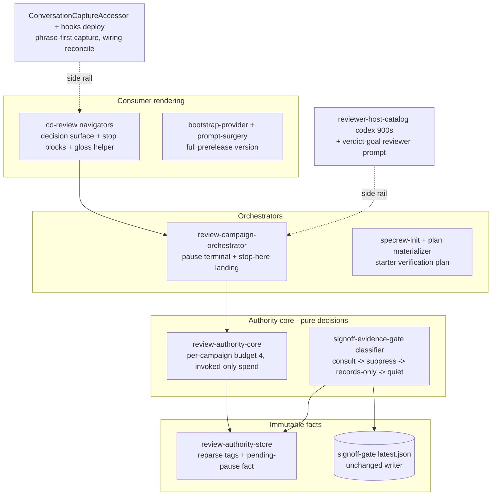

# Review Diagrams: Beta3 Stabilization

**Feature**: 199-beta3-stabilization
**Phase**: pre-implementation (planning artifact for reviewer)

## Component diagram



## Sequence: the pause (every round)

```mermaid
sequenceDiagram
  participant H as Human
  participant O as Orchestrator
  participant C as Core
  participant S as Store
  participant N as Navigator
  participant G as Stop governor
  O->>C: round ingested; compute pause verdict
  C-->>O: verdict (findings, cost, budget, recommendation)
  O->>S: write PendingPauseFact (atomic)
  O->>N: render decision surface
  N-->>H: findings + cost + 3 numbered options
  Note over O: engine exits - nothing spends
  G->>S: read pending pause
  S-->>G: present -> QUIET (no block)
  H->>S: numbered reply -> PauseDecisionFact
```

## Sequence: stop-here landing (the wedge killer)

```mermaid
sequenceDiagram
  participant H as Human
  participant O as Orchestrator
  participant V as Frozen-tree verification
  participant C as Core
  participant S as Store
  participant CL as Classifier
  participant N as Navigator
  H->>O: choice 2 (stop here)
  O->>V: run bounded verification on the frozen tree
  V-->>O: pass
  O->>C: validate identity-bound residual acceptance
  C->>S: write acceptance facts
  O->>CL: gate sync
  CL->>S: consult signoff-gate decision
  S-->>CL: allow
  N-->>H: "review signed off; N minor findings saved as follow-ups"
```
