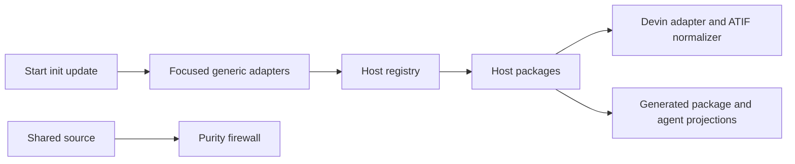
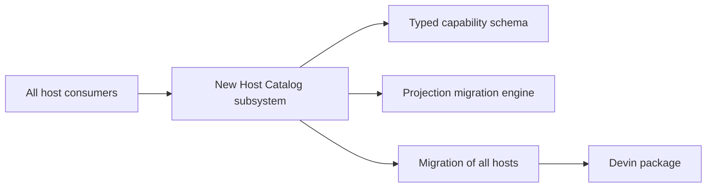

# Design Analysis: Devin CLI Host — Clean-Extensibility Proof

**Feature**: 200-devin-cli-host
**Iteration**: 001
**Date**: 2026-06-24
**Boundary**: design-analysis (pre-plan)
**Spec**: file:///C:/Dev/200-devin-cli-host/specs/200-devin-cli-host/spec.md
**Builds on**: file:///C:/Dev/200-devin-cli-host/specs/200-devin-cli-host/workshop/
**Spike evidence**: file:///C:/Dev/200-devin-cli-host/specs/200-devin-cli-host/iterations/001/research/devin-stop-payload-spike.md

## Problem Framing

Feature 200 adds Devin for Terminal while proving Specrew's host package
architecture is genuinely open for ordinary host additions. The user-visible
host must launch, receive lifecycle hooks, deploy instructions and Crew agents,
coordinate when selected, migrate existing projects, and provide real handover.
The architectural proof is stricter: outside `hosts/devin/`, production changes
must be generic abstractions or generated projections, the five production
firewall exceptions in scope must disappear, and the shared transcript parser
must remain untouched while Feature 197 owns it.

The early real-host spike selected the accepted handover path. Devin Stop carries
no assistant message, but export occurs before Stop and ATIF can be normalized
inside the Devin package to a JSONL shape the unchanged parser already reads.
The same spike exposed a Windows hook-runner prerequisite for `sh.exe`, which
keeps the host experimental until the packaged integration is revalidated.

## Key Design Decision Points

1. **Decomposition method**: preserve the modular-monolith host-package
   architecture with ports/adapters at `hosts/<kind>/`, or introduce a new host
   subsystem.
2. **Generic cleanup placement**: extend existing owning components with focused
   helpers, or scatter direct edits across current callsites.
3. **Handover path**: use the proven ATIF-to-existing-JSONL adapter inside the
   Devin package without editing the parser.
4. **Canonical data ownership**: manifests own host capability/default metadata;
   FileList and project agents configuration remain generated projections.
5. **Windows hook compatibility**: treat the tested `sh.exe` prerequisite as an
   explicit experimental constraint, never hidden full parity.
6. **Delivery capacity**: split the full feature across iterations capped at 20
   story points rather than raising project capacity.

## Alternatives

### Option A: Simplest — Direct edits in existing owners

**Approach**: Keep the current architecture but implement each generic cleanup
directly at its existing callsite. The three validators query the registry in
place; package generation is inserted into the current manifest-generation
script; coordinator projection logic remains inside init/update scripts; the
Devin package contains the host behavior and ATIF normalizer.

**Architectural pattern**: modular monolith with local procedural edits.

**Quality features considered**: meets functional scope and folder-only literal
purity, but provides weaker responsibility boundaries for generation,
migration, and hook payload adaptation.

**Effort estimate**: 36–40 story points across two full iterations.

**Reversibility cost**: Medium. Individual changes are small, but later
extraction would touch the same large scripts again.

**Trade-offs**:

- (+) Lowest number of new helper functions and files.
- (+) Fastest route to a working Devin package.
- (-) Repeats logic inside large init/update/build owners.
- (-) Makes future host and migration changes harder to test in isolation.
- (-) Two iterations have almost no capacity reserve.

**Design principle / why this matters**: local simplicity reduces immediate
surface area, but the feature exists specifically to remove repeated central
coupling. Keeping related projection logic embedded weakens the proof.

**Recommended for**: a one-off host where long-lived extensibility is not a
product requirement.

**Diagram**:


### Option B: Reasonable — Focused generic adapters in existing architecture

**Approach**: Preserve the confirmed modular host-package architecture and add
only focused generic mechanisms at the existing ownership seams:
registry-backed input validation, deterministic host-package FileList
generation, manifest-driven coordinator projection/migration, direct-event-map
hook deployment, a generated launcher/enrichment seam for the Devin-local ATIF
normalizer, and the permanent purity firewall. No second catalog or host
service is introduced.

**Architectural pattern**: modular monolith with ports/adapters and
manifest-driven strategy dispatch.

**Quality features considered**: strongest balance of clean extensibility,
isolated tests, user-file preservation, deterministic generation/migration,
honest degraded compatibility, and reversibility. It keeps all Devin logic in
the package and leaves the shared parser unchanged.

**Effort estimate**: 45 story points across three bounded iterations.

**Reversibility cost**: Low to medium. Each generic helper is owned by an
existing component and can be changed independently; manifest fields are the
long-lived compatibility surface.

**Trade-offs**:

- (+) Matches the confirmed component map and folder-only thesis.
- (+) Makes generation, migration, and handover adaptation independently
  testable.
- (+) Preserves one runtime catalog and one five-handler dispatch contract.
- (+) Keeps each iteration below the 20 SP cap.
- (-) Requires three lifecycle iterations.
- (-) Adds a small generic hook-enrichment contract because Stop omits both
  message and transcript path.
- (-) Windows hook parity remains evidence-gated around the pinned host defect.

**Design principle / why this matters**: isolate volatility where it already
exists. Host behavior stays in packages; shared owners expose only the generic
capability required by multiple present or future hosts.

**Recommended for**: Feature 200.

**Diagram**:



### Option C: By-the-book — New unified Host Catalog subsystem

**Approach**: Introduce a dedicated Host Catalog module with a formal schema,
typed capability objects, projection generators, migration engine, hook
transformation pipeline, compatibility inventory, and migration of every
existing host/core consumer onto the new API before adding Devin.

**Architectural pattern**: new host-platform subsystem with explicit ports,
repositories, schemas, and migration services.

**Quality features considered**: strongest theoretical uniformity and future
plugin readiness, but it duplicates the already-working registry and expands
Feature 200 into a platform rewrite.

**Effort estimate**: 60+ story points across at least four iterations.

**Reversibility cost**: High. A new public subsystem and migration become
expensive to reshape and broaden the existing-host regression surface.

**Trade-offs**:

- (+) Richest formal capability and compatibility model.
- (+) Could accelerate a future plugin-distribution proposal.
- (-) Creates the parallel catalog explicitly rejected by the workshop.
- (-) Migrates five working hosts without current necessity.
- (-) Delays Devin and materially increases regression risk.

**Design principle / why this matters**: abstraction should follow demonstrated
variation. Building the future plugin platform now would be speculative
generality rather than clean extensibility.

**Recommended for**: a later plugin-platform feature only if Proposal 058
requires it.

**Diagram**:



## Crew Recommendation

**Recommended: Option B.**

Option B realizes the component map the maintainer confirmed, satisfies the
folder-only proof, and handles the empirical handover outcome without crossing
Feature 197's parser ownership. Option A can technically meet many acceptance
criteria but leaves generation and migration logic too embedded for the
clean-extensibility claim. Option C re-platforms a registry architecture that
already works.

The plan must preserve two hard guards: each iteration remains at or below 20
story points, and the Windows hook-runner prerequisite remains experimental and
visible until real packaged evidence proves the supported path.

## Capacity Model

Inputs:

- Capacity: 20 story_points per iteration.
- Overcommit threshold: 1.0.
- Role owners: Spec Steward, Planner, Implementer, Reviewer.
- Requirement set: FR-001 through FR-022 and SC-001 through SC-012.
- Historical velocity: not used; scope is capability- and evidence-bounded.

Plan-ready split for Option B:

| Iteration | Slice | Requirements and evidence | Effort |
| --- | --- | --- | ---: |
| 001 | Handover spike and abstraction foundation | FR-001–FR-004, FR-011–FR-012, SC-002–SC-004, SC-008 | 14 |
| 002 | Devin package and lifecycle integration | FR-005–FR-010, FR-017–FR-018, SC-001, SC-005, SC-007, SC-009 | 15 |
| 003 | Coordinator/update migration, CI, docs, promotion | FR-013–FR-016, FR-019–FR-022, SC-006, SC-010–SC-012 | 16 |
| **Total** |  |  | **45** |

Iteration 001 taskable baseline:

| Task | Requirement refs | Owner | Effort |
| --- | --- | --- | ---: |
| Empirical Stop/export/normalization spike and bounded evidence | FR-011, FR-012, SC-008 | Planner, Reviewer | 3 |
| Registry-driven validation at three callsites | FR-001, SC-002 | Implementer | 2 |
| Deterministic host-package FileList generator and parity test | FR-002, SC-004 | Implementer | 3 |
| Purity assertion, negative test, and validator allow-list reduction | FR-003, FR-004, SC-002, SC-003 | Implementer, Reviewer | 3 |
| CI/prepublish wiring for Slice A checks | FR-019, SC-010 | Implementer, Reviewer | 2 |
| Review and expected rework reserve | TG-003–TG-006 | Reviewer, Spec Steward | 1 |
| **Total** |  |  | **14** |

Phase baseline for iteration 001:

| Phase | Effort |
| --- | ---: |
| Planning and artifact authoring | 2 |
| Discovery/spike | 3 |
| Implementation | 6 |
| Review and deterministic validation | 2 |
| Expected rework | 1 |
| **Total** | **14** |

Capacity status: **ok**. Iteration 001 uses 14/20 story_points. Later iterations
are forecast at 15/20 and 16/20. Any new capability dimension or Windows hook
work exceeding these bounds requires a human split/defer verdict; capacity is
not raised silently.

## Component Map

```text
CLI surfaces
  specrew start             specrew init/update
        |                           |
        v                           v
  HostInputBoundaries       CoordinatorCatalogProjection
        |                           |
        +-------------+-------------+
                      |
                      v
                 HostRegistry
          discovery / validation / capability
                 query / handler dispatch
                      |
          +-----------+------------+
          |                        |
          v                        v
 ExistingHostPackages       DevinHostPackage
                            launch / flags / detection
                            Crew format / hooks / rules
                                      |
                                      v
                           DevinHandoverAdapter
                           ATIF -> existing JSONL

hosts/* packages -> HostPackageFileListGenerator -> generated FileList
shared production source -> HostPurityFirewall -> no host-specific routing
```

Component responsibilities:

- **HostRegistry** — sole runtime host discovery, validation, capability-query,
  and five-handler dispatch authority.
- **HostInputBoundaries** — existing three input callsites; validate against the
  live registry.
- **HostPackageFileListGenerator** — derive deterministic package membership
  from installed host folders.
- **HostPurityFirewall** — reject host-specific shared-core routing and prevent
  allow-list growth.
- **CoordinatorCatalogProjection** — derive coordinator entries/defaults from
  manifests and migrate only the managed agents block.
- **HookConfigDeployer** — merge manifest-driven root-level direct event maps
  while preserving user entries.
- **InstructionDeployer** — retain path deduplication and managed-section merge
  for shared `AGENTS.md`.
- **CrewRuntimeDispatcher** — route canonical Crew roles through the existing
  host handler contract.
- **DevinHostPackage** — own all Devin-specific launch, permission, runtime,
  signal, Crew, hook, tested-build, and coordinator behavior.
- **DevinHandoverAdapter** — normalize the fixed export path from ATIF to an
  existing parser-supported JSONL shape before shared handover processing.
- **CompatibilityEvidence** — record build, OS, events, mechanism, result, and
  bounded reason codes for promotion and future monitoring.

## Key Flow

```text
specrew start --host devin
 -> HostInputBoundaries validate through HostRegistry
 -> HostRegistry dispatches DevinHostPackage
 -> Devin starts interactively with a controlled --export path
 -> SessionStart/UserPromptSubmit/Stop fire through HookConfigDeployer output
 -> DevinHandoverAdapter normalizes completed ATIF before Stop processing
 -> shared dispatcher/parser enforce lifecycle and capture handover
 -> CompatibilityEvidence records bounded result
```

## Applicable Lenses

- **architecture-core**: preserve the modular host-package architecture and one
  registry; reject a parallel catalog.
  - Addressed: Option B's focused adapters and Option C's rejected subsystem.
- **component-design**: responsibilities remain in existing owners with small,
  independently testable generic helpers.
  - Addressed: Option B and the component map.
- **requirements-nfr**: clean extensibility, compatibility, ownership safety,
  deterministic projection, and honest handover drive the option comparison.
  - Addressed: Option A's coupling trade-off and Option B's evidence gates.
- **data-storage**: manifests are canonical; FileList and managed agents are
  projections; ATIF/normalized files are controlled transient runtime data.
  - Addressed: Option B's generator, migration, and handover adapter.
- **security-compliance**: preserve user hook/instruction content and exclude
  conversations/credentials from evidence.
  - Addressed: Option B's merge boundaries and bounded evidence.
- **integration-api**: interactive positional launch, direct event-map hooks,
  fixed export path, and existing parser shape define the adapter contract.
  - Addressed: Option B's key flow and empirical spike.
- **devops-operations**: FileList parity, cross-platform CI, migration fixtures,
  prerelease evidence, and experimental-to-supported promotion are explicit.
  - Addressed: Option B's three-iteration capacity split.
- **observability-resilience**: boundary Stop failure blocks promotion; handover
  enrichment and Windows host prerequisites degrade visibly.
  - Addressed: Option B's hard guards and evidence record.
- **code-implementation**: PowerShell 7/PSD1/YAML/JSON, existing tests, no new
  dependency, data-driven strategy dispatch, and no parser edit remain binding.
  - Addressed: Option B's focused helpers and rejected Option C platform.

## Quality Profile Reconciliation

The resolver returned a bounded custom composition because it detected only the
repository-level `package.json`. Planning overrides the stack description with
the confirmed implementation stack: PowerShell 7, PSD1 manifests, YAML/JSON
managed data, PowerShell integration tests, and GitHub Actions.

Required quality dimensions remain code quality, separation of concerns,
verification confidence, maintainability, security, and robustness. Concurrency
is not material. Retry behavior is limited to one transient real-host canary
retry; deterministic generation and migration never retry.

## Co-Design Record

**Human-agreed**: yes.

The maintainer confirmed the modular host-package/ports-and-adapters design,
every named component responsibility, and the canonical start-to-handover flow
on 2026-06-24.

Binding constraints:

- `HostRegistry` remains the only runtime catalog.
- Devin-specific production behavior remains under `hosts/devin/`.
- Shared changes are focused generic abstractions or generated projections.
- `ConversationCaptureAccessor.ps1` remains unchanged.
- The empirical handover result is outcome 2: ATIF normalization inside the
  Devin package to an existing JSONL shape.
- The Windows `sh.exe` hook prerequisite remains visible and evidence-gated.
- Iterations remain under the 20 story-point cap.

Agreed flow:

```text
specrew start --host devin
 -> registry validation and dispatch
 -> interactive Devin plus controlled export
 -> manifest-driven lifecycle hooks
 -> Devin-local ATIF normalization
 -> unchanged shared parser and dispatcher
 -> bounded compatibility evidence
```

## Human Decision

- **Decision verdict**: approved for plan with Option B
- **Chosen option**: Option B
- **Reason**: Option B is the correct clean-extensibility architecture. Option
  A undermines the feature's proof by leaving the generic seams embedded in
  existing procedural owners, while Option C builds a second host subsystem
  beyond the demonstrated need.
- **Modifications**:
  - Accept the full 45 story points across three capped iterations. The
    difference from Proposal 200's 18–26 estimate is driven by the real host
    package, the empirically required ATIF normalizer, registry refactoring,
    coordinator migration, full real-host validation, and proof tests. This is
    newly evidenced implementation work within A/C/D, not scope creep.
  - Remove all five in-scope allow-list entries, including both coordinator
    entries; the full shrink is part of this feature's proof value.
  - Treat the `spec.md` change in `bbd218ea` as narrowing FR-011 to empirically
    proven outcome 2, not weakening the handover requirement. Full handover
    remains in scope.
  - Keep `sh.exe` as a documented experimental Windows constraint and include a
    host-neutral fix attempt that invokes `pwsh` directly so Windows users do
    not require Git Bash. If Devin's runner cannot support that generic path,
    retain the explicit constraint rather than adding Devin-specific core
    routing.
  - Keep the 20-story-point per-iteration cap.
- **Design-analysis draft commit**: bbd218ea49cd183d41e463be62edf8221e2b32b7
- **Decision recorded in commit**: 0cf182f931b7875a53541078a5e971a1e6f38cee
