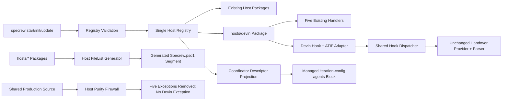
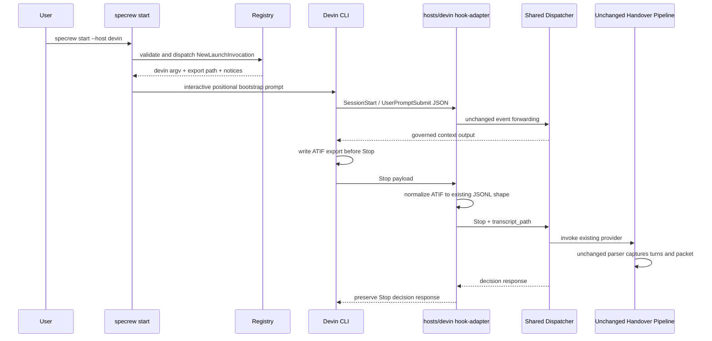
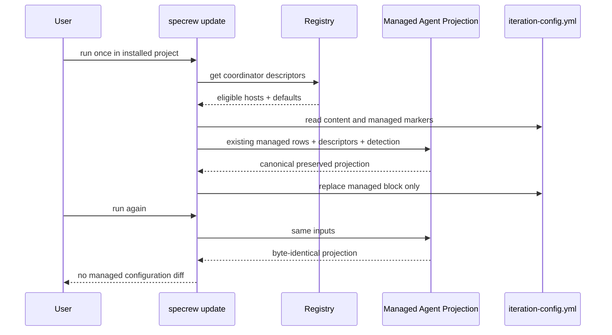
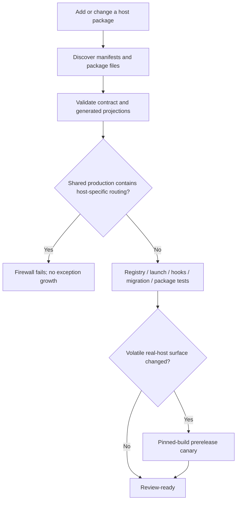

# Review Diagrams: Devin CLI Host — Clean-Extensibility Proof

**Feature**: 200-devin-cli-host
**Phase**: pre-implementation planning artifact for reviewer

## Component Diagram

## Sequence: Interactive Devin Session and Handover

## Sequence: One-Run Coordinator Migration

## Proof Boundary

